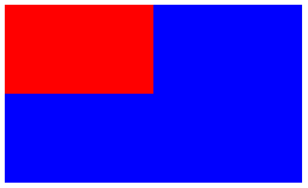
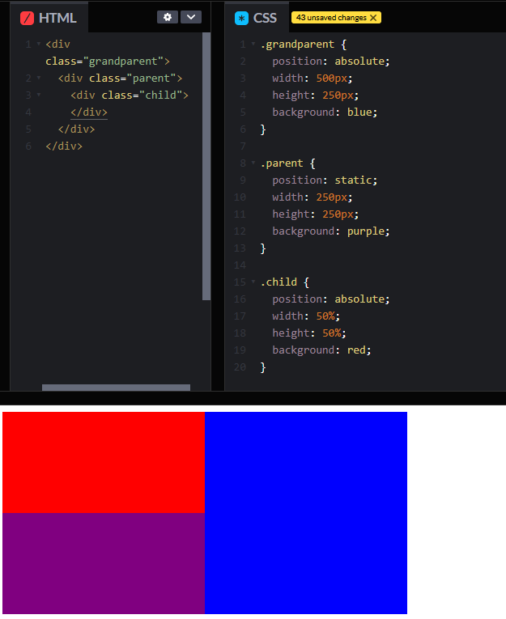
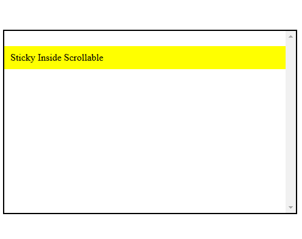

<div align=center>
    <h1> Containing Block </h1>
</div>

**The containing block refers to the ancestor element that serves as a reference point for the positioning and sizing of a child element**. For many CSS properties (such as `width`, `height` and `position`), the percentage values **are based on the containing block**. This block is typically a parent element, but it can also be another ancestor that has a defined size. This can be either explicitly or through layout rules.

However, the specific rules that **determine the containing block** depend on the positioning scheme (`static`, `relative`, `absolute`, `fixed`, or `sticky`) of the element in question.


# How the Containing Block is Determined

#### For Normally Positioned Elements - `static` and `relative`

If an element has `position: static` (the default) or `position: relative`, its containing block is formed **by the nearest ancestor block container** (i.e., an element that participates in block formatting) or the root element `<html>` if no such ancestor exists.

Ancestors that participate in block formatting are several scenarios such as,

1. The root element `<html>`
2. Elements with `float: left` or `float: right`
3. Elements with `position: absolute` or `position: fixed`
4. Elements with `display: inline-block`
4. Elements with `disply: flex` or `display: inline-flex`
5. Elements with `display: grid`
6. `...`


```CSS
.container {
  width: 500px;
  height: 300px;
  background-color: blue;
}

.child {
  width: 50%;
  height: 50%;
  background-color: red;
}
```

```html
<div class="container">
  <div class="child"></div>
</div>
```

Because `.child` has `position: static` (by default). The containing block of `.child` is the `.container` because its the **nearest block-level ancestor**. The `width` and `height` of `.child` are determined from the containing block.

<div align="center">
  
</div>

#### For Absolutely Positioned Elements - `absolute`

If an element has `position: absolute`, its containing block is the **nearest ancestor that has a** `position` value of `relative`, `absolute`, `fixed`, or `sticky`. If no such ancestor exists, the containing block is the **initial containing block**, which is the viewport in most cases.

<div align="center">
    
</div>

Because `.child` has `position: absolute`, its containing block is determined by the nearest ancestor with a position of `relative`, `absolute`, `fixed` or `sticky`. The direct parent has a `position: static;`, therefore the parent element **will not be the containing block**. The nearest ancestor with one of these positions is the grandparent ancestor with `position: absolute`. This means that the child element will receive `width: 50%` of the grandparent, which is why it has the width of half of the blue area instead of half of the purple area!

#### For Fixed Positioning - `fixed`

If an element has `position: fixed`, its containing block is **the viewport**, regardless of any ancestor elements positions, unless `transform`, `perspective`, `filter` or `contain` property is applied to an ancestor, which can change this behaviour.

The **viewport** is the visible area of a webpage on a users screen. It represents the portion of the document that is currently displayed within the browser window, **excluding scrollbars and UI elements such as toolbars**.

The viewport is **not necessarily** the full width and height of the entire document but is instead the **window through which the user views the content**. The document itself can be larger than the viewport, requiring scrolling to see additional content.

The **document** is the entire HTML page, including content that extends beyond the visible area. **The viewport is just the visible portion of the page**.

```CSS
.child {
  width: 100px;
  height: 100px;
  background-color: coral;
  position: fixed;
  top: 50px;
  left: 50px;
}
```

```HTML
<div class="child"></div>
```

The `.child` has `position: fixed`, so its containing block is the viewport. The `top: 50px; left: 50px;` position is measured **relative to the viewport**, ignoring any ancestor elements.

#### For Sticky Positioning - `sticky`

If an element has `position: sticky;`, its containing block is determined based on the nearest ancestor with a **scrolling context**. This means the element will stick relative to the nearest scrollable ancestor. 

**Before reaching the threshold**, it acts as a `relative` element.

**After reaching the threshold**, it "sticks" to the specified position (top, left, right or bottom).

```CSS
.scroll-container {
    margin-top: 50px;
    height: 300px;
    overflow-y: scroll;
    border: 2px solid black;
}

.sticky-box {
    position: sticky;
    top: 25px; /* Sticks 25px from the top */
    background-color: yellow;
    padding: 10px;
}
```

```HTML
<div class="scroll-container">
    <div class="sticky-box">Sticky Inside Scrollable</div>
</div>
```

Here, `.sticky-box` will **stick within** `.scroll-container` instead of the viewport.

<div align="center">
  
</div>