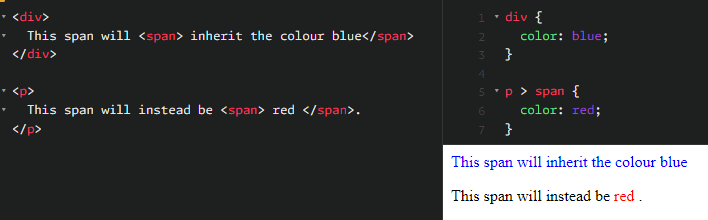

<div align="center">
  <h1> Handling Conflicts </h1>
</div>

CSS stands for **Cascading Style Sheets** ahd that first word **cascading** is incredibly important to understand. The way that the cascade behaves is key to understanding CSS.

When multiple CSS rules target the same element, the browser follows a structured process to determine which rule applies. This decision-making process consists of three major principles.

1. **The Cascade** - The order in which styles are applied based on their origin and importance.

2. **Specificity** - The ranking system used to determine which selector is the strongest.

3. **Inheritance** - Some properties are automatically inherited, while others are not.

# Cascade

The term "cascade" in CSS refers to the rules that determine which styles are applied when multiple sources define competing styles for the same element.

Styles in CSS come from multiple sources and their priority follows a strict hierarchy,

1. **User-Agent Styles (Browser Defaults)** - Every browser has a built-in default stylesheets. For example `<h1>` elements are typically bold by default.

2. **User Styles (Custom Browser Preferences)** - Some users modify styles for accessibility reasons, such as changing text size or contrast in their browser settings.

3. **Author Styles (Styles Written by the Developer)** - Styles written in external stylesheets, `<style>` tags within HTML or inline styles.

4. **`!important` Rules** - Any CSS rule marked with `!important` overrides all others unless another `!important` rules with higher specificity exists.

The highest priority belongs to user-defined `!important` rules, followed author-defined `!important` rules, then inline styles, then author styles, user styles and finally browser defaults. 

If multiple rules are defined in the same namespace, **the last one defined will be chosen**.

# Specificity

Each type of CSS selector has a specific numerical weight,

1. **Inline Styles** - These styles are applied using `style="..."` and have a **specificity of 1000**.

2. **ID selectors** - These styles are applied using `#example` and have a **specificity of 100**.

3. **Class Selectors** -  These styles are applied using `.class` and have a **specificity of 10**

4. **Attribute Selectors** - These styles are applied using `[type="text"]` and have a **specificity of 10**.

5. **Pseudo-classes** - These styles are applied using `:hover` and have a **specificity of 10**.

6. **Element Selectors** - These styles are applied using `p`, `div`, etc... and have a **specificity of 1**.

7. **Pseudo-elements** - These styles are applied being `::before`, `::after` etc... and **have a specificity of 1**.


Specificity scores are calculated by adding up the weights of all selecotrs in a rule.

```CSS
#main p { color: blue; }  /* Specificity: 100 (ID) + 1 (element) = 101 */
.text { color: red; }     /* Specificity: 10 (class) */
```

The first rule has a specificity of **101**, whole the second has a specificity of **10**. Because **101** is higher than **10**, the first rule takes precedence.

In the following examples,


```CSS
p { color: blue; } /* Specificity: 1 */
#main { color: green; } /* Specificity: 100 */
.text { color: red; } /* Specificity: 10 */
```

```HTML
<p id="main" class="text" style="color: red;">What color am I?</p>
```

The text will be red because the line style `color: red;` has the highest precedence.

# Inheritance

Some CSS property values set on parent elements are inherited by their child elements and some aren't.

For example, if you set a `color` and `font-family` on an element, **every element inside it** will also be styled with that colour and font, unless you've applied different colours and font values directly to them. **By default, text-related properties** are inherited such as,

- `color`
- `font` - Including, `font-family`, `font-size`, `...`
- `cursor`

Here, we have set the `<div>` to a `color: blue` style, meaning the `<span>` within it will inherit that colour. However, the other `<span>` has a style applied to it where it will be red, which overwrites and it and will not inherit blue.



Most **box model properties such as spacing, layout-related properties are not inherited**. Including,

- `width` and `height`
- `margin`, `border` and `padding`
- `display`, `position`, `top`, `left`, `right` and `bottom`
- `background`, `overflow`, `z-index`, etc


These properties do not inherit by default to prevent unintended design issues. If you set a `width` of 50% on an element, all of its descendants do not get a `width` of 50% of their parents width. If this was the case, CSS would be very frustrating to use.