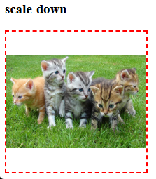

<div align="center">
    <h1> Images, Media and Form Layouts
</div>

Images and video are described as **replaced elements**. This means that CSS cannot affect the internal layout of these elements, only their position on the page amongst other elements.

Certain replaced elements, such as images and video, are also described as having **an aspect ratio**. This means that it has a size in both the horizontal (`x`) and vertical (`y`) dimensions and will be displayed using the intrinsic dimensions of the file by default.

# Content Images

By default, images want to show their true size. Images start as inline elements (they flow with text). **They sit on the texts baseline by default**, which often creates that annoying little gap at the bottom. This gap, while seemingly arbitrary, is actually a result of how browsers handle inline elements and text baseline alignment.

When an image is placed in an HTML document using the `` tag, browsers apply certain default styles and behaviours.

- **Intrinsic Dimensions** - The images natural width and height (intrinsic size) are determined by its file properties.
- **Default Display Mode** -  Images are inline elements by default (`display: inline`). This means they behave like text characters and align with surrounding inline content.
- **Intrinsic Aspect Ratio Preservation** - Unless explicitly overridden, **the browser scales images proportionally** to maintain aspect ratio. Images maintain aspect ratio when **only width OR height** is specified. Images potentially distort when both width and height are specified.
- **No Scaling Unless Defined** - If no width or height is specified, the image is displayed at its natural size.
- **Container Influence** - The image does not expand to fill its container unless `width: 100%` or other CSS properties applied. Without constraints, they'll overflow their containing blocks
- **Alignment** - Images align with the text baseline by default.
- **Images Are Not Responsive by Default** - Without CSS, an image does not resize when the viewport changes.

<div align="center">
    
</div>

All inline elements, including images, sit on an invisible line called the baseline. The baseline accomodates descending letters such as `g`, `j`, and `p`. The space below the baseline is reserved for these descenders.

<div align="center">
    
</div>


Images, being inline elements will respect this space. To deal with the unwanted space beneath the image, their are multiple approaches some of the most common solutions are,

#### The Display Block Approach

```CSS
img {
    display: block;
}
```

This works because,

1. Block elements create their own formatting context.
2. They no longer participate in inline layout.
3. They ignore baseline alignment completely.

#### The Vertical Alignment Method

```CSS
img {
    vertical-align: middle; /* or top, bottom */
}
```

This works because,

1. It explicitly changes the images relationship to the baseline.
2. Middle alignment centers the image relative to the surrounding text.
3. It maintains inline behaviour while eliminating gaps.

#### The Line Height Solution

```CSS
.container {
    line-height: 0;
}
```

This works because,

1. It removes the space allocated for text descenders.
2. It eliminates vertical spacing between lines.
3. It affects all content within the container.

#### Best Practice Solution

For most applications, a combination of properties provides the most robust solution.

```CSS
img {
    display: block;         /* Removes baseline alignment */
    max-width: 100%;        /* Ensures responsiveness */
    height: auto;           /* Maintains aspect ratio */
}
```

This approach,

1. Eliminates the baseline gap.
2. Ensures responsive behaviour.
3. Preserves image proportions.
4. Works across different contexts.


# Understanding and Utilizing `object-fit`

`object-fit` defines how the content of an element (like an image) should scale or fit **within its container**. It’s typically used on elements with defined `width` and `height` (Not including `auto`). Because `object-fit` is a property, it's used as, 

```CSS
img {
    object-fit: value;
}
```

With the possible `value`s being,

- `fill` - **This is the default**. Stretches the image to fill the dimensions exactly, **ignoring aspect ratio**.
- `contain` - Scales the image to fit entire within the box, while **maintaining aspect ratio**. This may leave empty space.
- `cover` - Scales the image to fill the entire box **while maintaining aspect ratio**. This may crop the image.
- `none` - Shows the image at its original size, potentially overflowing the container. **Centers it by default**.
- `scale-down`- Uses either `none` or `contain`, whichever would result in a smaller image size.

By default, an `` element follows its natural dimensions and `object-fit` is not applied. The requirements for `object-fit` to work are,

1. The image element much have both `width` and `height` set. If you set `width` or `height` to `auto`, the image will keep its natural aspect ratio, so `object-fit` won't apply.
2. These dimensions should be relative to the container, using `%` or have small pixel values if you want the image to fit inside.
3. The container should have defined dimensions.
4. If you explicitly set both `width` and `height`, the image behaves like `object: fill`, by stretching it.

```CSS
img {
    width: 150px;      /* Smaller than container */
    height: 150px;
    object-fit: fill;  /* Only affects content within 150x150 box */
}
```

For this reason, if the `` is within a container, `width: 100%` and `height: 100%` are frequently used.

#### Default Behaviour - No `object-fit`

Before applying `object-fit`, let's look at an image inside a **fixed-sized container** without any styling. Allow examples below will be placing a `200 x 200` image within a `300 x 200` container.


<div align="center">
    
</div>

The default behaviour is to display the image **at its natural size**. Because our image is `300 x 200`, we can observe that is goes beyond our `200 x 200` container by `100px`.

```html
<h3> Normal </h3>
<div class="container">
    
</div>
```

```css
.container {
    width: 200px;
    height: 200px;
    border: 2px dashed red;
}
```

#### Behaviour - `object-fit: fill`

All `object-fit` examples require the following changes,

```CSS
img {
    width: 100%;
    height: 100%
}
```

<div align="center">
    
</div>


The `fill` value stretches or compresses the image **to exactly fill its container**, regardless of the original aspect ratio. In this case, our `300 x 200` image is being forced into a `200 x 200` square, which means, 

- The width is compressed from `300px` to `200px`.
- The height is stretched from `200px` to `200px`.
- The original `3:2` aspect ratio is lost.
- No part of the image is cropped or hidden.
- No empty space is left is the container.

This is best used when aspect ratio preservation isn't important, such as with abstract patterns or backgrounds.

<div align="center">
    
</div>

#### Behaviour - `object-fit: contain`

<div align="center">
    
</div>

The `contain` value ensures the **entire image is visible while maintaining its aspect ratio**. For our `300 x 200` image in a `200 x 200` container,

- The image is scaled down proportionally until it fits entirely within the container.
- The width becomes `200px`, which is the container width.
- The height automatically becomes `133px` to maintain the `3:2` aspect ratio.
- Creates `33.5px` of empty space above and below the image
- The entire image is visible with no cropping.

This is ideal for,

- Product images where showing the entire item is crucial.
- Logos or icons that must be completely visible.
- Situations where preserving the entire image content is more important than filling the container.

<div align="center">
    
</div>

#### Behaviour - `object-fit: cover`

<div align="center">
    
</div>

The `cover` value **scales the image to fill the entire container while maintaining aspect ratio**. By defaulting, the cropping is applied equally on both sides.

With our `300 x 200` image in a `200 x 200` container,

- The image is scaled to ensure no empty space, this means it maintains a height of `200px`.
- The width becomes `300px` to maintain the `3:2` aspect ratio.
- `50px` is cropped from each side to fit the `200px` container. This is between `100px` is the total amount beyond the container, meaning `50px` on each side.
- The center of the image remains visible
- No stretching or compression occurs.

This is perfect for,

- Hero images or banner backgrounds.
- Thumbnail images where filling the space is more important than showing the entire image.
- Photo galleries where consistent sizing is needed.

<div align="center">
    
</div>

#### Behaviour - `object-fit: none`

<div align="center">
    
</div>

The `none` value displays the image at its original size, **ignoring the container dimensions completely**. The our `300 x 200` image in a `200 x 200` container.

- The image maintains its original `300 x 200` dimensions.
- The image overflows the container horizontally by `100px` (`50px` each side).
- No scaling or resizing occurs at all.
- The overflow is clipped by container boundaries.
- The image is centered by default. This can be adjusted with object-position.

This is useful for,

- Situations where maintaining exact image dimensions is crucial.
- Creating intentionial cropping effects.
- When you want to show a specific portion of a larger image.

<div align="center">
    
</div>

#### Behaviour - `object-fit: scale-down`

<div align="center">
    
</div>


The `scale-down` value compares the results of `none` and `contain`, then **uses whichever makes the image smaller**. For our `300 x 200` image in a `200 x 200` container.

- `none` would display at `300 x 200`. The original size.
- `contain` would display at `200 x 133` - Scaled down.
- Since `contain` results in a smaller 

<div align="center">
    
</div>
