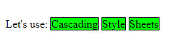

<div align="center">
  <h1> CSS Introduction </h1>
</div>

Using CSS, you can control exactly how HTML elements look in the browser, presenting your documents to your users with with whatever design and layout you like.

A document is usually a text file structured using a markup language - HTML is the most common markup language, but you may also come across other markup languages such as SVG or XML. Here, markup refers to the annotations or tags embedded in a document that describe or provide instructions for its display or behaviour.

Presenting a document to a user means converting it into a form usable by your audience. Browsers, like Firefox, Chrome or Edge are designed to present documents visually, for example, on a computer screen or a projector.

CSS can be used for text styling,

 1. Changing the colour and size of heading and links.
 2. Turning a single column of text into a layout with a main content area and a sidebar for related information.
 3. It can even be used for effects such as animation.

<div align="center">
  <h1> Basic Syntax </h1>
</div>

CSS **is a rule-based language** - you define the rules by specifying groups of styles that should be applied to particular elements or groups of elements on your web page.

For example, you can decide to style the main heading on your page as large red text. The following code shows a very simple CSS rule that would achieve this.

```CSS
h1 {
  color: red;
  font-size: 5em;
}
```

In the above example, the CSS rule **opens with a selector**. This *selects* the HTML element that we are going to style. In this case, we are styling level one headings (`<h1`>).

We then have a set of curly braces - `{ }`. The braces contain one or more **declarations**, which take the form of **property and value pairs**. We specify the property before the colon and we specify the value of the property after the colon.

A CSS stylesheet contains many such rules, written one after the other.

```CSS
h1 {
  color: red;
  font-size: 5em;
}

p {
  color: black;
}
```

You will find that you quickly learn some values, whereas others you will need to look up. The individual property pages on MDN gives you a quick wayu to look up properties and their values. For example, you can type `mdn colour` to easily find the potential `colour` values.

<div align="center">
  <h1> How is CSS applied to HTML </h1>
</div>

When a browser displays a document, it must combine the documents content with its style information. It processes the document in a number of stages. A brief overview is shown below but bear in mind that this is a very simplified version of what happens when a browser loads a webpage, and that different browsers will handle the process in different ways.

1. The browser loads the HTML.
2. It converts the HTML **into a tree-like structure called a DOM** (Document Object Model) tree. The DOM represents the document in the computers memory.
3. The browser then fetches most of the resources that are linked to by the HTML document, such as embedded images, videos and CSS! JavaScript is handled a bit later on in the process.
4. The browser parses the fetched CSS and sorts the different rules into different "buckets" based on which HTML elements (represented in the DOM as nodes) they will be applied to. The browser then attaches styles to different elements as required (this intermediate step is called a **render tree**).
5. The render tree is laid out in the structure is should appear in after the rules applied.
6. The visual display of the page is shown on the screen. This stage is called painting.


<div align="center">
  <h1> DOM </h1>
</div>

The DOM has a tree-like structure has a tree-like structure. Each element, attribute and piece of text in the markup language becomes a DOM node in the tree structure. The nodes are defined by their relationship to other DOM nodes. Some elements are parents of child nodes and child nodes have siblings.

Understanding the DOM will help you design. debug and maintain your CSS because the DOM is where your CSS and the documents meet up.

Take the following HTML code.

```HTML
<p>
  Let's use:
  <span>Cascading</span>
  <span>Style</span>
  <span>Sheets</span>
</p>
```

The browser parses the HTML and creates a DOM from it, which looks like this.

```
P
├─ "Let's use:"
├─ SPAN
|  └─ "Cascading"
├─ SPAN
|  └─ "Style"
└─ SPAN
    └─ "Sheets"
```

In the DOM, the node corresponding to our `<p>` element is a parent. Its children are a text node and the three nodes corresponding to our `<span>` elements. The `SPAN` nodes are also parents, with text nodes as their children. When the browser renders above the DOM, it will look like this,

```
Let's use: Cascading Style Sheets
```

Now, let's modify this to apply some CSS to our docment.


```CSS
span {
  border: 1px solid black;
  background-color: lime;
}
```

In this case, the browser will first create a DOM tree, as in the previous section,. Next, it parses the CSS. Since the only rule available in the CSS has a `span` selector, the browser sorts the CSS very quickly. It applies that rule to each one of the three `span` elementsd, then paints the final visual representation to the screen.



In a more complete example it would appear as,

```HTML
<!DOCTYPE html>
<html>
  <head>
    <title>Example</title>
  </head>
  <body>
    <h1>Hello World</h1>
    <p>This is a paragraph.</p>
  </body>
</html>
```

With the DOM tree as,

```
Document (Root)
└── html
    ├── head
    │   └── title
    │       └── "Example"
    └── body
        ├── h1
        │   └── "Hello World"
        └── p
            └── "This is a paragraph."
```

<div align="center">
  <h1> CSSOM (CSS Object Model) </h1>
</div>

The CSSOM is a tree-like structure created by the browser when it parses your CSS. It represents how styles are applied to DOM elements.

- Includes computed styles for each element (inherited styles, specificity)
- Styles are cascading, so the browser resolves conflicts. For example, `body { color : red; }` and `p { color: blue; }`.
- The CSSOM is render-blocking. The browsers waits for all CSS to load before rendering.

```CSS
body { font-size: 16px; }
h1 { color: red; }
p { display: none; }
```

Will give us,

```
body
├── font-size: 16px
├── h1
│   └── color: red
└── p
    └── display: none
``` 

<div align="center">
  <h1> Render Tree </h1>
</div>

The Render Tree is a combination of the DOM and CSSOM. It contains **only the visible elements** that will be rendered on the screen and is a representation of everything that is currently visible on screen. It contains both the content and the styles.

- Excludes elements hidden with CSS (e.g., `display: none`). This will also include the `<head>` tag.
- Combines the DOM (structure) and CSSOM (styles).
- Used to calculate the layout (position/size of elements) and paint pixels to screen.

Here is a Render Tree for the previous example,

```
Render Tree
└── html
    └── body [font-size: 16px]
        └── h1 [color: red, font-size: 2em (32px)]
```

- The `<p>` element is excluded because `display: none` hides it from the Render Tree.
- `<h1>` uses the browsers default `font-size: 2em` (32px, since `<body>` is 16px).
- `color: red` from CSS is applied to `<h1>`.

To create a Render Tree you do the following,

1. Start at the root of the DOM tree and check if there is any CSS rules by inspecting the CSSOM.
2. If the CSSOM correctly displays this element, copy the node into the Render Tree alongside its CSS properties.
3. Walk down the children of the previous node from the DOM. If it is  text, immediately copy it to the Render Tree. Otherwise, inspect the CSSOM again. When analyzing the CSSOM, if it contains `display: none`, do not copy over to Render Tree and skip its children as `display: none` cascades down.
4. Repeat until the Render Tree until all reachable elements from the DOM are inspects and copied to the Render Tree with the CSS styles.

```
DOM Tree                  CSSOM Tree               Render Tree
─────────                ───────────              ────────────
Includes ALL elements    Maps styles to elements  Only VISIBLE elements
- <html>                 - body { font-size }     - <html>
- <head>                 - h1 { color }           - <body>
- <body>                 - p { display: none }    - <h1> (styled)
- <h1>                                             
- <p>                   
```

<div align="center">
  <h1> Applying CSS </h1>
</div>

The very first thing we need to do is to tell the HTML document that we have some CSS rules we want it to use. There are three different ways to apply CSS to an HTML document that you'll come across,

1. External stylesheets
2. Internal stylesheets
3. Inline styles

#### External Stylesheets

An external stylesheet contains CSS in a separate file with a `.css` extension. This is the most common and useful method of bringing CSS to a document. You can link a single CSS file to multiple web pages, styling all of them with the same CSS stylesheet.

To link `styles.css` to `index.html` add the following line somewhere in `<head>` of the HTML document.

```HTML
<link rel="stylesheet" href="styles.css" />
```

This `<link>` element tells the browser that we have a stylesheet, using the `rel` attribute and the location of that stylesheet as the value of the `href` attribute. 

Save your HTML and CSS files and reload the page in the web browser. In the example above, the CSS file is in the same folder as the HTML document, but youi could place it anywhere else and adjust the path.

```HTML
<!-- In a subdirectory called styles in the current directory -->
<link rel="stylesheet" href="styles/style.css" />

<!-- In a subdirectory called general, which is in a subdirectory called styles, in the current directory -->
<link rel="stylesheet" href="styles/general/style.css" />

<!-- Go back one directory level, then in a subdirectory called styles -->
<link rel="stylesheet" href="../styles/style.css" />
```

#### Internal Stylesheets

Internal stylesheets are contained within `<style>` elements, which go inside the HTML `<head>`.

In your HTML document, add the following snippet anywhere between the `<head>` and `</head>` tags.

```HTML
<style>
  p {
    color: purple;
  }
</style>
```

For sites with more than one page, internal stylesheets are less efficient than external stylesheets. To apply uniform CSS styling to multiple pages using internal stylesheets, you must repeat the internal stylesheet across every web page. The efficiency penalty carries over to site maintenance too. With CSS internal stylesheets, there is the risk that even one simple styling changes may require edits to multiple web pages.

#### Inline Styles

Inline styles are CSS declarations that affects a single HTML element, contained within a `style` attribute.

```HTML
<span style="color: purple; font-weight: bold">span element</span>
```

Generally, **avoid using CSS in this way if possible**. It is considered bad practice. First, it is the least efficient implementation of CSS for maintenance. One styling change might require multiple edits within a single webpage. Second, inline CSS also mixes (CSS) presentational code with HTML and content, making everything more difficult to read and understand. Separating code and content makes maintenance easier for all who work on the website.
