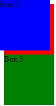
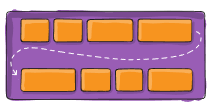
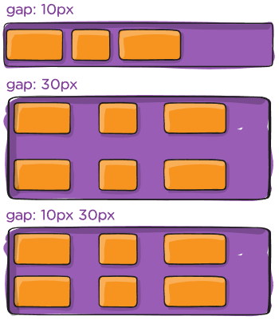

<div align="center">
  <h2> Default Layout </h2>
</div>

Each HTML element has an inherent display behavior that determines how it interacts with other elements. This behavior is primarily categorized into **block-level elements, inline elements, and inline-block elements.**

#### Block-Level Elements

Block-level elements **take up the full width available in their parent container and start on a new line by default.** These elements naturally expand to fill the entire width of their container unless a specific width is assigned.

Some common block-level elements include,

- `<div>` - A generic container used for structuring content
- `<p>` - Represents paragraphs and takes up the full width of the container.
- `<h1>` to `<h6>` - Headings that automatically break onto a new line.
- `<ul>` and `<ol>` - Lists that structure items vertically.

```HTML
<p>This is a paragraph.</p>
<p>This is another paragraph.</p>
```

Even though the text content is short, the second `<p>` element will appear on a new line because paragraphs are block-level elements.

Block elements can be modified using `width`, `margin`, `padding` and `display` properties.

```CSS
p {
  width: 50%;
  margin: 10px auto;
  background-color: lightgray;
}
```

#### Inline Elements

Unlike block elements, **inline elements only take up as much space as necessary and do not start on a new line.** They are typically used for styling portions of text within a block.

Some common inline elements include,

- `<span>` -  A generic inline container used for styling text.
- `<a>` - Links that stay within then flow of text.
- `<strong>` and `<em>` - Used for bold and italicized text.

```HTML
<p>This is an <span style="color: red;">inline span</span> inside a paragraph.</p>
```

The `span` element does not force a line break and takes up the space for its content, making it suitable for text styling.

Since inline elements do not allow modifications to width and height directly, developers often use `inline-block` to achieve more control.

```CSS
span {
  display: inline-block;
  width: 100px;
  height: 50px;
  background-color: lightblue;
}
```

This change allows the `<span>` element to behave like a block element while remaining inline with surrounding text.

#### Inline-Block Elements

Inline-block elements combine properties of both inline and block elements. They remain inline with other elements but allow modifications to `width`, `height`, `padding` and `margin` properties.

Some common inline-block elements are,

- `` - Images are inline-block by default.
- `<button>` - Buttons also behave like inline-block elements.

```HTML

<button> Click Me </button>
```
These elements align next to each other but can still have the `width` and `height` properties modified.

#### The `disply` Property

Although elements have default behaviours, CSS allows us to modify them using the `display` property.

- `block` - Makes an element behave like a block.
- `inline` - Makes an elememt behave like inline text.
- `inline-block` - Combines both behaviours.
- `none` - Hides the element from the document.

```CSS
div {
  display: inline;
}
```

This would make a `<div>` behave like an inline element instead of a block element.

<div align="center">
  <h2> Float </h2>
</div>

Introduced in early versions of CSS, `float` was originally designed to allow text to wrap around images, similar to how text flows around pictures in newspapers. Over time, developers started using it for creating multi-column layouts before newer layout methods like Flexbox and CSS Grid became popular. 

Today, while `float` still has valid use cases, **it is largely considered outdated for page layout**.

#### How Float Works

When an element is floated, **it is removed from the normal document flow** and shifted to the left or right of its container. Importantly, other content will flow around the floated element, creating a magazine-like layout effect. The property can take three primary values,

- `left` - Shifts the element to the left side of its container.

- `right` - Shifts the element to the right side of its container.

- `none` - Restores the element to its default position.

```HTML
<div class="container">
  
    <p> Hello World </p>
  
    
  
    <p> This text will wrap around the image, demonstrating how float allows content to flow dynamically around elements. </p>
  
    <br>
  
    <p> This text will wrap around the image, demonstrating how float allows content to flow dynamically around elements. </p>
</div>
```

```CSS
.float-left {
    float: left;
    margin-right: 15px;
}
```

<div align="center">
    
</div>

Despite its initial popularity, `float` has significant drawbacks.

1. **Layout Complexity** - Floated elements can cause unexpected layout behaviours.

2. **Clearing Issues** - Floats can "escape" their parent containers, leading to layout breaks.

3. **Non-Intuitive Behaviour** - Complex layouts become difficult to manage.

#### Modern Alternatives

With the evolution of CSS, several modern layout techniques have largely replaced `float`.

**Flexbox**

- It has more predictable and powerful layout system
- Easier alignment and distribution of space
- Better handling of responsive designs

**CSS Grid**

- Two-dimensional layout system
- Precise control over rows and columns
- Native support for complex, responsive layouts.

While modern techniques are preferred, `float` still has valid use cases.

- Simple text wrapping around images.
- Legacy browser support
- Basic side-by-side element positioning. 

<div align="center">
  <h2> Document Flow </h2>
</div>

It's important to understand the meaning of "document flow" when positioning elements. **Document flow** refers to the natural way elements are arranged on a webpage. When an element **is within document flow**, it takes up space and affects the positioning of other elements. If an element is removed from document flow, it no longer affects or interacts with the surrounding elements. It no longer takes up space **as if it wasn't there**, other elements do not adjust for it. **The two positioning types that remove it from document flow is `absolute` and `fixed`.**

```HTML
<div class="box1"> Box 1 </div>
<div class="box2"> Box 2 </div>
<div class="box3"> Box 3 </div>
```

```CSS
.box1 {
  width: 100px;
  height: 100px;
  background-color: red;
}

.box2 {
  width: 100px;
  height: 100px;
  background-color: blue;
}

.box3 {
  width: 100px;
  height: 100px;
  background-color: green;
}
```

In this example, we have three coloured boxes. By default, they'll stack vertically in order they appear in HTML because they're block elements. This vertical stacking happens because these elements are "in document flow". **Each element takes up space, and the next element flows naturally after it**.

<div align="center">
    
</div>

Elements can be taken "out of document flow" using CSS positioning properties such as `absolute` and `fixed`. If we were to apply this property on `.box2`,

```CSS
.box2 {
  width: 100px;
  height: 100px;
  background-color: blue;
  position: absolute;  /* Removes it from document flow */
  left: 0px;           /* Moves it to the right */
  top: 0px;            /* Moves it down */
}
```

Now,

- The red box is placed at the top normally.
- The blue box is **removed from document flow**. Meaning, it no longer influences the green box.
- The green box ignores the bluebox and moves up, appearing right below the red box.

<div align="center">
    
</div>

<div align="center">
  <h2> Positioning Layout </h2>
</div>

CSS provides several positioning methods that determine how elements are arranged relative to each other and their surroundings. These methods include `static`, `relative`, `absolute`, `fixed`, and `sticky` positioning. 

#### Static Positioning

```CSS
.element {
    position: static;
}
```

- The default positioning for all elements is `static`.
- Not positioned in any special way and it is always positioned according to the normal flow of the page.
- `top`, `right`, `bottom` and `left` properties have no effect.

#### Relative Positioning

`relative` was designed to let elements be shifted **slightly without affecting the layout**, which was essential for fine-tuning.

```CSS
.relative-element {
    position: relative;
    top: 10px;     /* Moves 10px down from its original position */
    left: 20px;    /* Moves 20px right from its original position */
}
```

- Element is positioned **relative to its normal position.**
- Does not affect the layout of surrounding elements when moved using `top`, `right`, `bottom` and `left`.
- The element will remain in document flow. Meaning it still takes up space **where it was originally placed.**

```HTML
<div class="container">
    <div class="box"> This is a relatively positioned box. </div>
</div>
```

```CSS
.container {
  background-color: red;
  width: 100px;
  height: 100px;
}

.box {
  position: relative;
  top: 100px;
  left: 100px;
  width: 100px;
  height: 100px;
  background-color: green;
}
```

In this particular example, we have created two boxes of equal size and displace the relatively positioned box of `top` and `left` to the same size of the `width` and `height` which results in it moving from its normal overlapping position to the corner of the red box.

<div align="center">
    
</div>

#### Absolute Positioning

`absolute` was created to give developers the ability to **remove an element from the normal flow** and position it freely. This behavior was needed for complex UI elements like modals, dropdowns, or fixed overlays.

```CSS
.container {
    position: relative;  /* Important for absolute child positioning */
}

.absolute-element {
    position: absolute;
    top: 50px;
    right: 100px;
}
```

- **Removed element from document flow**. Other elements behave as if the absolute element doesn't exist.
- Positioned relative **to the nearest positioned ancestor**. If no positioned ancestor exists, it positions relative to the initial containing block, usually the viewport.
- A "positioned" element is one whose position is anything except `static`.
- **You need to specify the coordinates in order for it to work**. That is, `top`, `right`, `bottom` and `left`.

```CSS
.container {
    position: relative;      /* Important for absolute child positioning */
    background-color: purple;
}

.pushed {
  background-color: red;
  width: 300px;
  height: 100px;
  margin-left: 200px;
}

.absolute-element {
    position: absolute;
    top: 30px;
    left: 10px;
    background-color: green;
}
```

```HTML
<div class="container">
  <div class="pushed">
    <div> Hello World </div>
    <div class="absolute-element"> This is a relatively positioned box. </div>
  </div>
</div>
```

In the example above we have a container with multiple child elements. The crucial component to understand here is that the `pushed` class has no positioning applied to it, i.e. it has `position: static`. Because of this the element with the `absolute-element` class will be positioned relative to the nearest position element, which is the element with the `container` class applied to it. For this reason, it will appear outside of the red rectangle because it's not position relatively relatively to its parent.

<div align="center">
    
</div>

#### Fixed Positioning

- Positioned **relative to the browser viewport.**
- Stays in the same place even when the page is scrolled.
- Useful for navigations, floating buttons.
- **Completely removed from document flow.**
- `top`, `right`, `bottom` and `left` will position it relative to the viewport.

```CSS
.fixed-box {
  position: fixed;
  top: 0px;
  right: 0px;
  width: 100px;
  height: 25px;
  background-color: red;
  color: white;
  text-align: center;
}
```

```HTML
<div class="fixed-box">Fixed Box</div>
```

The following will place a rectangle on the upper right corner of the viewport.

<div align="center">
    
</div>

#### Position Sticky

- Hybrid between `relative` and `fixed` positioning. The element behaves like `relative` positioning until the user scrolls to a specified point. Once it reaches a certain position, it becomes `fixed` in place. This means the `sticky` element is within document flow until it is "stuck" and then removed from document flow.
- Requires `top`, `bottom`, `left` or `right` for it to work.


<div align="center">
    
</div>

<div align="center">
  <h2> How Display and Position Work Together </h2>
</div>

CSS provides various tools to control the layout of elements on a webpage. Two fundamental properties that dictate how elements behave within a document are `display` and `position`. While each property serves a distinct purpose, their interaction can sometimes appear contradictory or confusing.

Every HTML element in a document is represented as a rectangular box. This CSS Box Model consists of content, padding, border and margin. How these boxes behave in relation to one another is determined largely by the `display` and `position` properties.

Recall that the `display` property serves two critical functions,

- **Outer Display Type** - Determines how the element participates in flow layout (`block` or `inline`).
- **Inner Display Type** - Defines how the elements children are laid out.

As a recap, `display: block` creates a block-level box that spans the full width of its container and creates a line breaks, while `display: inline` creates an inline box that flows with text. Beyond these basic types, we have more complex values like `flex` and `grid` that establish specialized formatting contexts for children.

When both `display` and `position` are applied to the same element, `position` **takes precedence in determining flow participation**, while `display` continues to **influence the internal formatting behaviour**. This hierarchy is key to understanding their seemingly contradictory interaction.

Let's example a more complex example that demonstrates how these properties affect not just the targeted elements but also their children.

```CSS
.container {
  position: relative;
  width: 600px;
  height: 400px;
  border: 3px solid black;
  margin: 20px;
  background-color: #f8f8f8;
}

.normal-block {
  display: block;
  width: 80%;
  background-color: lightblue;
  border: 2px solid blue;
}

.absolute-block {
  display: block;
  position: absolute;
  top: 125px;
  left: 100px;
  width: 200px;
  background-color: lightgreen;
  border: 2px solid green;
  padding: 15px;
}

.flex-container {
  display: flex;
  justify-content: space-between;
  margin-top: 350px;
  background-color: #eaeaea;
  padding: 15px;
  border: 2px dashed gray;
}

.flex-item {
  width: 120px;
  height: 80px;
  background-color: lightcoral;
  border: 2px solid red;
  padding: 10px;
  display: flex;
  align-items: center;
  justify-content: center;
}

.absolute-flex-item {
  position: absolute;
  top: 280px;
  left: 250px;
  background-color: lightgoldenrodyellow;
  border-color: goldenrod;
}

.child {
  background-color: rgba(255, 255, 255, 0.7);
  border: 1px dotted #333;
  padding: 5px;
  margin: 5px 0;
  display: block;
}

.nested-block {
  margin-top: 10px;
  padding: 8px;
  background-color: rgba(0, 0, 0, 0.1);
  border: 1px solid rgba(0, 0, 0, 0.3);
}
```

```HTML
<div class="container">
  <div class="normal-block">
    Block in normal flow
    <span class="child">Child in block</span>
  </div>
  
  <div class="absolute-block">
    Absolute block
    <span class="child">Child in absolute block</span>
    <div class="nested-block">Nested block</div>
  </div>
  
  <div class="flex-container">
    Flex container
    <div class="flex-item">Flex item 1</div>
    <div class="flex-item absolute-flex-item">
      Absolute flex item
      <span class="child">Child in absolute flex item</span>
    </div>
    <div class="flex-item">Flex item 3</div>
  </div>
</div>
```

<div align="center">
    
</div>

Here we can observe many of the previously discussed interactions,

#### Normal Block and Its Child

Here, the `.normal-block` follows normal document flow as a block element. This means it will,

- Take up `80%` of the width of the container.
- It's child (The `<span>`) becomes a block due to `display: block` applied to it.
- The child remains within the normal flow of its parent

#### Absolute Block and Its Children

- The `.absolute-block` **is removed from normal flow**.
- It's positioned at `125px` from the top and `100px` from the left of the container.
- Despite being removed from document flow, **it maintains block formatting context internally.**
- Its children (The `<span>` and `<div>`) follow normal flow **within** the absolutely positioned parent.

#### Flex Container and Its Items

- The `.flex-container` establishes a flex formatting context.
- **Its child elements** are arranged according to flex layout rules.
- The normal flex items follow flex layout positioning.
- The `.absolute-flex-item` is removed from the flex layout flow due to `position: absolute`. Despite being removed from flex flow, the absolute flex items **maintains flex display characteristics internally.** Its child follow normal flow within the absolute flex item.

#### Containment Hierarchy Persists

Even when an element is removed from document flow with `position: absolute`, **it still acts as a containing block for its children**. The children follow normal flow **within** the positioned parent, not within the overall document. An absolutely positioned element that is a flex container still maintains its flex formatting context **for its children**, even though it no longer participates in the parents normal flow.

In summary, elements with `position: absolute` or `fixed` exhibit a dual nauture.

- **Externally**, they're removed from flow and positioned according to their offset properties.
- **Internally**, they maintain their display-based formatting context for their children.

Understanding these interactions has several practical applications in CSS layout.

- **Modal Dialogs and Tooltips** - `position: absolute` removes an element from flow, but that element can still contain a complex internal layout with Flexbox or Grid.

- **Dropdown Menus** - A dropdown can be absolutely positioned relative to its trigger, while its menu items follow normal flow within the dropdown.

- **Complex UI Components** - Components like carousels, tabbed interfaces and custom form controls often rely on this interplay between position and display.

<div align="center">
  <h1> Flexbox </h1>
</div>

Flexbox (Flexible Box Layout) is a one-dimensional layout model that provides **a more efficient way to arrange, align and distribute space among items in a container**, even when their size is unknown or dynamic. Unlike traditional CSS layouts, Flexbox operates on a "flex formatting context" that introduces a special relationship between containers and their children.

Since Flexbox is a whole module and not a single property, it involves a lot of things including its whole set of properties. Some are meant to be set on the container (Parent element, known as "flex container") whereas the others are meant to be set on the children (Known as "flex items")

If "regular" layout is based on block and inline flow directions, the flex layout is based on "flex flow directions".

<div align="center">
  
</div>

Items will be laid out following either the main axis or the cross axis. 

The **main axis** of a flex container is the primary axis along **which flex items are laid out**. This is not necessarily horizontal, it depends on the `flex-direction` property. The **cross axis** is perpendicular to the main axis, this axis depends on the main axis direction.

# The Two-Actor System

Flexbox works as a two-actor system. This parent-child relationship is fundamental to understanding how Flexbox works.

- **Flex Container** - The parent element that establishes the flex formating context.

<div align="center">
  
</div>

- **Flex Items** - The direct children of the flex container.

<div align="center">
  
</div>

When you apply `display: flex` or `display: inline-flex` to an element, several import things happen.

1. The element becomes a **flex container**.
2. A flex formatting context is established.
3. The containers **direct children become flex items**.
4. The container defines **two axes** - The main axis and cross axis.
5. The container gains control over the layout of its items.

```CSS
.container {
  display: flex; /* or inline-flex */
}
```

The difference between `flex` and `flex-inline` affects how the container itself behaves in relation to other elements.

- **flex** -  The container itself **behaves like a block-level element by default**. The children inside the container (flex items) becomes flexible and follow the rules of the flexbox layout.

- **inline-flex** - The container itself **behaves like an inline-element**. The children inside the container (flex items) becomes flexible and follow the rules of the flexbox layout. 

Additionally, a **flex item can also be a flex container**. This will create nested flex layouts.

```HTML
<div class="outer-container">
  <div class="inner-container">
    <div class="item">Item 1</div>
    <div class="item">Item 2</div>
  </div>
  <div class="item">Item 3</div>
</div>
```

```CSS
.outer-container {
  display: flex;
  flex-direction: column;
}

.inner-container {
  display: flex;
  flex-direction: row;
}
```

This will result in the following output. The key point to understand here is that `.inner-container` is both,

1. A flex item - In relation to `.outer-container`.
2. A flex container - In relation to its own children.
3. The child flex items **are implicit** and do not need to be applied from a class.

<div align="center">
  
</div>

While some properties are applied to the container, others are applied to the children. 

The following properties are applied to the **flex container**.

1. `display` - Defines an element **as a flex container**.

```CSS
.container {
  display: flex | inline-flex;
}
```

2. `flex-direction` - Establishes the **main axis**.

```CSS
.container {
  flex-direction: row | row-reverse | column | column-reverse;
}
```

3. `flex-wrap` - Controls whether the items can wrap.

```CSS
.container {
  flex-wrap: nowrap | wrap | wrap-reverse;
}
```

4. `justify-content` - Align items **along the main axis**.

```CSS
.container {
  flex-flow: row nowrap;
}
```

5. `align-items` - Align items **along the cross axis**.

```CSS
.container {
  align-items: flex-start | flex-end | center | baseline | stretch;
}
```

6. `align-content` - Distributes extra space **on the cross axis**. This only works with multiple lines.

```CSS
.container {
  align-content: flex-start | flex-end | center | space-between | space-around | stretch;
}
```

7. `gap`, `row-gap` and `column-gap` - Controls **spacing between flex items**.

```CSS
.container {
  gap: 10px;
  row-gap: 10px;
  column-gap: 20px;
}
```

The **direct children of a flex container are flex items**. This means the following properties can be applied to them.

1. `order` - Controls the **order of the item**.

```CSS
.item {
  order: 5; /* default is 0 */
}
```

2. `flex-grow` - Ability for an **item to grow**.

```CSS
.item {
  flex-grow: 2; /* default is 0 */
}
```

3. `flex-shrink` - Ability for an **item to shrink**.

```CSS
.item {
  flex-shrink: 1; /* default is 1 */
}
```

4. `flex-basis` - Default size of an item **before growing/shrinking**.

```CSS
.item {
  flex-basis: 200px; /* default is auto */
}
```

5. `flex` - Shorthand for `flex-grow`, `flex-shrink` and `flex-basis`.

```CSS
.item {
  flex: 0 1 auto; /* default */
}
```

6. `align-self` - **Overrides the containers** `align-items` for a specific items.

```CSS
.item {
  align-self: flex-start | flex-end | center | baseline | stretch;
}
```

This separation between container and item properties is key to understanding how to effectively use flexbox for layouts. The **container controls the overall layout behaviour**, while item properties allow for **fine-tuning individual elements within that layout**. A more comprehensive explanation are shown below.

#### Flex Direction and Axes

The `flex-direction` property **establishes the main axis**, which fundamentally affects how all other flex properties work. Flexbox is a single-direction layout concept. Think of flex items as primarily laying out either in horizontal rows or vertical columns.

```CSS
.container {
  flex-direction: row | row-reverse | column | column-reverse;
}
```

<div align="center">
  
</div>

- `row` - By setting the property to `row`, the **main axis will run horizontally**. The **cross axis is perpendicular** and it will therefore run vertically.
- `column` - By settings the property to `column`, the **main aixs will run vertically**. The cross axis is perpependicular and **it will therefore run horizontally**.

This will also,

1. Affect how `justify-content` and `align-items` work.
2. Changes which dimension `flex-basis` refers to.
3. Alters the behaviour of `flex-grow` and `flex-shrink`.

#### Flex Wrap - Multi-line Layouts

The `flex-wrap` property enables multi-line layouts, fundamentally changing how items are arranged.

```CSS
.container {
  flex-wrap: nowrap | wrap | wrap-reverse;
}
```

<div align="center">
  
</div>


- `nowrap` (Default) - All items will attempt to fit in a single line, potentailly shrinking.
- `wrap` - Items will wrap to additional lines if they don't fit. Each wrapped line **becomes its own flex line**. The `align-content` property controls spacing between these lines. Items within each line still follows the containers `justify-content`.
- `wrap-reverse` - Items wrap in the reverse direction.

Hence,

- `flex-direction` - Controls items within a line.
- `flex-wrap` - Controls how lines stack.
- `align-content` - Controls spacing between lines.

#### Justify Content - Main Axis Distribution

The `justify-content` property distributes space **along the main axis**.

```CSS
.container {
  justify-content: flex-start | flex-end | center | space-between | space-around | space-evenly;
}
```

<div align="center">
  
</div>

- `flex-start` (Default) - Items are packed toward the start of the flex-direction
- `flex-end` - Items are packed toward the end of the flex-direction
- `center` - Items are centered along the line
- `space-between` - Distributes all remaining space between items, **none is given at each end**.
- `space-around` - Each item gets equal space around it, **half the space at each end**.
- `space-evenly` - All spaces are equal, **including each end**.

#### Align Items and Align Content - Cross Axis Control

These two properties, control the alignment **on the cross axis**.

```CSS
.container {
  align-items: stretch | flex-start | flex-end | center | baseline;
  align-content: stretch | flex-start | flex-end | center | space-between | space-around | space-evenly;
}
```

`align-items` is used to align items **within a single line**.

<div align="center">
  
</div>

`align-content` aligns multiple lines within the container. **This only works with** `flex-wrap: wrap`.

<div align="center">
  
</div>

#### Flex Item - Self-Alignment

This allows the default alignment of the one specified by `align-items` to be **overridden for an individual flex item**. `align-self` controls how an individual flex item aligns **along the cross axis** of the flex container, overriding the containers `align-items` property.

```CSS
.item {
  align-self: auto | flex-start | flex-end | center | baseline | stretch;
}
```
#### Spacing Between Elements with Gap Properties

The gap properties in Flexbox provide elegant spacing control between items **without margin hacks or complex selectors**.

 - `gap` - A shorthand that sets **both row and column gaps**.

 ```CSS
 .container {
  display: flex;
  gap: 20px;        /* Equal gaps in all directions */
  gap: 20px 10px;   /* row-gap column-gap format */
}
```

- `row-gap` - Controls **vertical spacing** between wrapped rows.

```CSS
.container {
  display: flex;
  flex-wrap: wrap;
  row-gap: 20px;    /* 20px spacing between rows */
}
```

- `column-gap` - Controls **horizontal spacing** between items.

```CSS
.container {
  display: flex;
  column-gap: 10px; /* 10px spacing between columns */
}
```

<div align="center">
  
</div>


#### Flex Item - Order

By default, flex items **are laid out in the source order**. However, the order property controls the order in which they appear in the flex container. Items with the same order revert to source order.

```CSS
.item {
  order: 5; /* default is 0 */
}
```

<div align="center">
  
</div>

#### Flex Item - Grow and Shrink

This defines the ability for a flex item to grow if necessary. It accepts a unitless value that serves **as a proportion**. It dictates what amount of the available space inside the flex container the item should take up.

If all items have `flex-grow` set to 1, the remaining space in the contaier will be distributed equally to all children. If one of the children has a value of 2, that child **would take up twice as much** of the space as either one of the others.

```CSS
.item {
  flex-grow: 4; /* default 0. Negative numbers are invalid */
}
```

<div align="center">
  
</div>

The inverse of `flex-grow` is `flex-shrink`. Having a `flex-shrink` value of 2, means it will be half the size of the largest. It essentially determines how much an item will shrink relative to others.

#### Flex Item - Flex Basis

`flex-basis` **defines the initial size** of a flex item before growing or shrinking occurs, effectively establishing the "starting point" for flex items. `flex-basis` sets the initial main size of an item **along the main axis**. Hence,

- With

```CSS
.item {
  flex-basis: 200px; /* Sets initial width to 200px in row direction */
}
```

The default value is `auto`, this means that items will **size to their content**.

```CSS
.item {
  flex-basis: auto; /* Size based on content */
}
```
 When this property is set to `0` or `0px`, items **start with no size**, relying entirely on `flex-grow`.

 ```CSS
 .item {
  flex-basis: 0; /* Start with zero size */
  flex-grow: 1;  /* Grow to fill space */
}
```

- In `flex-direction: row` - `flex-basis` controls initial width.
- In `flex-direction: column` - `flex-basis` controls initial height.

#### Flex Item - Flex Shorthand

The `flex` property is shorthand for `flex-grow`, `flex-shrink` and `flex-basis`.

```CSS
.item {
  flex: [flex-grow] [flex-shrink] [flex-basis];
}
```

Common examples include,

##### `flex: 1` - Expands to `flex: 1 1 0%`

This means that,

- Item can grow - `flex-grow: 1`
- Item can shrink - `flex-shrink: 1`
- Item **starts from zero width/height** - `flex-basis: 0%`

The final result is that the item **takes up available space proportionally**.

##### `flex: auto` - Expands to `flex: 1 1 auto`

This means that,

- Item can grow and shrink
- Item **starts from its content size**

The final result is an item **that takes up available space but respects content size**.

##### `flex: none` - Expands to `flex: 0 0 auto`

This means that,

- Item cannot grow or shrink
- Item size is based on content

The final result is an item **that maintains exact size regardless of container**.

##### `flex: 0 auto` - Expands to `flex: 0 1 auto`

This means that,

- Item cannot grow
- Item can shrink if necessary

The final result is an item **that won't expand beyond content size but can shrink**.

#### The Flex Distribution Algorithm

Understanding exactly how `flex-grow`, `flex-shrink` and `flex-basis` work together can be analyzed through the following algorithm,

**1. Apply** `flex-basis`

Each item is initally laid out according to its `flex-basis`. If set to `auto`, the items size is based on its content.

**2. Calculate Free Space**

Determine if there is positive free (Container larger than items) or negative free space (Items overflowing container).

**3. Apply Growth or Shrinkage**

- If positive free space - Apply `flex-grow` proportionally.
- If negative free space - Apply `flex-shrink` proportionally.

**4. The Math Behind Growth**

Available space is distributed according to grow ratios. If item *A* has `flex-grow: 2` and item *B* has `flex-grow: 1`, item *A* gets twice as much extra space as item *B*.

**5. The Math Behind Shrinkage**

The `flex-shrink` value is multiplied by the items `flex-basis` to determine how much it shrinks. This means larger items tend to shrink more than smaller ones, even with equal `flex-shrink` values.


<div align="center">
  <h1> Grids </h1>
</div>

Before CSS Grid, we used methods like,

- **Floats** - Hacky and hard to maintain.
- **Tables** - Not flexible for modern layouts.
- **Flexbox** - Good, but limited to one direction based on `flex-direction`.

A grid is a collection of horizontal and vertical lines creating a pattern against which we can line up our design elements. They help us to create layouts in which our elements won't jump around or change width as we move from page to page, providing greater consistency. It provides precise control over the placement, alignment, and sizing of elements, making it an essential tool for modern web development.

A grid will typically have **columns, rows** and then gaps between each row and column. The gaps are commonly referred to as **gutters**.

<div align="center">
  
</div>

#### Defining a Grid

CSS Grid is like a spreadsheet, where you define rows and columns, then place items inside them. This is first done by declaring a container with `display: grid`.

```CSS
.grid-container {
  display: grid;
}
```

Once you apply `display: grid`, **all child elements become grid items**. In addition to `display: grid`, you need to specify `grid-template-columns` and `grid-template-rows`. This will define the columns and rows.

```CSS
.grid-container {
  display: grid;
  grid-template-rows: 100px 100px;
  grid-template-columns: 200px 200px 200px;
}
```

This will,

1. Create 3 columns, each `200px` wide.
2. Create 2 rows, each `100px` tall.

If you have 6 child elements, they automatically arrange themselves into a **3 x 2 grid**.

```HTML
<div class="grid-container">
  <div class="item">1</div>
  <div class="item">2</div>
  <div class="item">3</div>
  <div class="item">4</div>
  <div class="item">5</div>
  <div class="item">6</div>
</div>
```

```CSS
.grid-container {
  display: grid;
  grid-template-columns: 100px 100px 100px; /* Creates 3 columns, each 100px wide */
  grid-template-rows: 50px 50px;            /* Creates 2 rows, each 100px tall */
  gap: 10px;
}

.item {
  background-color: lightblue;
  padding: 10px;
  text-align: center;
}
```

<div align="center">
  
</div>

#### Grid Lines

When you use grid layout, **you will always have numbered lines**. The lines are numbered for columns and rows, and are **indexed from 1**. Below is an example with 3 columns and 2 rows. This **gives us 4 column lines and 3 row lines**.

<div align="center">
  
</div>

The diagram below illustrate the "lines", where the grey circles label the column lines from 1 to 4 and the black circles label the row lines from 1 to 3.

<div align="center">
  
</div>

As a basic example, we create a `3 x 3` grid. This gives us **4 lines** in each direction.

```CSS
.wrapper {
  display: grid;
  grid-template-columns: repeat(3, 1fr);
  grid-template-rows: repeat(3, 100px);
}
```

Inside our grid container, we include **four child elements**.

```HTML
<div class="wrapper">
  <div class="box1">One</div>
  <div class="box2">Two</div>
  <div class="box3">Three</div>
  <div class="box4">Four</div>
</div>
```

If we do not place these on to the grid in any way they **will lay out according to the auto-placement rules**, one item in each of the first four cells. You can inspect the grid with your browser developer tools to see how the grid defines columns and rows.

<div align="center">
  
</div>

We can use line-based placement to control where these items sit on the grid. We can use the `grid-column-start` and `grid-column-end` properties to make the first item start on the far left of the grid and span a single column. With `grid-row-start` and `grid-row-end`, we make the item start on the first row line at the top of the grid and span to the fourth row line.

```CSS
.box1 {
  grid-column-start: 1;
  grid-column-end: 2;
  grid-row-start: 1;
  grid-row-end: 4;
}
```

<div align="center">
  
</div>

As you position some items, **other items on the grid will continue to be laid out using the auto-placement rules**. A more detailed example can be the following,

```CSS
.box1 {
  grid-column-start: 1;
  grid-column-end: 2;
  grid-row-start: 1;
  grid-row-end: 4;
}

.box2 {
  grid-column-start: 3;
  grid-column-end: 4;
  grid-row-start: 1;
  grid-row-end: 3;
}

.box3 {
  grid-column-start: 2;
  grid-column-end: 3;
  grid-row-start: 1;
  grid-row-end: 2;
}

.box4 {
  grid-column-start: 2;
  grid-column-end: 4;
  grid-row-start: 3;
  grid-row-end: 4;
}
```

<div align="center">
  
</div>

Note that **you can leave cells empty if we wish**. One of the very nice things about grid layout is the ability to have white space in our designs without any hacks.

####  Row and Column Expansion Shorthand - `grid-column` and `grid-row`

By default, grid items **flow automatically** into the next available space. The previous example using `grid-column-start` and `grid-column-end` can also be written using a shorthand `grid-column`. This is defined using `grid-column` where it accepts the format `x / y`, **where `x` and `y` are grid line numbers**.

```CSS
.item {
  grid-column: 1 / 3; /* Spans from column line 1 to column line 3 */
  grid-row: 2 / 4;    /* Spans from row 2 to row 4 */
}
```

```CSS
.item {
  grid-column: 1 / span 2; /* Start at line 1 and span 2 column lines */
  grid-row: 2 / span 2;    /* Start at line 2 and span 2 row lines */
}
```

It's crucial to understand that `grid-column` and `grid-row` **reference the grid lines, not the actual columns**. 

#### Defining an Area Using - `grid-area`

We can take things a step further and define each area with a single property `grid-area`.

```CSS
.grid-item {
  grid-area: grid-row-start / grid-column-start / grid-row-end / grid-column-end
}
```

This means the previous example,

```CSS
.box1 {
  grid-column-start: 1;
  grid-column-end: 2;
  grid-row-start: 1;
  grid-row-end: 4;
}
```

could be equivalently written as,

```CSS
.box1 {
  grid-area: 1 / 1 / 4 / 2;
}
```

<div align="center">
  
</div>

#### Naming Grid Template Areas

Instead of relying on column and row numbers, you can **name areas** and place them inside a grid. First, we define the areas using `grid-template-areas` where the name is the name of the `grid-area` value defined later on. Here we define 3 `grid-area` values, `header`, `sidebar` and `main`.

```CSS
.grid-container {
  display: grid;
  grid-template-columns: 1fr 3fr;
  grid-template-rows: auto auto;
  grid-template-areas:
    "header header"
    "sidebar main";
}
```

Now, we create classes with these grid values to assign them to out HTML elements.

```CSS
.header {
  grid-area: header;
  background-color: red;
  padding-left: 20px;
}
.sidebar {
  grid-area: sidebar;
  background-color: blue;
  padding-left: 20px;
}
.main {
  grid-area: main;
  background-color: purple;
  padding-left: 20px;
}
```

```HTML
<div class="grid-container">
  <div class="header">Header</div>
  <div class="sidebar">Sidebar</div>
  <div class="main">Main Content</div>
</div>
```

<div align="center">
  
</div>

This means that the `header` item will take up 2 columns on the first row, while `sidebar` and `main` will each take 1 column width on the second row. This can be used to make layouts much easier to read and modify.


#### Using Flexible Units

Fixed widths (`px`) aren't great for responsive design. Instead we use `fr` (fractional unit).

```CSS
grid-template-columns: 1fr 2fr 1fr;
```

- The first column takes **1 part**.
- The second column takes **2 parts**, meaning, it is **twice as big**.
- The third column takes **1 part**.

#### Using `auto` - Based on Content

```CSS
grid-template-columns: auto auto auto;
```

Here, columns adjust their size **based on the content inside them**.

#### Using `repeat()` - Shorthand

When we have multiple columns with the same width, instead of writing

```CSS
grid-template-columns: 200px 200px 200px 200px;
```

We can instead use,

```CSS
grid-template-columns: repeat(4, 200px);
```

This will create **4 equal columns of 200px each**.

#### Spacing and Gaps

You can control the space between rows and columns using `gap`.

```HTML
<div class="grid-container">
  <div class="item">1</div>
  <div class="item">2</div>
  <div class="item">3</div>
  <div class="item">4</div>
</div>
```

```CSS
.grid-container {
  display: grid;
  grid-template-columns: 100px 100px;
  grid-template-rows: 50px 50px;
  gap: 100px;
}

.item {
  background-color: lightblue;
  padding: 10px;
  text-align: center;
}
```

The `gap` property controls the space between **rows and columns**. For individual control, `row-gap` or `column-gap` can be used.

<div align="center">
  
</div>

#### Aligning Items Inside the Grid

There are two levels of alignment,

1. Aligning **individual grid items.**
2. Aligning the **whole grid itself.**

##### Aligning Grid Items

- `justify-items` - Aligns items **horizontally** (`start`, `center`, `end`, `stretch`).

- `align-items` - Aligns items **vertically** (`start`, `center`, `end`, `stretch`)

```CSS
.grid-container {
  justify-items: center;
  align-items: center;
}
```

##### Aligning the Entire Grid

The align a grid we require a **grid to be smaller than its parent**.

- `justify-content` - Moves the **whole grid** horizontally. It controls how the entire grid is positioned inside its parent container. It does not change the positions of individual grid items inside their respective grid cells.

- `align-content` - Moves the **whole grid** vertically.

Below, we define a grid with `display: grid` on the container and set a `width` of `500px`, here we are specifying the **width of the grid container, not the grid itself!**

- **Grid Container Width** - The containers width is `500px`, meaning that it can hold grid itrems inside the `500px` space.

- **Grid Items** - The grid items inside the container are place based on the column definitions - `grid-template-columns`. The containers width is `500px`, but the grids structure is defined by the columns. With `repeat(3, 100px)`, the **total grid width from the columns** is `300px`.

The parents width is what defines the available space and the grid containers size is determined by its own content, such as the column definitions. Because the **grid is smaller than the container**, we can therefore use `justify-content` to horizontally center the grid. Additionally, we can use `align-content` to vertically center the grid because we have defined each column height to be `100px` but the grid container is `250px` in height.

```CSS
.grid-container {
  display: grid;
  grid-template-columns: repeat(3, 100px);
  width: 500px;     /* Sets the parent width */
  height: 250px;    /* Sets the parent height */
  border: 2px solid lightblue;
}

.item {
  background-color: lightcoral;
  text-align: center;
  padding: 10px;
  border: 1px solid black;
  height: 100px;    /* Sets the column height */
}
```

```HTML
<div class="grid-container">
  <div class="item">1</div>
  <div class="item">2</div>
  <div class="item">3</div>
</div>
```

```CSS
.grid-container {
  justify-content: center; /* Horizontally Center */
  align-items: center;     /* Vertically Center */
}
```

<div align="center">
  
</div>

#### Mobile Responsive Grids

When you define a Grid size such as `2 x 3` it will not automatically change dimensions to accomodate responsive design such as changing dimensions to `6 x 1` when displayed on smaller screens. To make it a mobile responsive we still need to use media queries and change the dimensions on a larger screen. Here, the default the size here `6 x 1`, but when the screen width is larger than `900px` the dimensions are changed to `2 x 3`.

It's important to note that **it's not a choice between Grid and Flexbox**, Grid items can become Flex items to **align its content**. In the below example, `display: flex` is used to align the text while the item itself is also a Grid item.

```HTML
<div class="grid-container">
  <div class="grid-item">1</div>
  <div class="grid-item">2</div>
  <div class="grid-item">3</div>
  <div class="grid-item">4</div>
  <div class="grid-item">5</div>
  <div class="grid-item">6</div>
</div>
```

```CSS
.grid-container {
  display: grid;
  grid-template-rows: repeat(6, 200px);
  grid-template-columns: repeat(1, 1fr);
  gap: 10px;
  max-width: 100%;
}

@media (min-width: 900px) { 
  .grid-container {
    grid-template-columns: repeat(3, 1fr);
    grid-template-rows: repeat(2, 200px);
  }
}

.grid-item {
  display: flex;
  align-items: center;
  justify-content: center;
  background-color: steelblue;
  color: white;
  font-size: 24px;
  font-weight: bold;
  border-radius: 8px;
}
```