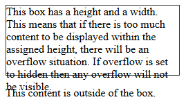
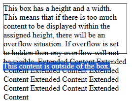
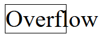
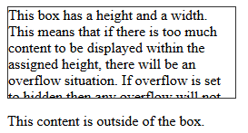
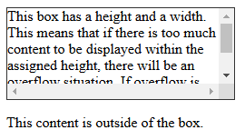
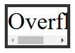

<div align="center">
    <h1> Overflow </h1>
</div>

Everything in CSS is a box. You can constrain the size of these boxes by assigning values such as `width` and `height`. **Overflow happens when there is too much content to fit in a box**. CSS provides various tools to manage overflow.

#### CSS Tries to Avoid "data loss"

The first example is a box that has been restricted by setting a `height`. Then we add content that exceeds the allocated space. The content overflows the box and falls into the paragraph below.

```HTML
<div class="box">
  This box has a height and a width. This means that if there is too much
  content to be displayed within the assigned height, there will be an overflow
  situation. If overflow is set to hidden then any overflow will not be visible.
</div>

<p>This content is outside of the box.</p>
```

```CSS
.box {
  border: 1px solid #333333;
  width: 250px;
  height: 100px;
}
```

<div align="center">
    
</div>

The content that overflows through **does not affect document flow**. Meaning, the `<p>` contents will not be lower.

<div align="center">
    
</div>

The second example is a word in a box. The box has been made too small for the word and it will therefore break out of the box.

```HTML
<div class="word"> Overflow </div>
```

```CSS
.word {
  border: 1px solid #333333;
  width: 100px;
  font-size: 250%;
}
```

<div align="center">
    
</div>

You might wonder why CSS works in such a messy way, displaying content outside of its intended container. Why not hide overflowing content? Why not scale the size of the container to fit all the content?

Whenever possible, **CSS does not hide content**. This would cause data loss. The problem with data loss is that you might not notice. Website visitors may not notice. If the submit button on a form disappears and no one can complete the form, this could be a big problem! Instead, CSS overflows in visible ways. You are more likely to see there is a problem. At worse, a site visitor will let you know that content is overlapping.

If you restrict a box with a `width` or a `height`, **CSS trusts you to know what you are doing**. CSS assumes that you are managing the potential for overflow. **In general, restricting the block dimension is problematic when the box contains text**. There may be more text than you expected when designing the site, or the text may be larger (For example, if the user has increased their font size).

# The Overflow Property

The `overflow` property helps you manage an elements content overflow. Using this property, you can convey to a browser how it should handle overflow content. The default value of the `<overflow>` value type is `visible`. With this default setting, one can see content when it overflows.

#### Hiding Overflowing Content

To hide content when it overflows, you can set `overflow: hidden`. This does exactly what it says, it hides overflow. Beware that this can make some content invisible. You should only do this if hiding content won't cause problems.

```HTML
<div class="box">
  This box has a height and a width. This means that if there is too much
  content to be displayed within the assigned height, there will be an overflow
  situation. If overflow is set to hidden then any overflow will not be visible.
</div>

<p>This content is outside of the box.</p>
```

```CSS
.box {
  border: 1px solid;
  width: 250px;
  height: 100px;
  overflow: hidden;
}
```

<div align="center">
    
</div>

#### Scrolling Overflowing Content

Instead, perhaps you would like to add scrollbars when content overflows? Using `overflow: scroll`, browsers with visible scrollbars will always display them - **even if there is not enough content to overflow**. This offers the advantage of keeping the layout consistent, instead of scrollbars appearing or disappearing, depending upon the amount of content in the container.

```HTML
<div class="box">
  This box has a height and a width. This means that if there is too much
  content to be displayed within the assigned height, there will be an overflow
  situation. If overflow is set to hidden then any overflow will not be visible.
</div>

<p>This content is outside of the box.</p>
```

```CSS
.box {
  border: 1px solid #333333;
  width: 250px;
  height: 100px;
  overflow: scroll;
}
```

<div align="center">
    
</div>

In the example above, we only need to scroll on the `y` axis, but however we get scrollbars in both axes. To just scroll on the `y` axis, you could use `overflow-y` property, setting `overflow-y: scroll`.

You can also enable scrolling along the x-axis using `overflow-x`, although this is **not the recommended way to accomodate long words!**. If you have a long word in a small box, consider using the `word-break` or `overflow-wrap` property.

```HTML
<div class="word">Overflow</div>
```

```CSS
.word {
  border: 5px solid;
  width: 100px;
  font-size: 250%;
  overflow-x: scroll;
}
```

<div align="center">
    
</div>

#### Only Displaying Scrollbars When Needed

If you only want scrollbars to appear when there is more content than can fit the box, use `overflow: auto`. This allows the browser to determine if it should display scrollbars.

#### Unwanted Overflow in Web Design

Modern layout methods manage overflow. They largely work without assumptions or dependencies for how much content there will be on a web page.

This was not always the norm. In the past, some sites were built with fixed-height containers to align box bottoms. These boxes may otherwise have had no relationship to each other. This was fragile. If you encounter a box where content is overlaying other content on the page in legacy applications, you will recognize that this happens with overflow. Ideally, you will refactor the layout to not rely on fixed-height containers.

When developing a site, **always keep overflow in mind**. Test designs with large and small amounts of content. **Increase and decrease font sizes by at least two increments**. Ensure your CSS is robust. Changing overflow values to hide content or to add scollbars is reversed for a few select use cases.
