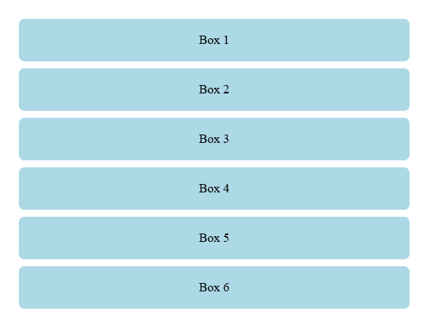
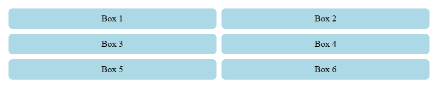
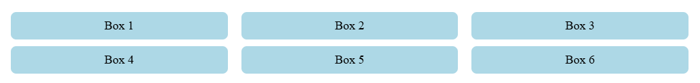
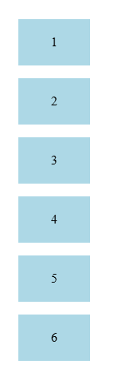
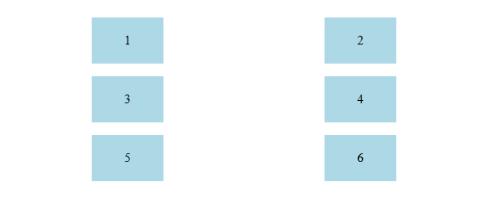
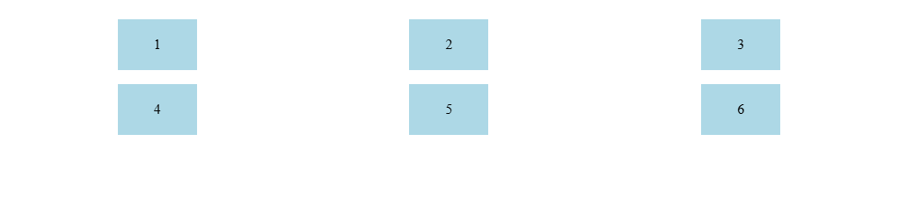
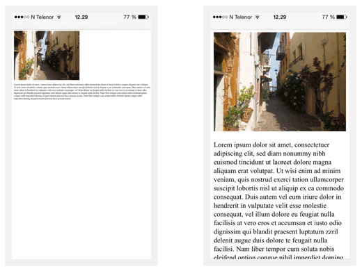

<div align="center">
  <h1> Responsive Design </h1>
</div>

#### Early Challenges in Web Design

Before responsive web design became a standard, websites were typically designed with fixed layouts. Developers would specify widths in pixels, leading to rigid designs that didn't adapt well to different screen sizes. This worked fine when desktops were the primary way to access the web, but as mobile devices gained popularity, this approach quickly became a problem.

##### Common Problems in Early Web Design

1. **Non-Scalable Layouts** - Websites designed for a single screen width would break or require excessive horizontal scrolling on smaller devices.

2. **Mobile Subdomains (`m.example.com`)** - Some sites created separate mobile versions, which increased maintenance effort and caused inconsistencies between mobile and desktop versions.

3. **Performance issues** - Sites built for desktops often loaded large images and scripts that were unnecessary on mobile devices, slowing down page load times.

4. **Device Fragmentation** - As more screen sizes emerged (tablets, different mobile resolutions, smart TVs), managing multiple versions of a website became impractical.

<div align="center">
  <h2> The Birth of Responsive Web Design</h2>
</div>

With the explosion of mobile devices, developers needed a way to adapt websites to different screen sizes. The introduction of CSS media queries enabled developers to define styles based on device width.

```CSS
body {
    background-color: blue;
}

@media (max-width: 768px) {
    body {
        background-color: red;
    }
}
```

This simple rule changes the background colour when the screen width is `768px` or smaller, demonstrating how styles can dynamically adjust. Alnernatively `min-width` could be used,

```CSS
body {
    background-color: red;
}

@media (min-width: 768px) {
    body {
        background-color: blue;
    }
}
```

In 2010, Ethan Marcotte introduced the concept of **Responsive Web Design (RWD)** in an article on A List Apart. He proposed a method where a single website could adapt to different screen sizes using,

- **Fluid Grid Layouts**
- **Flexible Images**
- **CSS Media Queries**

This revolutionized web development by eliminating the need for multiple versions of the same website and allowing layouts to dynamically adjust to any screen size

<div align="center">
  <h2> Modern Solutions for Responsive Web Design </h2>
</div>

Flexbox and CSS Grid are now the most common ways to create responsive layouts without relying on floats or inline-block elements.

<div align="center">
  <h3> Mobile-First Approach </h3>
</div>

Instead of designing for desktop first, **modern web development prioritizes mobile screens** and progressively enhances for larger devices.

Because CSS Cascade rules says that the last defined rule will be the one used, we first define the mobile CSS and then progressively define `min-width` for each breakpoint where we change the rules.

```CSS
.button {
  padding: 10px 15px;
  font-size: 14px;
}

@media (min-width: 768px) {
  .button {
    padding: 15px 20px;
    font-size: 16px;
  }
}
```

Tailwind CSS can provide nice classes for these where the equivalent of above is,

```HTML
<button class="p-2 text-sm md:p-4 md:text-base">Click Me</button>
```

The Tailwind CSS source code will set the class `md:p-4` and `md:text-base` compile to,

```CSS
@media (min-width: 768px) {
  .md\:p-4 {
    padding: 1rem; /* 16px */
  }
}

@media (min-width: 768px) {
  .md\:text-base {
    font-size: 1rem; /* 16px */
    line-height: 1.5rem; /* 24px */
  }
}
```

<div align="center">
  <h3> Responsive Flexbox </h3>
</div>

By default, when we set

```CSS
.container {
    display: flex;
    flex-wrap: wrap;
}
```

- `display: flex` makes **the container** a flex container and its child elements (`.box`) become flex items.

- The default value of `flex-direction` is `row`, meaning **items will be placed in a row from left to right**.

- Because of `flex-wrap: wrap`, when items **run out of space on a row**, they automatically move to the next row.

```HTML
<div class="container">
    <div class="box">Box 1</div>
    <div class="box">Box 2</div>
    <div class="box">Box 3</div>
    <div class="box">Box 4</div>
    <div class="box">Box 5</div>
    <div class="box">Box 6</div>
</div>
```

```CSS
.container {
  display: flex;
  flex-wrap: wrap;
  justify-content: space-between;
  gap: 10px;     /* Adds spacing between boxes */
  padding: 20px;
}

.box {
  width: 100%;
  background-color: lightblue;
  padding: 10px;
  text-align: center;
  font-size: 18px;
  border-radius: 8px;
}

@media (min-width: 768px) {
  .box {
    width: 47%; /* Two items per row on tablets */
  }
}

@media (min-width: 1024px) {
  .box {
    width: 30%; /* Three items per row on desktops */
  }
}
```

#### Mobile View - `< 768px`

Since `.box` is `100%` wide, each box takes up a full row. This means that all six boxes will stack vertically, one per row. 

<div align="center">
    
</div>

#### Tablet View - `min-width: 768px`

When we have a width that is between `768px` and `1023px` we will meet the condition to apply,

```CSS
@media (min-width: 768px) {
    .box {
        width: 45%;
    }
}
```

- Each box now takes up `45%` of the container width. The width is set to `45%`. This now leaves `10%` of the width to be set for the `gap`, `padding`, `margin`, etc...
- Because **two boxes** can fit in a single row before exceeding `100%`, the layout **will have two columns per row**.
- Because of `flex-wrap: wrap`, the remaining items wrap onto the next row.


We need to expand further than `768px` to account for additional `padding`, `gap`, ... to finally allow for two items to fit in a column. This is where `box-sizing: border-box;` can be useful to get it exactly to resize on `768px`.

<div align="center">
  
</div>

#### Desktop View - `min-width: 1024px`


When we reach `1024px` width, the following will apply,

```CSS
@media (min-width: 1024px) {
    .box {
        width: 30%;
    }
}
```

- Each box now takes up `30%` of the container width.
- Here we set each box to `30%`, occupying `90%` of the width and therefore allowing `10%` to accomodate for `padding`, `gap` and `margin`.
- Any remaining items will wrap to the next row.

<div align="center">
  
</div>

<div align="center">
  <h3> Responsive CSS Grid </h3>
</div>

Creating a responsive CSS Grid involves defining grid layouts that adjust based on screen size **using CSS media queries**.

First start by defining the grid container,

```HTML
<div class="grid-container">
  <div class="grid-item">1</div>
  <div class="grid-item">2</div>
  <div class="grid-item">3</div>
  <div class="grid-item">4</div>
  <div class="grid-item">5</div>
  <div class="grid-item">6</div>
</div>
```

```CSS
.grid-container {
  display: grid;
  gap: 1rem; /* Spacing between grid items */
  padding: 1rem;
  justify-items: center; /* Centers the item inside its grid cell */
}

.grid-item {
  text-align: center;
  background-color: lightblue;
  padding: 20px;
  width: 50px;
}
```

#### Mobile-First Approach

By default, you can have a **single-column** layout for small screens.

```CSS
.grid-container {
  grid-template-columns: 1fr; /* One column on mobile */
}
```

<div align="center">
  
</div>

#### Table Layout - `min-width: 600px`

At `600px` and above, adjust the grid to **two columns**. This is done by extending the CSS to also include.

```CSS
.grid-container {
  grid-template-columns: 1fr; /* One column on mobile */
}

@media (min-width: 600px) {
  .grid-container {
    grid-template-columns: repeat(2, 1fr); /* Two columns */
  }
}
```

<div align="center">
  
</div>


#### Desktop Layout - `min-width: 1024px`

For wider screens, increease to **three or more columns** by extending the CSS to handle widths of size 1024 and greater.

```CSS
.grid-container {
  grid-template-columns: 1fr; /* One column on mobile */
}

@media (min-width: 600px) {
  .grid-container {
    grid-template-columns: repeat(2, 1fr); /* Two columns */
  }
}

@media (min-width: 1024px) {
  .grid-container {
    grid-template-columns: repeat(3, 1fr); /* Three columns */
  }
}
```

<div align="center">
  
</div>

#### Auto-Fitting Columns - `minmax()`

<div align="center">
  <h3> Viewport Meta Tag </h3>
</div>

The viewport meta tag is crucial for making websites responsive. By default, **mobile browsers render web pages at a fixed width**, which makes them appear zoomed out. This tag tells the browser to **match the width of the device screen and scale content accordingly**.

```HTML
<meta name="viewport" content="width=device-width, initial-scale=1">
```

The viewport is the users visible area of a web page. The viewport varies with the device and will be smaller on a mobile phone than on a computer screen.

Before tablets and mobile phones, web pages were designed only for computer screens and it was common for web pages to have a static design and a fixed size.

Then, we started surfing the internet using tablets and mobile phones, fixed size web pages were too large to fit the viewport. To fix this, browsers on those devices **scaled down the entire web page** to fit the screen. This was not perfect, but a quick fix.

The `width=device-width` part sets **the width of the page to follow the screen-width of the device**, which will vary depending on the device.

The `initial-scale=1.0` part sets the initial zoom level when the page is first loaded by the browser.


Below is a comparison wh
ere the left website has no viewport meta tag and it will therefore zoom out to display the entire website. The website on the right has this viewport meta tag set.

<div align="center">
  
</div>

<div align="center">
  <h3> Responsive Images </h3>
</div>

Instead of loading large images on mobile devices, modern solutions use the `srcset` attribute, which allows the browser to choose the most appropriate image based on screen size.

Here `src="https://via.placeholder.com/300"` is the default image source. If the browser doesn't support `srcset` or cannot determine an appropriate image from `srcset`, it will load this `300px` wide image.

To determine how to choose an image,

1. The browser looks at the **screen width**

2. It checks the `sizes` attribute to **determine the required image width**.

3. It then picks the closest **matching image from** `srcset`.

```HTML

```

#### `srcset="..."` - Responsive Image Sources

The `srcset` attribute provides multiple image sources at different solutions. It allows the browser to choose the best image based on the devices screen size and resolution.

- `https://via.placeholder.com/600 600w` - This means "Use this image if the display needs a width of 600 pixels".

- `https://via.placeholder.com/900 900w` - This means "Use this image if the display needs a width of 900 pixels".

The `w` (width descriptor) tells the browser how many pixels wide each image is.

#### `sizes="..."` - How to Choose an Image

The `sizes` attribute tells the browser how much space the image will take up on the screen based on the viewport width.

- `(max-width: 600px) 300px` - If the screen width is `600px` or smaller, use an image that is `300px` wide.

- `(max-width: 900px) 600px` - If the screen width is between `601px` and `900px`, use an image that is `600px` wide.

- `900px` - If the screen width is larger than `900px`, use an image that is `900px` wide. This is also **the default**.

The browser uses `sizes` to determine how much space the image will take up and then selects the most appropriate image from `srcset`.