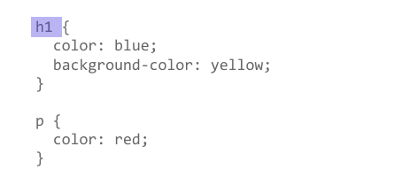
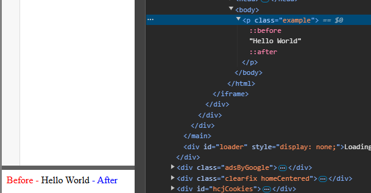
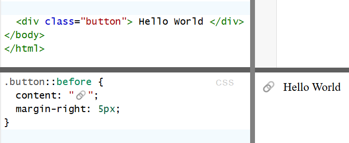

<div align="center">
  <h1> Selectors </h1>
</div>

A CSS selector is the first part of a CSS rule. It is a pattern of elements and other terms that tell the browser which HTML elements should be selected to have the CSS property values inside the rule applied to them. The element or elements which are selected by the selector are referred to as the subject of the selector.



<div align="center">
  <h1> CSS Scopes </h1>
</div>


Scoping in CSS refers to how styles apply to elements based on their location in the document and how they're defined in stylesheets.

#### Global Scope (Default behaviour)

If you were to write,

```CSS
p {
  color: red;
}
```

This rules applies **globally** to every `<p>` tag in the entire document, unless

1. Another more specific rule overrides it.
2. A different style rules is applied inline, e.g. `style="color: blue"` on a specific `<p>`.
3. A parent element has a higher specificity or a different inherited style.

#### Scoped Styles with Classes or IDs

To avoid affecting every `<p>` tag, you can scope styles using,

##### Classes

Classes are created using the dot `.` operator. When you apply a class on an element, it applies only to that specific element - it does not affect other elements unless they also have it applied.

```CSS
.red {
  color: red;
}

.fancy {
  font-weight: bold;
  text-shadow: 4px 4px 3px #77f;
}
```

and is applied as,

```HTML
<p class="red fancy">This is red and fancy.</p>
```

Classes are designed to be **reusable in multiple elements**. If you define two classes with the same name in a global stylesheet, they are **globally scoped** and the last one declared will overwrite the previous one due to the CSS Cascade.

```CSS
/* First definition */
.button {
  background-color: blue;
  color: white;
}

/* Later definition (overwrites the first one) */
.button {
  background-color: red;
  color: black;
}
```

In this case, all `.button` elements will have a red background and black text because the second `.button` declaration overrides the first one.

##### IDs 

IDs have a higher specificity than classes and instead use `#`.

```CSS
#unique-paragraph {
  color: blue;
}
```

and is applied as,

```HTML
<p id="unique-paragraph">This is blue.</p>
```

IDs are designed to be used for **a single tag**.

##### Container-based scoping

```CSS
.container p {
  color: green;
}
```

This applies only to `<p>` tags inside `.container`.

#### Module CSS

 A `module.css` file is used in React (or other component-based frameworks) to scope styles **locally to a specific component**.

 For example, in `MyComponent.module.css`

 ```CSS
 .paragraph {
  color: purple;
}
```

can be used in a React component,

```TSX
import styles from './MyComponent.module.css';

export default function MyComponent() {
  return <p className={ styles.paragraph }>This is purple</p>;
}
```

The `.paragraph` class gets transformed into a unique name like `MyComponent_paragraph__1a2b3c`, preventing global conflicts. **This means the styles only apply within the specific component**.


<div align="center">
  <h1> Selector Types </h1>
</div>

#### Universal Selector - `*`

The universal selector is indicated by an asterisk `*`. It selects everything in the document. If `*` is chained using a descendant combinator, it selects everything inside that ancestor element. For example, `p *` selects all the nested elements inside the `<p>` element.

```CSS
* {
  margin: 0;
  padding: 0;
}
```

Removes default margin and padding from all elements.

#### Type Selector

Selects elements by their tag name.

```CSS
p {
  color: blue;
}
```

Styles all `<p>` elements with blue text.

#### Class Selector - `.`

The class selector uses `.` and it selects elements with a specific class.

```CSS
.button {
  background-color: red;
  color: white;
}
```

Will styles all elements with the class `button`.

An example usage,

```HTML
<button class="button">Click Me</button>
```

#### ID Selector - `#`

Selects an element by its unique ID. This should be used at most once per page.

```CSS
#header {
  background-color: gray;
}
```

An example usage,

```HTML
<div id="header">Welcome</div>
```

IDs have higher specificity than classes and will be applied if both classes and ID are used on a tag.

#### Grouping Selector - `,`

Applies styles to multiple elements at once by using `,`.

```CSS
h1, h2, h3 {
  font-family: Arial, sans-serif;
}
```

This will apply styles to all `<h1>`, `<h2>` and `<h3>` elements.

#### Descendant Selector - ` ` (Space)

Selects elements that are **nested inside** another element.

```CSS
div p {
  color: green;
}
```

Targets `<p>` elements **inside a** `<div>`

```HTML
<div>
  <p>This text is green.</p>
</div>
<p>This text is not affected.</p>
```

Keep in mind, this is **not an immediate child**, but inside.  This means the following `<p>` tag will still be affected,

```HTML
<div>
  <span>  
    <p>This text is green.</p> 
  </span>
</div>
<p>This text is not affected.</p>
```

#### Child Selector - `>`

Selects elements that are **direct children** of a specific element.

```CSS
div > p {
  color: orange;
}
```

Only styles `<p>` elements that are immediate children of `<div>`.

```HTML
<div>
  <p>This is orange.</p>
  <span>
    <p>This is not affected.</p>
  </span>
</div>
```

#### Adjacent Sibling Selector - `+`

Selects an element that is **immediately** after a specific element.

```CSS
h1 + p {
  color: red;
}
```

This will style only **the first `<p>` after an `<h1>`**.

```HTML
<h1>Heading</h1>
<p>This paragraph is red.</p>
<p>This one is not.</p>
```

#### General Sibling Selector - `~`

Selects **all** sibling elements that come after the specified element

```CSS
h1 ~ p {
  color: purple;
}
```

This will style **all `<p>` elements after an `<h1>`**.

```HTML
<h1>Title</h1>
<p>This is purple.</p>
<p>This is also purple.</p>
```

#### Basic Attribute Selector - `[attr]`

Selects elements with a specific attribute.

```CSS
input[type] {
  border: 2px solid black;
}
```

Targets all `<input>` elements with a `type` attribute.

```HTML
<input type="text">
<input type="password">
```

#### Attribute Value Selector - `[attr="value"]`

Matches elements where the attribute **exactly** equals a value.

```CSS
input[type="password"] {
  background-color: lightgray;
}
```

Styles only password input fields.

```HTML
<input type="text" value="Unaffected">
<input type="password" value="Affected"/>
```

#### Attribute Contains - `[attr*="value"]`

Matches elements where the attribute **contains a substring**.


```CSS
a[href*="example"] {
  color: red;
}
```

Styles links that contain "example" in the `href` tag.

```HTML
<a href="https://example.com"> This will be red </a>
<a href="https://google.com"> This will be the default blue </a>
```

#### Attribute Starts With - `[attr^="value"]`

Matches elements where the attribute **starts with** a specific value.

```CSS
a[href^="https"] {
  color: green;
}
```

Styles all links that start with `https`.

```HTML
<a href="https://example.com"> This will be green </a>
<a href="https://google.com"> This will be also be green </a>
```

#### Attribute Ends With - `[attr$="value"]`

Matches elements where the attribute **ends with** a specific value.

```CSS
img[src$=".jpg"] {
  border-radius: 10px;
}
```

Will style images ending in `.jpg`.

#### Pseudo-Classes - `:hover`

This will apply styles when an element **is hovered**.

```CSS
button:hover {
  background-color: blue;
}
```

```HTML
<button>Hover Me</button>
```

#### Pesudo Classes - `:first-child`

Represents **the first element** among a group of sibling elements.

```CSS
p:first-child {
  color: red;
}
```

```HTML
<div>
  <p>This is the first p tag within a group of siblings </p>
  <p>This is not affected.</p>
</div>
```

The first `<p>` inside of `div>` turns run as it's the first sibling within that group.

#### Pesudo Classes - `:last-child`

Similar to `first-child` but selects the last.

```CSS
p:last-child {
  color: red;
}
```

```HTML
<div>
  <p>This is not affected</p>
  <p>This is the last p tag within a group of siblings</p>
</div>
```

#### Pseudo Classes - `:nth-child(n)`

Selects the `nth child` of its parent.

```CSS
li:nth-child(2) {
  font-weight: bold;
  color: green;
}
```

```HTML
<ul>
  <li>Item 1</li>
  <li>Item 2 - I am green and bold</li>
  <li>Item 3</li>
</ul>
```

#### Pseudo Elements - `::`

Pseudo-elements allow you to style specific parts of an element without needing additional HTML markup. They are prefixed with `::` and behave as if they create new elements inside the DOM, even though they do not actually exist in the HTML structure. The most commonly used pseudo-elements are,

1. `::before` - Inserts generated content **before an elements main content**.
2. `::after` - Inserts generated content **after an elements main content**.
3. `::first-letter` - Styles the **first letter** of an element.
4. `::first-line` - Styles the **first line** of an element.
5. `::selection` - Styles text when selected.

These pseudo-elements **do not create new DOM elements** but are instead rendered as ps part of the selected  element. They're treated as **child elements** property to display anything and require the `content` property to display anything. They're inline by default but can be styled with CSS properties like `display`, `position`, `width`, ...

Even though `::before` and `::after` are not actual DOM elements, they behave as if they were children of the selected element. They do not appear in the DOM tree when inspecting elements but can be seen in the rendered output using browser developer tools.

```CSS
.example::before {
  content: "Before - ";
  color: red;
}

.example::after {
  content: " - After";
  color: blue;
}
```

The rendered output will contain `Before - ` and ` - After`, however, in the actual DOM, there are no extra `<span>` or `<div>` elements for `::before` and `::after`, they are purely visual and exist only in the CSS layer.

```HTML
<p class="example">Hello World</p>
```



It can be very useful when trying to add icons such as,

```CSS
.button::before {
  content: "🔗";
  margin-right: 5px;
}
```

