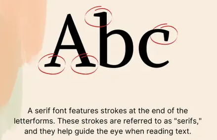
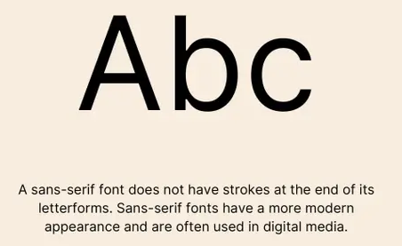
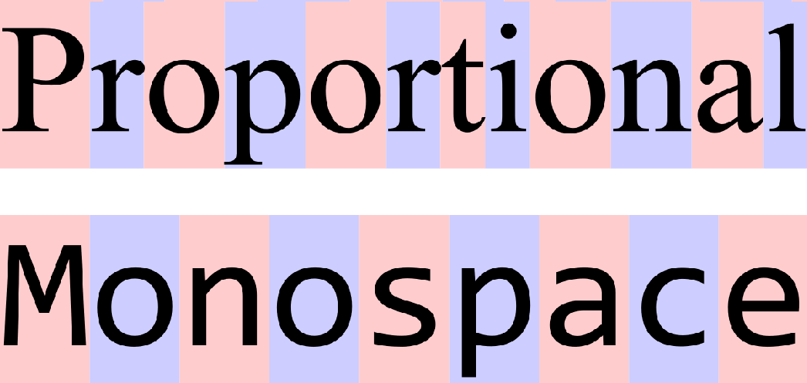
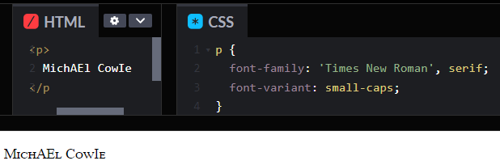
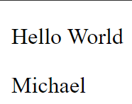
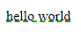

<div align="center">
  <h1> Understanding Font Classifications </h1>
</div>

A **font-family is a set of fonts grouped by a common design style**, such as `serif`, `sans-serif` and `monospace`. A font refers to a specific typeface like `Arial` or `Times new Roman`, **which belongs to a font family**.

`Serif` - `Serif` fonts **feature small decorative lines (called serifs)** at the end of character strokes. These fonts often convey tradition, reliability, and formality. Examples include `Times New Roman`, `Georgia`, and `Baskerville`. The subtle serifs create a visual "rail" that guides the eye horizontally across text, making them particularly suitable for long-form content in print and high-resolution displays.

<div align="center">
  
</div>

`Sans-serif` - `Sans-serif` fonts **lack these decorative features**, resulting in cleaner, more minimalist letterforms. These fonts project modernity, clarity, and straightforwardness. `Arial`, `Helvetica`, and `Roboto` are prominent examples. The absence of serifs makes these fonts highly legible at smaller sizes and on lower-resolution screens, which explains their popularity in digital interfaces.

<div align="center">
  
</div>

`Monospace` - `Monospace` fonts allocate **identical horizontal space for each character**, regardless of the character's natural width. This uniformity creates a mechanical, technical appearance, making these fonts ideal for displaying code, technical documentation, or content where character alignment is crucial. `Courier New`, `Consolas`, and `Roboto Mono` exemplify this category.

<div align="center">
  
</div>

<div align="center">
  <h2> Font Stacks </h2>
</div>

A **font stack** is a list of fonts that the browser will try in order, using the first available. **The final value in a well-constructed font stack should always be a generic family name**. Fonts are required to be in quotation marks only when their are spaces, e.g. `"Times New Roman"`.

The `font-family` property specifies the typeface to be used for text. The values provided are part of a **font stack**, which means the browser will try to use the fonts in the listed order.

```css
body {
  font-family: "Georgia", serif;
}

h1, h2, h3 {
  font-family: "Helvetica Neue", Arial, sans-serif;
}
```

1. `"Helvetica Neue"` – **This is the preferred font**. If the system has it installed, the browser will use it. It’s a modern, refined version of `Helvetica`.

2. `Arial` – If `"Helvetica Neue"` is unavailable, the browser will use `Arial`, which is a widely available `sans-serif` font.

3. `sans-serif` – If neither `"Helvetica Neue"` nor `Arial` is available, the browser will use **any default `sans-serif` font** installed on the system.

Each operating system has its own built-in default fonts for different generic families.

<div align="center">

| **Operating System** | **Default `Sans-Serif` Font** |
|----------------------|-----------------------------|
| **Windows**          | `Segoe UI`                  |
| **macOS**            | `San Francisco (SF Pro)`    |
| **Linux**            | `Ubuntu` / `DejaVu Sans`    |
| **Android**          | `Roboto`                    |
| **iOS**              | `San Francisco (SF Pro)`    |

</div>

<div align="center">
  <h2> Web-Safe Fonts </h2>
</div>

Web-safe fonts are those with near-universal availability across operating systems, ensuring consistent presentation without requiring font files to be downloaded. While these fonts offer reliability, they limit creative expression and brand differentiation.

- `sans-serif` - `Arial`, `Helvetica`, `Verdana` and `Tahoma`
- `serif` - `Times New Roman`, `Georgia`, and `Garamond`
- `monospace` - `Courier New` and `Andale Mono`

<div align="center">
  <h2> Web Fonts - Expanding the Typographic Palette </h2>
</div>

Their are several ways to incorporate custom fonts, with two popular methods being the use of `@font-face` and font services like Google Fonts. Both approaches allow for the use of custom fonts, but they differ in implementation, flexibility and performance.

#### Fonts from `@font-face`

The `@font-face` rule is a CSS feature that lets developers load custom fonts from local or remote files. It enables the use of fonts not installed on a users device, ensuring typography across all platforms. Developers define the fonts name and the file path using `@font-face`, specifying font formats for browser compatibility.

Here, `font-family: 'MyCustomFont'` is simply a label or name that you assign to a specific font file. It does not refer to an actual "family" in the traditional sense, but rather it allows you to use that font in your CSS.

```CSS
@font-face {
  font-family: 'MyCustomFont';
  src: url('fonts/MyCustomFont.woff2') format('woff2'),
       url('fonts/MyCustomFont.woff') format('woff');
}

body {
  font-family: 'MyCustomFont', sans-serif;
}
```

You should use `@font-face` when you need a **custom font** not available from font services or you want complete control over font hosting. In this example, two `src` were used. This follows a fallback structure where it attempts to load `.woff2` and fallbacks to `.woff` if `.woff2` is not found.


#### Fonts from Font Services

Font services like Google Fonts offer an easy way to implement custom fonts by hosting fonts on a CDN. Developers can link to the font files in their HTML or CSS without managing or hosting the fonts themselves.

```HTML
<link href="https://fonts.googleapis.com/css2?family=Roboto:wght@400;700&display=swap" rel="stylesheet">
```

Then, apply the font in CSS with

```CSS
body {
  font-family: 'Roboto', sans-serif;
}
```

Font services are easy to implement and often free. They provide optimized, fast-loading fonts from a CDN, reducing the effort for font management. They are ideal for projects that need popular fonts and fast, reliable performance. They may not offer the flexibility of custom fonts that `@font-face` provides.

You should use font services when you want a quick and easy solution with fonts that are already optimized for performance or when you need popular, web-safe fonts and don't need custom typography.

<div align="center">
  <h2> Font Size - Establishing Visual Hierarchy</h2>
</div>

The `font-size` property determines the visual prominence of text elements and helps establish information hierarchy.

```css
body {
  font-size: 16px; /* Base size for body text */
}

h1 {
  font-size: 2.5rem; /* 40px if the root is 16px */
}

.caption {
  font-size: 0.875rem; /* 14px if the root is 16px */
}
```

<div align="center">
  <h2> Font Weight - Controlling Visual Emphasis </h2>
</div>

Font weight determines the **thickness of characters**, allowing for subtle or dramatic emphasis within text:

```css
p {
  font-weight: 400; /* Normal weight */
}

strong {
  font-weight: 700; /* Bold */
}

h1 {
  font-weight: 300; /* Light weight for elegant headings */
}
```

Modern font families often provide a spectrum of weights, typically ranging from `100` (ultra-thin) to `900` (extra-bold or black), with `400` representing normal weight and `700` representing bold. Not all fonts support all weights; when an unsupported weight is specified, the browser maps to the closest available weight.

<div align="center">
  <h2> Font Style - Adding Emphasis and Variation </h2>
</div>

The `font-style` property in CSS is used to define the style of a font, such as making it `italic` or `oblique`.

```css
p {
  font-style: normal;
}

em {
  font-style: italic;
}

blockquote {
  font-style: oblique;
}
```

The `font-style` property has a few key values.

1. `normal` - This is **the default value** and applies the regular, upright version of the font.

2. `italic` - This **applies a slanted version of the font**, often designed specifically for italics.

3. `oblique` - This also applies a slanted version of the font, but unlike `italic`, it doesn’t necessarily use a specific italic design. It's typically a slanted version of the regular typeface.

When you apply `font-style` to a text element, it modifies how the text is displayed, but it only works if the font you're using **has an italic or oblique variant available**. If the font doesn't have an italic or oblique version, the **browser will simulate the effect** by slanting the text, which may not look as intended.

For example, if you use a font like `Arial` which doesn't have a built-in italic, the browser will simulate italics by slanting the regular version of the font. However, if you use a font like `Times New Roman`, which has an actual italic version, the browser will use the version when `font-style: italic` is applied.

<div align="center">
  <h2> Font Variant - Exploring Alternative Presentations </h2>
</div>

The `font-variant` property offers alternative presentations of the same characters. It allows you to control the use of alternate glyphs and styles in a font, such as small caps, ligatures or other stylistic variations that the font may offer. It provides a way to apply these variations without needing to manually define different font files.

```css
.feature {
  font-variant: small-caps;
}
```
The `font-variant` property has several values that modify the presentation of the text, most commonly for **small caps, ligatures and other stylistic features**. The exact effect depends on whether the font you are using supports these variations.

1. `normal` -  This is the default value, which applies no special variants to the font. Text will appear as usual, using the regular glyphs and design of the font.

2. `small-caps` - This value causes lowercase letters to be displayed as smaller uppercase letters (small caps). The font must have small caps variant for this to work properly.

<div align="center">
  
</div>

3. `ligatures` - Ligatures in typography refer to the automatic joining of certain character pairs into a single, visually cohesive glyph. Ligatures are special characters combinations such as `fi` or `fl` that are often used for aesthetic or typographic purposes. The property `font-variant-ligatures` controls how ligatures are applied.

- `common-ligatures` - Automatically applies common ligatures.
- `no-common-ligatures` - Disables the use of common ligatures.
- `discretionary-ligatures` - Allows more stylistic or discretionary ligatures.

4. `historic` - Some fonts have older or historical versions  of characters and this value can be used to enable them, though this feature is relaveily less common.

<div align="center">
  <h2> Font Line Height - Cosmic Enhancement </h2>
</div>

The `line-height` property in CSS controls the **vertical space** between lines of text within a block-level element, such as a paragraph or heading. It affects the overall **line box height**, in which each line of text is drawn. The main purpose of `line-height` is to control the space **above and below each line** of text, which can significantly impact text readability.

```CSS
line-height: normal | <length> | <number>;
```

- `normal` - Default. It sets the line height to a reasonable value based on the font size. This is usually about **1.2 times the font size**.

- `<length>` - A specific measurement (e.g., `5px`, `1em`, `2rem`) that determines the exact space between lines.

- `<number>` - A multiplier for the font size. This is a single number such as `1.5`, which means the will be **1.5 times from the current font size**.

The following,

```HTML
<p> Hello World </p>
<p> Michael </p>
```

Will render as,

<div align="center">
  
</div>

Whereas,

```HTML
<p style="line-height: 0;">Hello World</p>
<p style="line-height: 0;"> Michael </p>
```

Will render as,

<div align="center">
  
</div>

The decreased line height, making the `Hello World` closer to the top of the page and closer to `Michael` as the vertical spacing has decreased.

<div align="center">
  <h2> Font Shorthand - Efficient Typography Declarations </h2>
</div>

The `font` shorthand property in CSS allows you to set multiple font-related properties in a single declaration.

```CSS
font: [font-style] [font-variant] [font-weight] [font-size][/line-height] [font-family];
```

The components of the font shorthand are,

1. `font-style` (optional) - Controls the style of the font (`normal`, `italic` or `oblique`)

2. `font-variant` (optional) - Controls small caps (`normal` or `small-caps`)

3. `font-weight` (optional) - Defines the thickness of the font (`normal`, `bold`, `100` to `900`)

4. `font-size` (required) - Specifies the size of the font (e.g., `16px`, `1.2em`)

5. `line-height` (optional, but must follow a `/` if included) - Defines the spacing between lines.

6. `font-family` (required) - Specifies the fonts to use, with fallback options.

```CSS
p {
  font: italic bold 16px/1.5 "Helvetica Neue", sans-serif;
}
```

- `font-style` - `italic`
- `font-weight` - `bold`
- `font-size` - `16px`
- `line-height` - `1.5`
- `font-family` - `"Helvetica Neue"`, fallback to `sans-serif`.

<div align="center">
  <h2> Text Transform - Controlling Capitalization </h2>
</div>

The `text-transform` property modifies the capitalization of text without changing the underlying content.

```
text-transform: none | capitalize | uppercase | lowercase | full-width | full-size-kana;
```

- `none` - Default. No transformation is applied.
- `capitalize` - Transforms the first letter of **each word** to uppercase.
- `uppercase` - Converts **all letters** to uppercase.
- `lowercase` - Converts **all letters** to lowercase.
- `full-width` - Converts characters to **full-width** form. For East Asian typography.
- `full-size-kana` - Controls how small kana (Japanese characters) are displayed.


```HTML
<p>hello world</p>
```

```CSS
p {
  text-transform: capitalize;
}
```

Will display as `Hello World`.

<div align="center">
  <h2> Text Decoration - Adding Visual Embellishments </h2>
</div>

The `text-decoration` property in CSS is used to add or remove decorative lines on text, such as **underlines, overlines, strikethrough**.

```CSS
text-decoration: [text-decoration-line] [text-decoration-style] [text-decoration-color];
```

#### `text-decorlation-line` - Type of Decoration

This property controls the type of line applied to the text,

- `none` - Default. Removes any decoration.
- `underline` - Adds a line **below** the text.
- `overline` - Adds a line **above** the text.
- `line-through` - Adds a **strikethrough** effect.

#### `text-decoration-style` - Line Style

Controls the style of the underline, overline or line-through.

- `solid` - Default. A solid line.
- `double` - A **double** line.
- `dotted` - A **dotted** line.
- `dashed` - A **dashed** line.
- `wave` - A **wavy** line.

#### `text-decoration-color` - Line Color

Changes the colour of the decoration.

```CSS
p {
  text-decoration: underline red;
}
```

#### Shorthand

You can set each property separetely such as,

```CSS
p {
  text-decoration-line: underline;
  text-decoration-style: dashed;
  text-decoration-color: green;
}
```

This is equivalent as,

```CSS
p {
  text-decoration: underline dashed green;
}
```

<div align="center">
  
</div>
