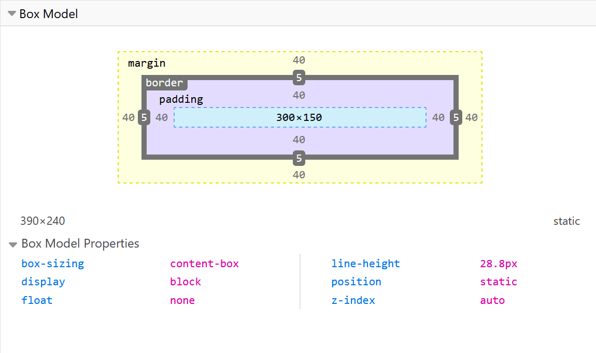
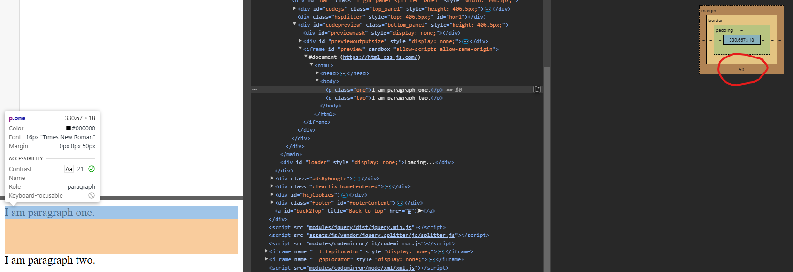
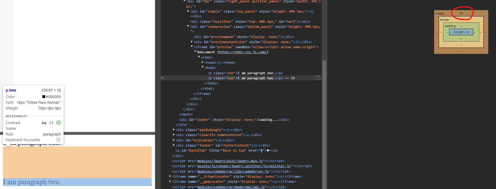

<div align="center">
  <h1> CSS Box Model </h1>
</div>

**Everything in CSS has a box around it**, understanding these boxes is key to being able to create more complex layouts with CSS or to align items with other items.


# Block and Inline boxes

In CSS we have several types of boxes that generally fit into the categories of **block boxes** and **inline boxes**. The type refers to how the box behaves in terms of page flow and in relation to other boxes on the page. Boxes have an **inner display type** and an **outer display type**. In general, you can set various values for the display type using the `display` property, which can have various values. 

`block` and `inline` display values are said to be **outer display types** — they affect how the box is laid out in relation to other boxes around it. 


Block and inline layout are the default way things behave on the web. By default and without any other instruction, the elements inside a box are also laid out in normal flow and behave as block or inline boxes.

#### `display: block`


If a box has a display value of `block`, then

- The box will **break onto a new line**.
- The `width` and `height` properties **are respected**.
- `padding`, `border` and `margin` will cause other elements **to be pushed away**.
- If `width` is not specified, the box will extend in the inline direction **to fill the space available in its container**. In most cases, the box will become as wide as its container, filling up 100% of the space available.

Some HTML elements, such as `<h1>` and `<p>` use `block` as their outer display type by default.

#### `display: inline`

If a box has a display type of `inline`, then

- The box **will not break onto a new line**.
- The `width` and `height` properties **will NOT apply**.
- Top and bottom `padding`, `border` and `margin` will apply but **will NOT cause other `inline` boxes** to move away from the box.
- Left and right `padding`, `border` and `margin` will apply and **will cause other `inline` boxes** to move away from the box.

Some HTML elements, such as `<a>`, `<span>` and `<strong>` use `inline` as their default display type by default.

#### `display: inline-block`

If a box has a display type of `inline-block`, then

- The box **will not break onto a new line**, behaving like an inline element.
- The `width` and `height` properties are respected.
- `padding`, `border` and `margin` will apply and cause other elements to move accordingly.
- Unlike `inline`, top and bottom `margins` and `padding` **will push surrounding content**. 
- The box will only take up as **much width as necessary to fit its content**, unless a specific width is set.

Some HTML elements such as `<button>` and `<input>` use `inline-block` as their default display type.


#### Inner and Outer Display Types

`block`, `inline` and `inline-block` display value are said to be **outer display** types, they affect how the box is laid out in relation to other boxes around it. Boxes also have an **inner display** type, which dictates how elements **inside that box** are laid out.

You can change the inner display type by setting an inner display value, for example `display: flex;`. The element will still use the outer display type `block` but this changes the inner display type to `flex`. Any **direct children** of this box will become flex items and behave according to the Flexbox specification.

##### Outer Display Type

The outer display type controls how the element fits into the document flow. The main types are `block`, `inline` and `inline-block`,which were previously described but also include `none`. Using `none` will hide the element completely and it is removed from document flow.

##### Inner Display Type

The inner display type determines how child elements are arranged inside the element. Frequently used values include,

| Inner Display Type | Description |
| --- | --- |
| `flow` | Default layout for `block` and `inline` elements. Children follow normal document flow |
| `flex` | Children are arranged using flexbox rules |
| `grid` | Children are arranged using a grid-based layout |
| `table` | Behaves like a table container, affecting child elements behaviour |

#### How They Work Together

Some `display` values are shorthand for both **outer and inner** display types.

| `display` Value | Outer Type | Inner Type |
| --- | --- | --- |
| `block`       | `block`  | `flow` |
| `inline`      | `inline` | `flow` |
| `flex`        | `block`  | `flex` |
| `inline-flex` | `inline` | `flex` |
| `grid`        | `block`  | `grid` |
| `inline-grid` | `inline` | `grid` |

# CSS Box Model

The CSS box model as a whole applies to applies to `block` boxes and defines how the different parts of a box - `margin`, `border`, `padding` and the content area work together to create a box that you can see on a page. `inline` boxes use **just some of the behaviour** defined in the box model.

To add complexity, there is a standard and alternative box model. By default, browsers use the standard box model.

#### Parts of the Box

- **Content box** - The area where your content is displayed. Size it using properties such as `width` and `height`

- **Padding box** - The padding sits around the content as white space. Size it using `padding` and related properties.

- **Border box** - The border box wraps the content and any padding. Size it using `border` and related properties.

- **Margin box** - The margin is the outermost layer, wrapping the content, padding and border as whitespace between this box and other elements. Size it using `margin` and related properties.

<div align="center">
    
</div>

# The Standard CSS Box Model

In the standard box model, if you set `width` and `height` property values on a box, these values define the `width` and `height` of the **content box**. Any padding and borders are **then added to those dimensions** to get the total size taken up by the box.

```CSS
.box {
  width: 350px;
  height: 150px;
  margin: 10px;
  padding: 25px;
  border: 5px solid black;
}
```

The actual space taken up by the box will be 410px wide.

1. Width = 350px
2. Left Side = Padding + Border = 25 + 5 = 30
3. Right Side = Left Side

Total = 350 + 30 * 2 = 410px

The **margin is not counted** towards the actual size. It affects the total space that the box will take up on the page, but only the space outside the box. The box's area stops at the border, it does not extend into the margin.


# The Alternative CSS Box Model

In the alternative box model, any width is the **width of the visible box on the page**. The content area width is that width minus the width for the `padding` and `border`. No need to add up the border and padding to get the real size of the box.

To turn on the alternative model for an element, set `box-sizing: border-box` on it.

```CSS
.box {
  box-sizing: border-box;
}
```

```CSS
.box {
  width: 350px;
  height: 150px;
  margin: 10px;
  padding: 25px;
  border: 5px solid black;
}
```

Now, the actual space taken up by the box will be 350px in the inline direction and 150px in the block direction.


#  DevTools to View the Box Model

Your browser developers tools can make understanding the box model far easier. They can show you the size of the element plus its margin, padding and border. Inspecting an element in this way is a great way to find out if your box is really the size you think it is.



# Margin

The margin is an **invisible space around your box**. It pushes other elements away from the box. Margins can have **positive or negative values**. Setting a negative margin on one side of your box can cause it to overlap other things on the page. Whether you are using the standard or alternative box model, the margin is always added after the size of the visible box has been calculated.

We can control all margins of an element at once using the `margin` property, or each individually using the equivalent longhand properties,

- `margin-top`
- `margin-right`
- `margin-bottom`
- `margin-left`

#### Margin Collapsing

Depending on whether two elements whose **margins touch** have positive or negative margins, the results will be different.

- **Two positive margins** will combine to become one margin. Its size will be equal to the **largest individual margin**.
- **Two negative margins** will collapse and the smallest value will be used.
- If **one margin is negative**, its value will be **subtracted from total**.

In the example below, we have two paragraphs. The top paragraph has a `margin-bottom` of 50 pixels, the other has a `margin-top` of 20 pixels. The **margins have collapsed** together so the actual margin between the boxes is 50 pixels and **not the total of the two margins**.

```HTML
  <p class="one">I am paragraph one.</p>
  <p class="two">I am paragraph two.</p>
```

```CSS
.one {
  margin-bottom: 50px;
  margin-top: 0px;
}

.two {
  margin-top: 20px;
  margin-bottom: 0px;
}
```

We can observe that the `margin-bottom: 50px` is being utilized. The distance between the top paragraph to the bottom is 50px, not 70px!

Likewise, setting any `margin-top` value beteen `0` and `50` will do nothing as it will choose the largest value between the two paragraphs. 

<div align="center">
    
</div>

Changing the `two` class to become,

```CSS
.two {
  margin-top: 70px;
  margin-bottom: 0px;
}
```

<div align="center">
    
</div>

will make the difference between the two paragraphs to become `70px` as this is now the largest distance between the two. The final way to make them change is to make either of the margins negative to make them move closer.

# Borders

The border is drawn **between the margin and the padding** of a box. If you are using the standard box model, the size of the border is added to the `width` and `height` of the content box. If you are using the alternative box model, then the bigger the border is, the smaller the content box is, as the border takes up some of the available `width` and `height` of the element box.

For styling borders, there are a large numbers of properties. **There are four borders**, and each border has a style, width and colour that we might want to manipulate.

To set the properties of each side individually, use

- `border-top`
- `border-right`
- `border-bottom`
- `border-left`

To set the width, style or colour of all sides, use

- `border-width`
- `border-style`
- `border-colour`

To set the width, style or colour of a single side, use one of the more granular longhand properties,

- `border-top-width`
- `border-top-style`
- `border-top-colour`
- `...`

# Padding

The padding sits between the border and the content area and is **used to push the content away from the border**. Unlike margins, you cannot have a negative padding. **Any background applied to your element will display behind the padding**.

The `padding` property controls the padding on all sides of an element. To control each side individually, use these langhand properties,

- `padding-top`
- `padding-right`
- `padding-bottom`
- `padding-left`

