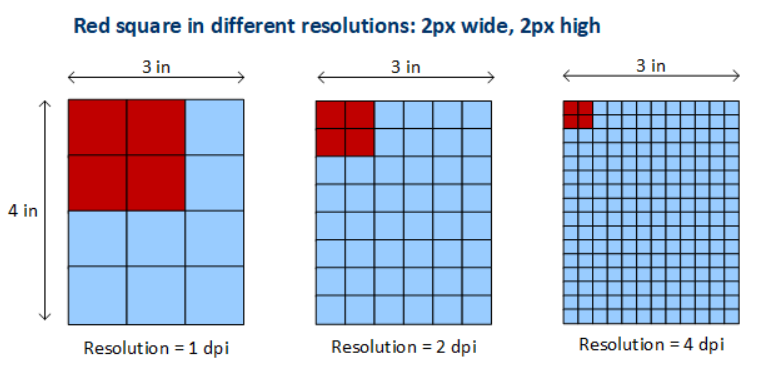
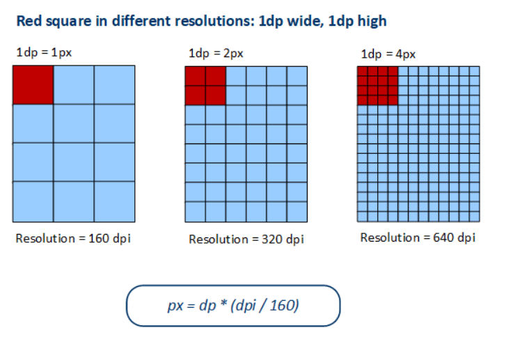

<div align=center>
    <h1> CSS Units </h1>
</div>

CSS provides two primary categories of units,

1. **Absolute Units** - Fixed-size units that do not change based on the viewport or device.

2. **Relative Units** - Units that scale according to external factors such as the parent element, viewport size or font settings.

# Absolute Units

Absolute units define **fixed dimensions that do not change** with the viewport or screen size. These are useful for elements that require precise measurements. CSS provides several units that, in theory, map to physical measurements. However, their implementation in digital contexts reveals some fascinating complexities.

The inch (`in`) units in CSS is defined as exactly 96 pixels. This means that when you specify `width: 1in`, you're actually getting 96 device-independent pixels, regardless of the physical size of the display. Similarly, centimeters (`cm`) and millimeters (`mm`) are calculated based on this same relationship, where 1 inch equals 2.54 centimeters. **It's not tied to physical measurements on screens**.

```CSS
.box {
    width: 1in; /* Always equals 96px on screen */
}
```

CSS defines absolute units in a way that is supposed to mimic real-world sizes, but it does not meant it converts to real-world lengths.

<table>
  <thead>
    <tr>
      <th style="background:#f2f2f2; border-radius: px; padding: 10px;">CSS Unit</th>
      <th style="background:#f2f2f2; border-radius: 8px; padding: 10px;">Definition</th>
    </tr>
  </thead>
  <tbody>
    <tr>
      <td> <b> 1 in </b> </td>
      <td> <b> 96 px </b> </td>
    </tr>
    <tr>
      <td> <b> 1 cm </b> </td>
      <td> <b> 37.8 px </b> </td>
    </tr>
    <tr>
      <td> <b> 1 mm </b> </td>
      <td> <b> 3.78 px </b> </td>
    </tr>
    <tr>
      <td> <b> 1 pt </b> </td>
      <td> <b> 1/72 inch = 1.33 px </b> </td>
    </tr>
    <tr>
      <td> <b> 1 pc </b> </td>
      <td> <b> 12 pt = 16 px </b> </td>
    </tr>
  </tbody>
</table>

The disconnect between these CSS "absolute" units and their physical counterparts becomes apparent when trying to match physical measurements. **A CSS inch will rarely match a physical inch on screen**, though it becomes more accurate in print contexts. **CSS inches are not real inches on screens but become real inches in print.**

**You should use absolute units when**,

1. Fixed UI components, e.g. Buttons and Borders.
2. Consistent element sizes across all devices.
3. Print stylesheets, e.g. `pt`, `cm` and `mm`.

**Do not use absolute units when**,

1. Responsive layouts, as they do not scale dynamically.
2. Font sizes, because `rem` or `em` is better for accessibility.

#### Pixels - `px`

When working with CSS, the `px` (pixel) unit is one of the most commonly used absolute units. However, its behaviour is more complex than a simple one-to-one mapping to physical screen pixels. **This is because modern devices use device-independent pixels (DIP)** to ensure web content appears consistent across different screen sizes and resolutions.

**A CSS pixel (`px`) is a logical unit** used in web design that does not always correspond directly to the physical pixels of a screen. Instead, it is a unit that adapts based on the devices resolution and pixel density.

Some key points are,

1. CSS pixels remain consistent regardless of the actual screen resolution.
2. Browsers scale CSS pixels based on the devices pixel density to maintain usability.
3. A `px` unit is mapped to multiple physical pixels on high-DPI screens to maintain clarity.

If an element is defined as,

```CSS
.box {
  width: 100px;  /* This means 100 DIPs */
  height: 100px; /* This means 100 DIPs */
}
```

this will **not always** occupy `100 x 100` physical pixels on all devices. Instead, its actual display size depends on the devices **pixel density and scaling factor**.

#### Device-Independent Pixels

A device-independent pixel is a virtual measurement unit used by operating systems and web browsers to standardize how content appears on different screen densities. Device-independent pixels are used to resolve scaling issues between different pixel densitites between screens. Without DIPs, when specifying the exact pixels to use their would be inconsistent rendering.

Device-indepndent pixels **only maintain consistent size across different resolutions of the same physical monitor size**. They don't maintain consistent physical size across different monitor sizes.

Let's take an example and compare a **15" 1080p monitor** with an equivalent sized **15"** but is instead a **4k monitor**. If we were to set an element with `width: 200px`, the same element mains **the same physical size despite the higher resolution**. This is what device-independent pixels are for, **maintaining sizes across resolutions**. If we now instead have the `width: 200px` element on a **24" 1080p monitor**, the same element will appear physically larger. This occurs because the same number of pixels are spread across a larger area. Therefore, DIPs solve the resolution problem (`1080p` vs `4k`) but **not** the physical size problem (**15"** vs **24"**).


The below demonstrates what would occur using a set number of pixels and increasing the resolution of the physical monitor **without DIPs**.

<div align="center">
    
</div>

As seen above, the rendered box will decrease in size. Now, using device-independent pixels, when the resolution increase the number of physical pixels drawn will increase so that the rendered surface area is the same.

<div align="center">
    
</div>

The formula to calculate a device-independent pixel from physical pixels is,

$$ \text{DIP} = \frac{ \text{Physical Pixels}}{ \text{ DPR (Device Pixel Ratio)}}$$

Where,

- **DIP** is the device-independent pixel, this is the set value using `px`.
- **Physical Pixels** are the actual physical pixels on the screen.
- **Device Pixel Ratio (DPR)** is the ratio of physical pixels to CSS pixels.

#### DPI - Dots Per Inch

**DPI is the number of physical pixels packed into one inch** of a screen. It determines the pixel density of a display.

$$ \text{DPI} = \frac{\sqrt{(\text{Screen Width Resolution}^2 + \text{Screen Height Resolution}^2)}}{\text{Screen Size (In Inches)}}$$

Where,

- **Screen Width Resoution** is the total number of horizontal **physical pixels**.
- **Screen Height Resolution** is the total number of vertical **physical pixels**.
- **Screen Size** is the **diagonal size** of the monitor.

When a monitor is advertised as 24 inches, that measurement **is always the diagonal distance from corner to corner** of the visible screen area. Typically, a display will have the same DPI horizontally and vertically, so if we know the screens physical dimensions we can calculate the DPI.

If we had to calculate the DPI for a **24-inch monitor** with a resolution of `1920 x 1080` using the formula it would become,

$$ \text{DPI} = \frac{\sqrt{(1920^2 + 1080^2)}}{24}$$

The output will be **91.79 DPI**. This calculated DPI will then be used with a standard reference point to calculate the DPR. After the DPR is calculated, we can finally calculate the number of physical pixels to display on screen.

Windows and most operating systems assume a 96 DPI baseline. If a screens actual DPI is close to 96 DPI, the system **does not apply any scaling**. A 91.7 DPI is close enough to 96 DPI that it will follow a `1:1` mapping for UI elements.

#### DPI Reference Point

The concept of **96 DPI (dots per inch) as a baseline reference for device-independent pixels** comes from historical choices made by Microsoft and W3C to standardize UI scaling across different display resolutions. This meant the decision was made largely due to historical hardware and early operating system design choices.

Back in the 1980s to 1990s, early CRT monitors had a **physical density of around 72 to 96 DPI**. Apple chose 72 DPI for the original Macintosh because it matched their printer resolution of 72PPI (Points Per Inch). Microsoft however, standardized 96 DPI in Windows to make text and UI elements easier to read.

As screens got higher resolutions, UI scaling became necessary. Since **96 DPI was already the standard**, OSs like Windows, macOS and Android used DIP scaling based on it.

#### DPR - Device Pixel Ratio

The DPR is simply a ratio between physical pixels and CSS pixels. **It determines how many physical pixels should be used to display a single CSS pixel**.

$$ \text{DPR} = \frac{\text{Physical Pixels (Horizontal)}}{ \text{CSS Pixels (Horizontal)}}$$

- **Physical Pixels** - The actual number of hardware pixels on the screen, this should be 3840 for a 4k display.
- **CSS Pixels** - The width of an element in pixels. Defined in CSS using the `px` unit.

Let say we define a `div` with,

```CSS
div {
    width: 200px; /* CSS Pixels*/
}
```

The `200px` refers to **CSS pixels**, which are independent of the actual screen resolution. The browser **translates** this `200px` into **physical pixels** based on the devices DPR.

For a **4k monitor (3840 x 2160) resolution at 24 inches**, the DPI is calculated as,

$$ \text{DPI} = \frac{\sqrt{(3840^2 + 2160^2)}}{24} = ~183.54$$

We then calculate the DPR (Assuming a standard CSS reference of 96 DPI),

$$ \text{DPR} = \frac{183.54}{96} = 1.91 = \text{} \thicksim 2.0$$

This results in a **4k 24inch monitor having a DPR of roughly 2**.

Now that we have the DPR, we can calculate how CSS pixels are **translated into physical pixels** by shifting around the previously written formula into,

$$\text{Physical Pixels} = \text{CSS Pixels * DPR}$$

This means that our `<div>` width a `width` of 200 CSS Pixels will be rendered as,

$$ \text{Physical Pixels} = 200 * 2 = 400 \text{ Physical Pixels}$$

If a person were to set their monitor to **200% size (scaling) in their OS settings**, they are adjusting the UI scaling factor. This means that the end result will **double the logical pixels size** of UI elements.

**DPR is a hardware-level property** that describes the ratio between physical pixels and CSS pixels. **Scaling is a software-level setting** that adjusts how large things appear on the screen.


| Device | Resolution | DPR | CSS Width `px` | Physical Width `px` |
| ------ | ---------- | --- | -------------- | ------------------- |
| **1080 Monitor 24"** | **1920 x 1080** | **1.0** | **200px** | **200px** |
| **4k Monitor 24"**   | **3840 x 2160** | **2.0** | **200px** | **400px** |
| **4k Laptop 15"**    | **3840 x 2160** | **2.8** | **200px** | **560px** |


# Relative Units

Relative units are units of measurement that are defined **relative to a specific reference point**. The reference point can vary depending on the unit, such as the size of a parent element, the root element or the viewport. This flexibility makes relative units highly dynamic and **ideal for responsive web design**, as they scale proportionally according to the reference point, ensuring consistency across different screen sizes and user settings. By using relative units instead of absolute units, it can allow for more flexible, scalable and responsive design.

Relative units can be broken into several categories,

1. **Relative to Font Size** - `em`, `rem`, `ex` and `ch`
2. **Relative to Viewport** - `vw`, `vh`, `vmin`, `vmx`, `svw`, `lvw`, `dvw`, etc
3. **Relative to Containing Block** - `%`
4. **Relative to Line Heights** - `lh` and `rlh`
5. **Relative to Root Element** - `rem`

#### `em`

The `em` unit is **relative to the font size of the elements parent**. It is commonly used for typography, padding and margin settings. `em` units are inherited, meaning nested elements compound their sizes if not carefully managed.

```CSS
body {
    font-size: 16px;
}

.container {
    font-size: 1.5em; /* 1.5 * 16px = 24px */
}

.child {
    font-size: 2em; /* 2 * 1.5 * 16= 48px */
}
```

#### `rem` - Root `em`

The `rem` unit is always relative to the root element (`<html>`), making it more predictable than `em`. Unlike `em`, it does not compound when nested. Using `rem` makes font scaling easier when setting global themes. You can adjust `html { font-size: 10px; }` and all `rem`-based sizes will update accordingly.

```CSS
html {
    font-size: 16px; /* Default browser setting */
}

h1 {
    font-size: 2rem; /* 2 * 16px = 32px */
}

p {
    font-size: 1rem; /* 1 * 16px = 16px */
}
```

Now, `h1` will always be `32px`, regardless of its parents font size. Additionally, `p` will always be `16px`. 

#### `vw` - Viewport Width

The `vw` unit is **based on the width of the viewport** (browser window). This means that `1vw` is equal to `1%` of the viewport width. The `vw` unit is great for making text or elements dynamically adjust based on screen width.

```CSS
h1 {
    font-size: 5vw; /* 5% of the viewport width */
}
```

If the text becomes too large or too small on extreme screen sizes, you can use a `min` or `max` function,

```CSS
h1 {
    font-size: min(5vw, 50px); /* Ensures font doesn't exceed 50px */
}
```

#### `vh` - Viewport Height

The `vh` unit is similar to `vw`, but relative to the height of the viewport. The `vh` is perfect for fullscreen sections, landing pages and background images. On mobile browsers, the address bar can affect `vh`, causing layout inconsistencies. A workaround is using `100dvh` (Dynamic Viewport Height), available in newer browsers.

#### `%` - Percentage

The `%` unit **is relative to the size of its containing block**. It is commonly used for widths, heights, paddings and margins. Percentages in CSS are **always relative to something else**, but exactly what they're relative to depends on the property used.

##### Width and Max-Width

One of the most common uses of `%` is with the `width` property.

```CSS
.container {
  width: 80%;
}
```

In this case, the width of `.container` is 80% of **its containing block**. The `%` width is relative to the width of the containing block. You can also use `max-width: 100%` to ensure an element does not exceed the maximum width.

```CSS
.container {
  width: 90%;
  max-width: 1200px;
}
```

This ensures the container scales with its containing block but never exceeds `1200px`.

#### Height and Max-Height

Unlike `width`, `height: %` behaves differently because many elements do not have an explicitly defined height.

Here, `.container` will be 50% of the **height of its containing block**, but only if the containing block has a defined height.

```CSS
.container {
  height: 50%;
}
```

If the containing block has `height: auto`, the childs `%` height will collapse to zero. `min-height: 100%` is often used to ensure an element takes at least the full height of its containing block. `max-height: 100%` ensures an element never exceeds its containing block height.

#### Margin and Padding

Margins and paddings set in `%` are based on the **width of the containing block**, even when applied to vertpical properties (`margin-top`, `padding-bottom`).

```CSS
.box {
  width: 50%;
  margin: 10%;
  padding: 5%;
}
```

The `margin: 10%` means the margin on all sides is **10% of the width of the containing block**. The `padding: 5%` means padding is also relative to width, not height.