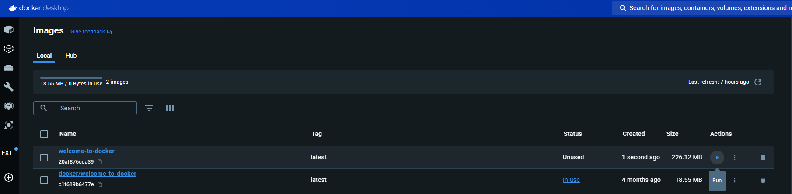
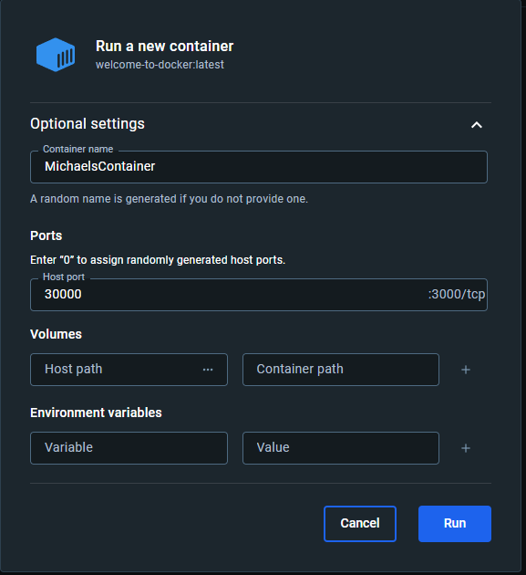
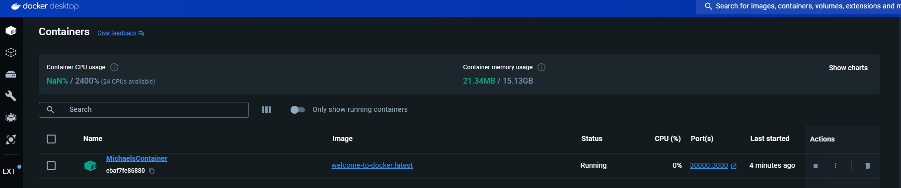
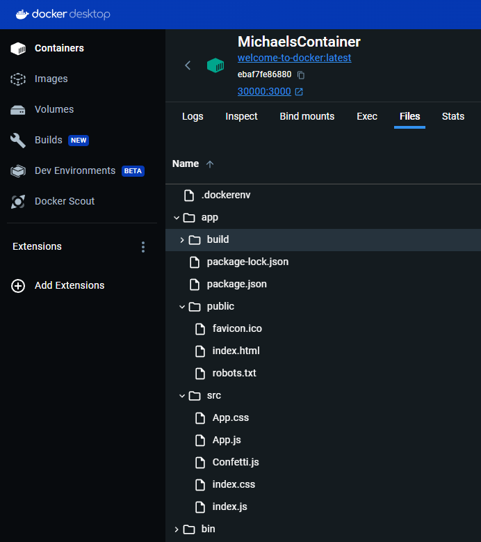
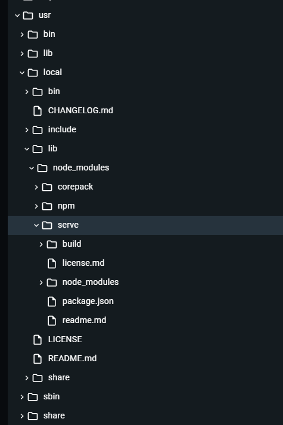

# Static Server Example

Inside the directory `welcome-to-docker` includes a small project. It is a static webpage provided by the docker documentation guide. Normally, this project can be ran and hosted by any traditional means. Here, this will be done using Docker. Firstly, the image (Docker file) will be created that gathers the dependencies, source code and initializes the server.

To create a container from an image, the following command will be used,

```
docker build -t welcome-to-docker .
```

Here, the `-t` sets the name and `.` tells docker the current location of the Docker file (This is ran from inside the root directory of `welcome-to-docker`). Using Docker Desktop, we can see the created image with the ability to run a container using the "run" button.



Once the image is created, we run the image (i.e, create a container).



Here, two IP addresses will be specified. It is in the format of `<host ip>: <container ip>`. Here, it's stating that port `30000` on the host machine is mapped to port `3000` inside the Docker container. The container IP address is the internal IP address assigned to the container within the Docker network. The host IP address for the hosts physical machine, allowing access via `http://localhost:30000/`.



## Inside the Docker file

The Docker file is shown below,

```Docker
# Start your image with a node base image
FROM node:18-alpine

# The /app directory should act as the main application directory
WORKDIR /app

# Copy the app package and package-lock.json file
COPY package*.json ./

# Copy local directories to the current local directory of our docker image (/app)
COPY ./src ./src
COPY ./public ./public

# Install node packages, install serve, build the app, and remove dependencies at the end
RUN npm install \
    && npm install -g serve \
    && npm run build \
    && rm -fr node_modules

EXPOSE 3000

# Start the app using serve command
CMD [ "serve", "-s", "build" ]
```

Here, I will explain each line individually.

---

```Docker
# Start your image with a node base image
FROM node:18-alpine
```
1. `FROM:` This keyword is used to set the base image. It indicates the image that your image will be based on.

2. `node:18-alpine`: This is a specific Docker image reference. It tells Docker to use an image named node with version 18 and based on the Alpine Linux distribution (alpine). The version 18 corresponds to the Node.js version. By specifying `FROM node:18-alpine`, you are choosing the official Node.js image as the foundation for your image. This image comes preconfigured with `Node.js` and `npm`, along with other dependencies, based on the Alpine Linux distribution. Alpine Linux is known for its lightweight nature, making the resulting Docker image smaller.

Here, the "base image" refers to the starting point for your Docker image, providing the fundamental operating system and environment on which your application will run.

---

```Docker
# The /app directory should act as the main application directory
WORKDIR /app
```

`WORKDIR`: Sets the working directory inside the container to `/app`. This means that subsequent commands will be executed from this directory, simplifying the path references.

---

```Docker
# Copy the app package and package-lock.json file
COPY package*.json ./
```

`COPY`: Copies the `package.json` and `package-lock.json` files from the local directory (where the Dockerfile is located) to the `/app` directory inside the container. This is done before copying the application source code to take advantage of Docker's caching mechanism, optimizing image build times.

---

```Docker
# Copy local directories to the current local directory of our docker image (/app)
COPY ./src ./src
COPY ./public ./public
```

More `COPY` commands to copy the `src` and `public` directories from the local directory to the `/app` directory inside the container. This includes your application source code and any public assets.

Both of the copies are observable when inspecting the container and we can see are all of the copies are inside the directory `/app` where the commands were ran.



---

```Docker
# Install node packages, install serve, build the app, and remove dependencies at the end
RUN npm install \
    && npm install -g serve \
    && npm run build \
    && rm -fr node_modules
```

1. `RUN`: Executes commands during the image build process.
2. `npm install`: Installs Node.js packages based on the `package.json` and `package-lock.json` files.
3. `npm install -g serve`: Installs the `serve` package globally, which is a simple HTTP server for serving static files.
4. `npm run build`: Runs the build script specified in your `package.json`. This is common for projects using tools like Webpack, which bundle and minify the source code. The build folder is called `build` and is highlighted in the above screenshot. This folder is generated via this command. The `build` folder will be contain minified code, etc...
5. `rm -fr node_modules`: Removes the `node_modules` directory to reduce the image size. Since the application has already been built, the dependencies are no longer needed in the final image. For cases where you just need to serve a static site, everything you need is in the `build` folder, so the `node_modules` folder is only necessary for when you first build the static files. After that it can be safely removed because you have installed `serve` globally with `-g`.

In this case the global installation of `serve` will be put into `node_modules` located at, `usr/local/lib/node_modules/serve`.



---

```Docker
EXPOSE 3000
```

`EXPOSE`: Informs Docker that the container will listen on the specified network ports at runtime. In this case, it exposes port `3000`, indicating that the application inside the container will be accessible on this port.

---

```Docker
# Start the app using serve command
CMD [ "serve", "-s", "build" ]
```

`CMD`: Specifies the default command to run when the container starts. In this case, it runs the `serve` command with the `-s` flag and the `argument build`, indicating that the static files in the `build` directory should be served.