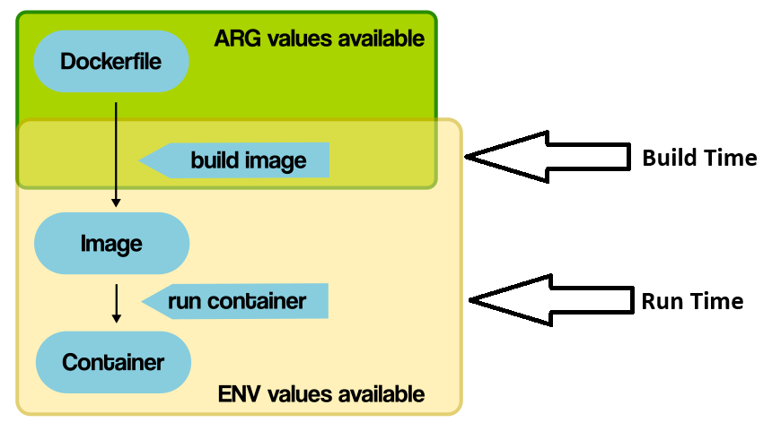

# Build Time and Run Time


In Docker, build time and run time refer to two distinct phases in the lifecycle of a containerized application.



#### Build Stage

The build stage involves creating a Docker image from a Dockerfile. This stage focuses on defining the environment and dependencies required to run the application. Commands specified inside a Dockerfile are executed during the build stage when you build a Docker image using the `docker build` command. An example Docker file can be,

```Docker
FROM python:3.9

WORKDIR app

COPY ./requirements.txt .

RUN pip install -r requirements.txt
```

- The build stage involves creating a Docker image. During this stage, Docker reads instructions from a Dockerfile and executes them to create a self-contained image that includes all the dependencies and configurations required to run the application.
- Typical actions performed during the build stage include copying application code, installing dependencies, configuring the environment, and more. Common commands inside the Dockerfile include `pip install requirements.txt` for Python based applications.
- The build stage results in the creation of a Docker image, which serves as a blueprint for running containers.

Because the build time focuses on the creation of the Docker image it's important to remember some key characteristics of the Docker image.

1. A Docker image is a lightweight, standalone, and executable package that contains all the dependencies and configurations required to run a software application.

2. Think of a Docker image as a snapshot of a filesystem that includes everything needed to run an application: the application code, runtime environment, system libraries, dependencies, and other files.

3. Docker images are created using a Dockerfile, which contains instructions for building the image, such as specifying the base image, copying files, installing dependencies, and defining the runtime environment.

4. Docker images are immutable, meaning they are read-only and cannot be modified once created. Any changes to an image require creating a new image.

5. Docker images are composed of one or more read-only layers. Each layer represents a set of filesystem changes made to the image during the build process. Layers are created based on the instructions in the Dockerfile, such as `RUN`, `COPY`, `ADD`, and `FROM`. Layers are used for efficient storage, caching, and distribution of Docker images.


#### Runtime Stage

The runtime stage involves creating and running containers based on the Docker image created during the build stage. This stage focuses on executing the application code within the containers.

- The runtime stage involves creating and running containers from the Docker image built during the build stage. Once the image is created, it can be used to instantiate one or more containers, each of which represents a running instance of the application.
- During the runtime stage, Docker starts the container based on the instructions and configurations defined in the Docker image.
- Containers created during the runtime stage execute the application code and interact with the underlying system resources (e.g., networking, storage) as specified in the Docker image.
- The actual volume mounting takes place after the container (The startup command) is running. Volumes are utilized in the runtime stage, **NOT** the buildstage.

It's important to remember that the build being done with the Docker file and running a Docker container (Which can also be done with `docker compose`) are two seperate things/concepts. Therefore, an example `compose.yaml` file with a database and server,

```YAML
services:
  web:
    build: ./app
    command: python manage.py runserver 0.0.0.0:8000
    volumes:
      - ./app:/usr/src/app/
    ports:
      - "8000:8000"
    env_file:
      - ./.dev.env
    depends_on:
      - db
  db:
    image: postgres:16
    volumes:
      - postgres_data:/var/lib/postgresql/data/
    environment:
      - POSTGRES_USER=admin
      - POSTGRES_PASSWORD=admin
      - POSTGRES_DB=radix_fitness_postgresql_db

volumes:
  postgres_data:
```

will be performed during runtime and **not** buildtime. Because containers are created from images, this means the volume will be mounted **after** the commands have been executed from the image. Because the mounting occurs at run time instead of build time, files need to be given to the image to perform the commands such as `pip install requirements.txt`, this is why `COPY` commands still need to be done, even if the volume gave access to the necessary files.