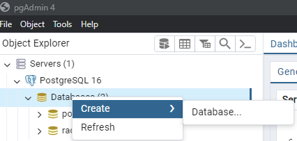
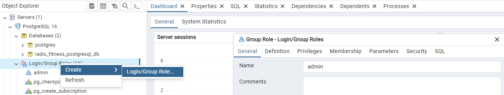
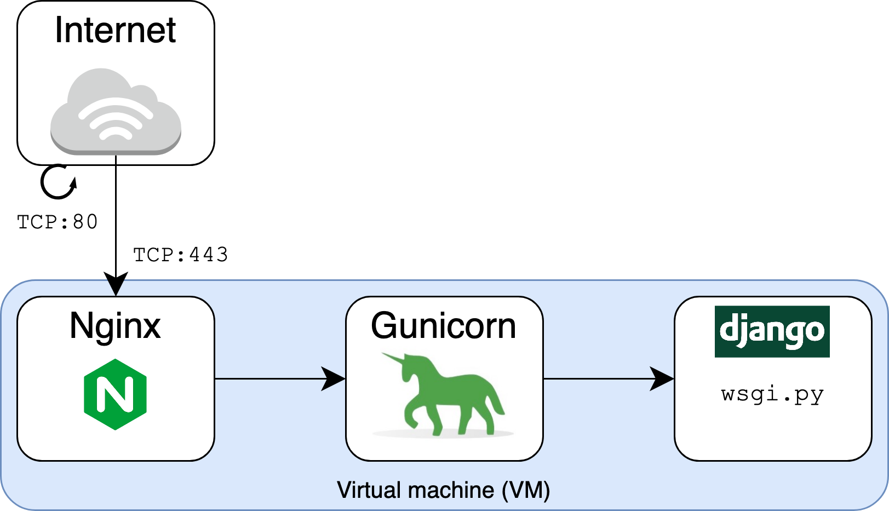

# Deploying Django

#### SQLite to PostgreSQL

Deployment of Django in a production server requires some modifications of the default architecture. Firstly, it should be noted that the default database used in a Django project is SQLite. This is found inside the `settings.py` and defaults to the following,

```Python
DATABASES = {
    'default': {
        'ENGINE': 'django.db.backends.sqlite3',
        'NAME': BASE_DIR / 'db.sqlite3',
    }
}
```

The `db.sqlite3` file is what contains the application data. While SQLite3 is acceptable for local development with low amounts of user data, when deploying this to production it's not sufficient for large scale projects. Three frequently used databases are SQLite, MySQL and PostgreSQL. All are relational database management systems. The key differences between each of them are,

1. **Architecture -** SQLite is a file-based database system that is embedded in the application itself, while MySQL are server-based databases that require a server to run.

2. **Scalability -** MySQL and PostgreSQL are designed to handle large databases and can scale to support multiple users and high-traffic websites, while SQLite is better suited for smaller projects and single-user applications.

3. **Performance -** SQLite is faster than MySQL and PostgreSQL for small to medium-sized databases, but it may not perform as well for large-scale applications.

4. **Features -** MySQL and PostgreSQL offer a wide range of advanced features such as stored procedures, triggers and views. Meanwhile, SQLite has a more limited feature set.

Here, SQLite has been shown to be useful when beginning development on Django, however when deploying it is best to change to database to PostgreSQL. [As per the reccomendation](https://stackoverflow.com/questions/585549/mysql-vs-postgresql-which-should-i-choose-for-my-django-project) of PostgreSQL from the creators of Django, it was decided to move forward with PostgreSQL when deploying.

Now, because I do not want to lose my current current inside my `db.sqlite3` file, we need to perform the following steps to migrate our database from SQLite3 to PostgreSQL without data loss.

1. First, backup the data first with the following command.

```sh
python manage.py dumpdata > datadump.json
```

2. An additional dependency is required called `psycopg2`. Install this from,

```sh
pip install psycopg2
```

Also, remember to update the `requirements.txt` using `pip freeze > requirements.txt`

3. Change the `DATABASES` variable inside of `settings.py` mentioned above to,

```Python
DATABASES = {
    'default': {
        'ENGINE': 'django.db.backends.postgresql',
        'NAME': 'radix_fitness_postgresql_db',
        'USER': 'admin',
        'PASSWORD': 'admin',
        'HOST': 'localhost',
        'PORT': '5432',  # Default PostgreSQL port
    }
}
```

4. Download and install PostgreSQL. Once PostgreSQL has been installed, the GUI tool that will be used is pgAdmin 4. Now, within the tool I will create the database called `radix_fitness_postgresql_db`.



In addition to this, I will create the account `admin` that will be used, with the password `admin`.



Here, the `USER` and `PASSWORD` will both be the user I just created with the username and password as `admin`. The `NAME` variable will be the name of the database I just created, `radix_fitness_postgresql_db`. The `HOST` variable is the IP address of where the database is hosted. Because I will be running this locally for now, `localhost` is used. Finally, the default port used for PostgreSQL is `5432`.

4. Migrate the database,

```sh
python manage.py makemigrations
python manage.py migrate
```

5. Finally, place the previously backed up data files into the new database with

```sh
python manage.py loaddata datadump.json
```

Now our application can successfully use PostgreSQL instead of SQLite3.

#### WSGI, nginx and Gunicorn


When deploying a Django application, WSIG (Web Server Gateway Interface), nginx, and Gunicorn are often used together to handle various aspects of serving web content efficiently and securely.


##### **WSGI (Web Server Gateway Interface)**

- WSGI is a specification for a universal interface between web servers and web applications or frameworks for the Python programming language.
- It defines a standardized way for web servers to communicate with Python web applications and frameworks.
- Django itself provides a WSGI application object that serves as the entry point for the web server to interact with the Django application.
- By defining this standard and pass the data through a WSGI server, we can change the backend as we please such as swapping Django for flask, because the specification is the same, the data passed to the Python object should accessible through the same names.

##### Gunicorn (Green Unicorn)

- Gunicorn is a popular WSGI HTTP server for Unix. It is a pre-fork worker model HTTP server for Python WSGI applications.
- It works by creating multiple worker processes, each capable of serving requests concurrently.
- Gunicorn is often used as an interface between the external web server (like nginx) and the Django application.
- It helps in handling incoming HTTP requests, manages concurrency, and ensures efficient handling of web traffic.

#### nginx

- nginx is a high-performance, open-source web server and reverse proxy server.
- It's often used as a reverse proxy server in front of Gunicorn to serve static files, handle SSL termination, load balancing, and manage other aspects of HTTP traffic.
- nginx can efficiently handle a large number of concurrent connections and can act as a frontend to Gunicorn, forwarding incoming requests to the Gunicorn server.


How these components are incorporated when deploying a Django app:

- **Client requests:** All incoming HTTP requests from clients are first received by the nginx server.

- **Static file serving:** nginx serves static files directly, such as CSS, JavaScript, and image files, without involving the Django application or Gunicorn. This reduces the load on the Django application and improves performance.

- **Dynamic content:** When a request requires dynamic content handled by the Django application, nginx forwards the request to the Gunicorn server.

- **Gunicorn:** Gunicorn, which is running the Django application, receives the forwarded request from nginx. It processes the request, interacts with the Django application using the WSGI interface, and generates an appropriate HTTP response.

- **Response:** Gunicorn sends the generated response back to nginx, which then forwards it to the client.



#### Containering Django

Before jumping into the creation of our Docker Compose, we first need to think about the architecture. We knowing the following things,

1. Our Database will be using PostgreSQL, this is where our Django application will request data from.
2. Our Django application will be ran using Gunicorn
3. We need to run a nginex server that will act as a proxy to our Gunicorn ran server.

Because of these three criteria, we know that we will need three containers, each to perform these tasks.

The final result `docker-compose.yaml` appears like this,

```YAML
services:

  db:
    image: postgres:16
    volumes:
      - postgres_data:/var/lib/postgresql/data/
    environment:
      - POSTGRES_USER=admin
      - POSTGRES_PASSWORD=admin
      - POSTGRES_DB=radix_fitness_postgresql_db

  web:
    build: .
    env_file:
      - .dev.env
    depends_on:
      - db

  nginx:
    build: ./nginx
    ports:
      - 1337:80
    depends_on:
      - web

volumes:
  postgres_data:
```

From here, I will break down and analyze each three componenets and what they accomplish.

# 1. PostgreSQL

This explanation will only explain the docker commands, for instructions on execution, this is explained further in the [README](https://github.com/Michael-Cowie/RadixFitnessBackend?tab=readme-ov-file#docker-for-development) for my backend.

The PostgreSQL configuration is setup using,

```YAML
db:
  image: postgres:16
  volumes:
    - postgres_data:/var/lib/postgresql/data/
  environment:
    - POSTGRES_USER=admin
    - POSTGRES_PASSWORD=admin
    - POSTGRES_DB=radix_fitness_postgresql_db
```

The breakdown of this is as follows,

- `image:` This specifies the Docker image to be used for the `db` service. In this case, it's using the official PostgreSQL image tagged as version 16 (postgres:16). This image provides a pre-configured PostgreSQL database server.
- `volumes:` This section specifies any volumes to be mounted inside the container. In this case, it's creating a volume named `postgres_data` and mounting it to the `/var/lib/postgresql/data/` directory within the container. This allows the database data to persist even if the container is stopped or removed.
- `environment:` Here, environment variables are defined for configuring the PostgreSQL database. Three environment variables are set:
    - `POSTGRES_USER`: This sets the username for accessing the PostgreSQL database to `admin`.
    - `POSTGRES_PASSWORD`: This sets the password for the `admin` user to `admin`.
    - `POSTGRES_DB`: This specifies the name of the database to be created within the PostgreSQL server. In this case, it's set to `radix_fitness_postgresql_db`.

Additonal environment variables can be found image documentation on [Docker hub](https://hub.docker.com/_/postgres).

# 2. Gunicorn

Inside the `docker-compose.yaml` the section responsible for using Gunicorn is,

```YAML
  web:
    build: .
    env_file:
      - .dev.env
    depends_on:
      - db
```

- `build:` This says that we will be using a `Dockerfile` located in the current directory to build our image.
- `env_file:` - Set environment variables for the container located inside the file `.dev.env`.
- `depends_on:` - When you start the containers using Docker Compose, it ensures that the `db` service is started before the `web` service. However, it's important to note that `depends_on` DOES NOT WAIT for the `db` service to be "ready" before starting the `web` service; it only ensures that the `db` service is started.

The Dockerfile that this is referring to is,

```Dockerfile
# Use the official Python image as a base image
FROM python:3.9

# Prevents Python from writing pyc files to disc (equivalent to python -B option)
ENV PYTHONDONTWRITEBYTECODE 1

# Prevents Python from buffering stdout and stderr (equivalent to python -u option)
ENV PYTHONUNBUFFERED 1

WORKDIR /usr/src/app

COPY . .

EXPOSE 8000

RUN pip install -r requirements.txt

RUN python manage.py collectstatic

CMD ["gunicorn", "backend.wsgi:application", "--bind", "0.0.0.0:8000"]
```
- `WORKDIR /usr/src/app` - Sets the current working directory.
- `COPY . .` - Copies the current directory of the Dockerfile (On the host machine) location to the current working directory previously set. In my example the Dockerfile is located at `backend/app/Dockerfile`. Therefore, it copies the entire contents of `app` to `/usr/src/app`.
- `RUN pip install -r requirements.txt` - This command is essential to put the dependencies of our application into the image. Remember that this Dockerfile creates the image, not the container.
- `RUN python manage.py collectstatic` - This is the second command that runs the Django command `collectstatic` to create a folder called `static` that contains all of the static files such as images, CSS, etc...

Finally, the command that setups up Gunicorn.

```Dockerfile
CMD ["gunicorn", "backend.wsgi:application", "--bind", "0.0.0.0:8000"]
```

This line specifies the default command to run **when the Docker container starts**. It launches the Gunicorn WSGI server to serve the Django application. Here, Gunicorn starts and binds to port 8000 `(0.0.0.0:8000)` and serve the Django application located at `backend.wsgi:application`. The `backend.wsgi:application` part refers to the WSGI application object within the Django project.

As part of the invocation of the WSGI application object, Django initializes itself. This initialization includes setting up various components such as database connections, middleware, and other settings defined in the project's `settings.py` module.

1. Once Django is initialized, it is ready to handle incoming HTTP requests.
2. When Gunicorn receives an HTTP request, it forwards the request to the Django application via the WSGI interface.
3. Django processes the request, generates a response, and returns it to Gunicorn, which then sends it back to the client.

Django is run within the context of the Gunicorn server, which acts as the web server handling HTTP requests and passing them to the Django application via the WSGI interface. A Django project typically has a structure where the `wsgi.py` file is the entry point for the WSGI application. This `wsgi.py` file contains a callable application object that Gunicorn can use to communicate with the Django application. When Gunicorn starts, it loads the WSGI application object.

The `backend.wsgi:application` string tells Gunicorn where to find the WSGI application object within the Django project's module structure. When Gunicorn starts, it imports the specified module (`backend.wsgi`) and accesses the application object defined within that module. When Gunicorn receives an HTTP request, it calls the WSGI application object. This invocation triggers the execution of the Django application code, starting with the initialization of the WSGI application object defined in `wsgi.py`.

The IP address `0.0.0.0` is a special address used in network configuration to represent all available network interfaces on a machine. It's often referred to as a "wildcard" address or "any address." Specifying `0.0.0.0` as the bind address instructs Gunicorn to listen for incoming connections on all network interfaces within the Docker container.

# 3. nginx

Finally, we will analyze how the nginx container works. This is seen in the Docker compose file as,

```YAML
nginx:
  build: ./nginx
  ports:
    - 1337:80
  depends_on:
    - web
```

- `build:` - This specifies the locker of the Dockerfile used for this container. It is located inside the `nginx` directory.
- `ports:` - This specifies that port 80 of the nginx container should be exposed on port 1337 on the host machine. This means that nginx will be accessible on port 1337 on the host machine.
- `depends_on:` - This indicates that the nginx service depends on the `web` service. Previously, we defined the `web` service to be gunicorn. It is important that gunicorn begins first as the nginx service will be forwarding the requests to gunicorn.

Next, we need to analyze two more things. Firstly, the Dockerfile found inside of `./nginx` and the configuration file used by the image.

The Dockerfile appears like this,

```Dockerfile
FROM nginx:1.25

RUN rm /etc/nginx/conf.d/default.conf
COPY nginx.conf /etc/nginx/conf.d
```

and the `nginx.conf` looks like this,

```nginx
upstream django {
    server web:8000;
}

server {
    listen 80;
    server_name localhost;

    location / {
        proxy_pass http://django;
        proxy_set_header Host $host;
        proxy_set_header X-Real-IP $remote_addr;
        proxy_set_header X-Forwarded-For $proxy_add_x_forwarded_for;
    }
}
```

First, let's go over the Dockerfile.

- `FROM nginx:1.25:` - This line specifies the base image for the nginx container. This example uses the official nginx docker image for version 1.25.
- `RUN rm /etc/nginx/conf.d/default.conf` - This line removes the default nginx configuration file that is included in the nginx image by default. This is done because we will be using a custom nginx configuration file instead.
- `COPY nginx.conf /etc/nginx/conf.d` - This line copies the custom nginx configuration file from the build context into the nginx containers `/etc/nginx/conf.d*` directory. This is where nginx looks for additional configuration files.\

This Dockerfile does not need a CMD line, unlike our gunicorn example. This is because the nginx base image [specifies the `CMD` to start the nginx server for us](https://github.com/nginxinc/docker-nginx/blob/1f227619c1f1baa0bed8bed844ea614437ff14fb/mainline/debian/Dockerfile#L119C1-L119C35). Remember, each Docker container can only run one `CMD`. If our Dockerfile were to specify a `CMD` it will overwrite the `CMD` inside the base image that would be executed. **Docker will always run a single command, not more**.

Finally, once our nginx image is setup can copies over our configuration file, it will be ran and interface with our gunicorn process. Next, we need to analyze and understand our `nginx.cong` specified above.

First, let's understand,

```nginx
upstream django {
    server web:8000;
}
```

1. `upstream django { ... }` - This line begins the definition of an upstream group named `django`. The name `django` is arbitrary and can be anything you choose; it's just a label for this group of servers.

2. `server web:8000;` - This line specifies a single server within the django upstream group. Here, `web:8000` is used as the server address. `web` refers to the hostname of the backend server. In Docker Compose, services can be accessed by their service name as DNS hostnames. So, `web` corresponds to the service name defined in the `docker-compose.yml` file. `8000` is the port on which the backend server is listening for incoming connections. In this example, it is `8000` because we specified that as the bind port for the gunicorn server.

The purpose of this `upstream` block is to define the backend servers (in this case, a single server) that NGINX should proxy requests to. When NGINX receives an HTTP request for a location that it's configured to proxy (e.g., in the location block within the NGINX configuration), it will forward that request to one of the servers defined in the upstream block. In this configuration, NGINX is instructed to forward requests to the `web` service  running on port `8000` within the Docker network.

Now, we will understand the second component of the configuration file,

```nginx
server {
    listen 80;
    server_name localhost;

    location / {
        proxy_pass http://django;
        proxy_set_header Host $host;
        proxy_set_header X-Real-IP $remote_addr;
        proxy_set_header X-Forwarded-For $proxy_add_x_forwarded_for;
    }
}
```

1. `server { ... }` - This defines a block used for a NGINX server configuration.
2. `listen 80;` - This directive tells NGINX to listen for incoming HTTP requests on port `80`. Port `80` is the default port for HTTP traffic.
3. `server_name localhost;` - The `server_name` directive in NGINX is used to specify which server block should handle a request based on the value of the `Host` header in the HTTP request. In this case, it's set to `localhost`. This means that NGINX will handle requests directed to `localhost`. 

In this context, a "server block" is referring to the block inside of the definition `server { ... }`. When NGINX receives an HTTP request, it examines the `Host` header to determine which server block should handle the request. NGINX compares the value of the `Host` header with the `server_name` directives in its configuration to find a match.

4. `location / { ... }` - This block defines a location directive for requests to the root URI `(/)`. It specifies how NGINX should process requests to this URI. However, this matches every URL or URI that begins with a forward slash `(/)`, which includes every URL or URI that will be queried.

The syntax for definition a location is,

```
location [modifier] [URI] {
  ...
}
```
If no modifiers exist in the location block (Such as our example), the requested URI is matched against the beginning of the requested URI.

5. `proxy_pass http://django;` - This directive tells NGINX to pass requests to the upstream group named `django`, which was defined using the `upstream` directive. NGINX will forward requests to one of the servers defined in the `django` upstream group. The `http://django` syntax is a reference to the `upstream` group defined earlier. Therefore, any requests made to `localhost:1337` via the Docker compose exposted port, will be forwarded to `http://web:8000`, which is our gunicorn server.

6. `proxy_set_header Host $host;` - This directive sets the value of the `Host` header in the proxied request to the value of the `$host` variable. The `$host` variable contains the hostname from the request's `Host` header. The `$host` variable in NGINX is a predefined variable that contains the value of the `Host` header in the client's HTTP request.

The `$host` variable in NGINX contains the value of the Host header from the client's original HTTP request. When you use `proxy_set_header Host $host;`, you're essentially setting the `Host` header in the request being sent to the backend server to the same value as the `Host` header in the client's request. In this case, the directive `proxy_set_header Host $host;` may seem redundant because it's effectively maintaining the original value of the `Host` header. However, it's often considered a best practice to explicitly set headers like `Host` to ensure clarity and consistency in the configuration.

7. `proxy_set_header X-Real-IP $remote_addr;` - This directive sets the value of the `X-Real-IP` header in the proxied request to the value of the `$remote_addr` variable. This header is used to pass the real IP address of the client making the request to the backend server.

8. `proxy_set_header X-Forwarded-For $proxy_add_x_forwarded_for;` - This directive sets the value of the `X-Forwarded-For` header in the proxied request to the value of the `$proxy_add_x_forwarded_for variable`. This header is used to pass the client's IP address along with any intermediary proxies that forwarded the request.

**Usage with the `upstream` Block** - The `location / { ... }` block is where the `proxy_pass` directive is used to define the `upstream` server group (`http://django`) to which NGINX should forward requests. NGINX will receive incoming HTTP requests on port `80` and forward them to the upstream servers defined in the `django` upstream group.

Now, at the end of all of this, 

1. After running `docker compose up`, we can now make a request to `localhost:1337` on the local machine. 
2. Docker compose exposed our nginx container running on port `80` to be accessed on port `1337`. Therefore, making
   a request to `localhost:1337` will now be forwarded to nginx. 
3. Now, because NGINX is setup to forward our request to our `django` container via `proxy_pass http://django;`, this
   will now be received by the gunicorn process.
4. After NGINX has forwarded our request to our gunicorn process, they will then forward it to our running Django application where we will parse the request and handle a response.
  