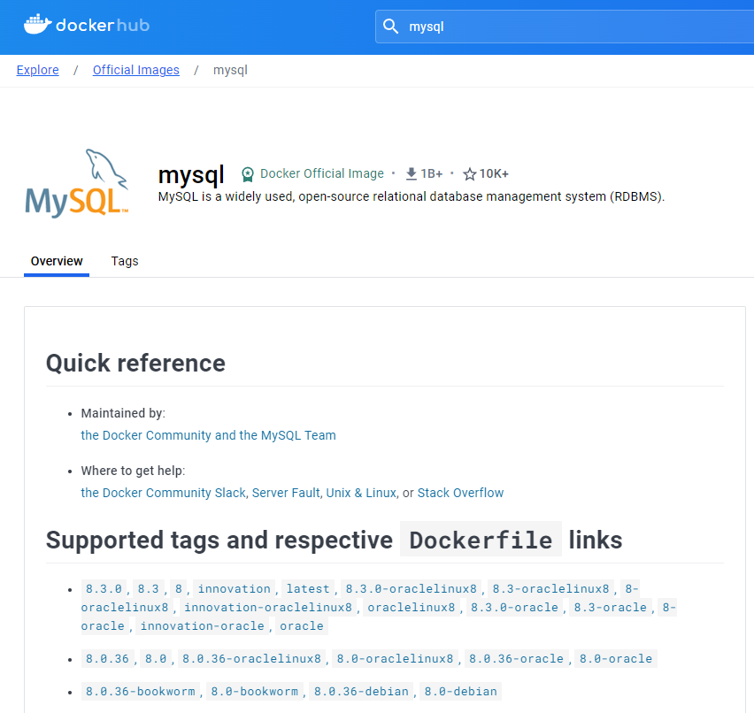
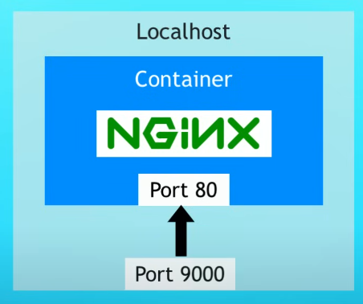
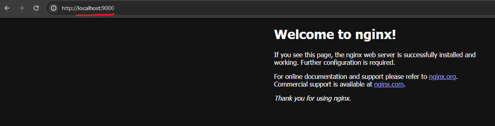
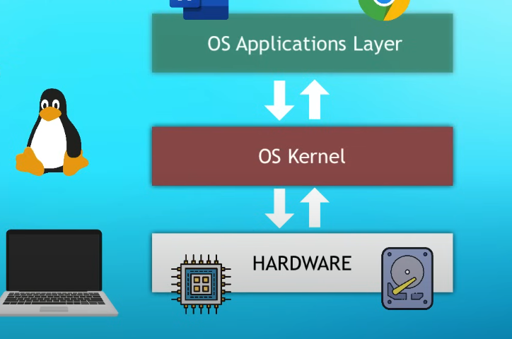
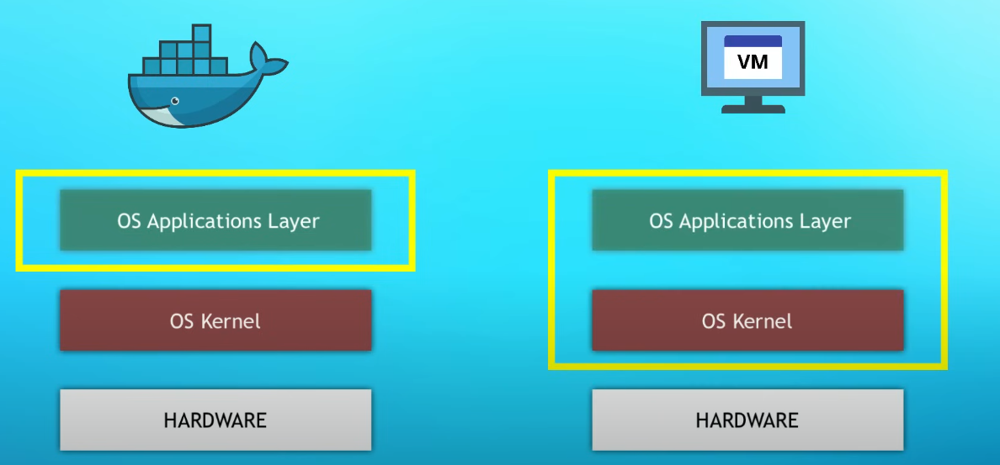
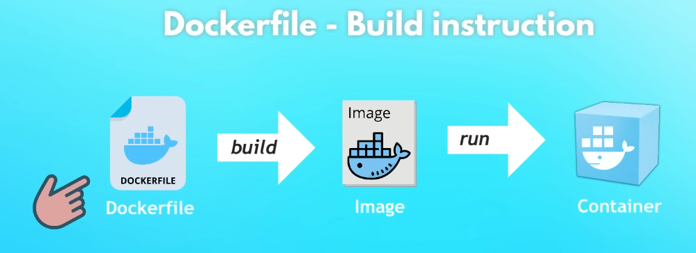
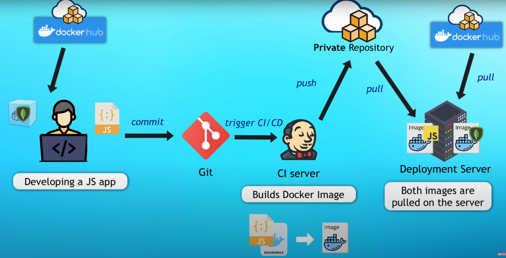

<div align="center">
  <h1> Docker Introduction </h1>
</div>

Docker is virtualization software that makes developing and deploying applications much easier. **Docker does this by packaging an application with all the necessary dependencies, configurations, system tools into something called a container**. The application code itself, libraries, dependencies and also the runtime and environment configuration. So, the application and its running environment are
both packaged in a single Docker package which we can easily share and distribute. The two key concepts to understand in Docker are **containers** and **images**. Containers and images are fundamental concepts that work together to facilitate the deployment and execution of applications.


Key features of Docker include:

1. **Portability:** Docker containers encapsulate the application and its dependencies, ensuring consistency and portability across various environments, from development to testing and production. The dependencies and build instructions will be defined in the `Dockerfile`.

2. **Isolation:** Containers provide a level of isolation, ensuring that applications and their dependencies run consistently regardless of differences in the underlying infrastructure.

3. **Resource Efficiency:** Docker containers share the host operating system's kernel, reducing the overhead associated with virtual machines and making better use of system resources.

4. **Versioning and Rollback:** Docker allows versioning of container images, enabling easy rollbacks to previous states if issues arise during deployment or updates.

##### What Problems Does Docker Solve?

Docker was created to address the challenges of deploying and managing applications in diverse and dynamic computing environments. Usually, when you have a team of developers working on some application, they would have to install all of the services that application depends on, such as databases (SQL, MongoDB), etc... directly on their machine. Every developer on the team needs to install and configure all services directly. Depending on the OS, each installination environment will be different too. This task can become very tedious depending on how complex the application is.

Containers solve this problem as we do not need to install any of the services directly on the host machine because with Docker we have the service packaged in one isolated environment, packaged with its entire configuration inside of a container. As a developer, we do not need to go and look for some binaries to download and install. Creating the container, Docker will fetch the dependencies and start it.

Docker containers aid when deploying too, as it aids significaly when setting up and configuring it on the server. It will significantly reduce any errors, as such the server having multiple different versions of a single dependency or simply human error setting up the application again on the server. Now, given the application code and Docker file, the application can easily be deployed on the server. This only has the requirement of the server requiring the Docker runtime to be installed. 

##### Docker Image

An image is a lightweight, standalone, and executable package that includes everything needed to run a piece of software, such as code, runtime, libraries, and system tools. **An image serves as a template for creating containers**. Images are typically built from a set of instructions (Dockerfile) that specify the application's configuration and dependencies. Images are versioned, allowing you to track changes and roll back to previous states if needed. Images are immutable, meaning they cannot be modified once created. Instead, any changes result in the creation of a new image. The creation of a Docker image is done during the buildtime stage.

A Docker image is composed of one or more read-only layers. Each layer represents a set of filesystem changes made to the image during the build process. Layers are created based on the instructions in the Dockerfile, such as `RUN`, `COPY`, `ADD`, and `FROM`. Layers are used for efficient storage, caching, and distribution of Docker images.

##### Docker Container

**A container is a runnable instance of a Docker image**. It is an isolated environment that encapsulates the application and its dependencies, ensuring consistency across different environments. Containers are lightweight and share the host operating system's kernel, making them more resource-efficient compared to traditional virtual machines. Creating and using a Docker container is done during the runtime stage.

Containers are a standalone isolated environment to run any code. Containers include everything needed to run a piece of software, including the code, runtime, libraries, and system tools. Docker uses containerization technology to isolate applications from the underlying infrastructure, making it easy to deploy and run applications consistently across different environments.

Containers provide process isolation, file system isolation, and networking isolation, enabling multiple containers to run on the same host without interference. Containers can be easily started, stopped, moved, and replicated, contributing to a more agile and scalable deployment process.

##### Summary

An image is a static, immutable snapshot that includes all the necessary components for an application, while a container is a dynamic, runnable instance of that image. Images act as blueprints for containers, allowing developers to package and distribute applications consistently. Containers, on the other hand, offer an isolated and portable runtime environment for executing applications based on these images. Together, images and containers form the core building blocks of containerization in Docker.

##### Docker Registries

Now, it's clear that we get containers by running images. However, how do we get images to run containers from? Let's say we want to run a database container such as MySQL, how do we get their Docker images? That is where Docker Registries come in. Their are ready Docker images online in image storage or registry. Basically, this is a storage specifically for Docker image type of artifacts. Usually, the company developing those services like MySQL, as well as the Docker community itself will create that is called "official images", so you know this MySQL image was actually created by MySQL itself or the Docker community.

Docker itself offers the biggest Docker registry called [Docker Hub](https://hub.docker.com/). This is where we can find any of these official images or additional images that individual developers have created and uploaded there. Docker hub also offers the ability for private registries that require authentication to access.

As a quick note, we may hear the terms "registry" and "repository". As a simple explanation, a docker registry is a service providing storage for images. It can be hosted by a third party such as AWS or by yourself. Inside the registry, we hold multiple repositories for all of different application images. A docker repository is simply, a collection of related images with the same name but different versions.

##### Docker Image Versions

As time goes on, technology changes and images will be changed. In this case, a new Docker image will be created. Therefore, images are versioned aswell, these are called image tags and follow the format `<name>:tag`. On the page for each image on Docker Hub, we actually have the list of versions/tags of that image. Below is an example for MySQL.



There is a special tag which all images have called `latest`. Using the `latest` tag will grab the newest release. Using a specific version is best practice, especially for deploying to production. Without specifying the version, such as using `docker pull mysql`, the tag `latest` is implicitly used.

To obtain the image, the command `docker pull <image_name>:<version>` is used, such as `docker pull mysql:latest`. From here, the Docker client will connect to Docker Hub and request to download the specific image. Running the command `docker images` will list all available images on the local machine. From here we can run a container from the downloaded image by using 

```sh
docker run -d --name <container_name> <image name>:<version>
```

Infact, we do not need to pull an image for this to work. When running a command and providing an image at the end, if we do not have it locally, Docker will automatically fetch it from Docker Hub.

##### Container Port vs Host Port

After running a container, how can we access it? Simply put, we cannot right now. This is because the container is running in the closed Docker Network, so we cannot access it from our local computer browser. We need to expose the container port to the host. What we need is do is called "port binding". This will bind the containers port to the hosts port to make the service available to the outside world. The container is running on some port, each application has some standard port on which it's running. For example, `nginx` always runs on port `80`, `redis` runs on port `6379`. 

What we need to do is tell Docker to bind the specific port inside the container to be a port on the host machine. This mean, we treat port `9000` on the host machine as port `80` on the container. This means `localhost:9000` will make a request to the container on port `80`.



This is done with an additional flag when creating a Docker container in the format `-p <host_port>:<container_port>`. For example,

```sh
docker run -d -p 9000:80 nginx:1.23
```

will create a `nginx` container running on port `80` on the container, but become accessible on the host machine on port `9000`.



---

In addition to port mapping, it should be noted that the `EXPOSE` keyword in the Dockerfile **does not expose a port**. `Expose` is basically documentation, and not using it does not restrict access. This is a dangerous misunderstanding if anyone relies on it to limit access. The `EXPOSE` instruction does not actually publish the port. It functions as a type of documentation between the person who builds the image and the person who runs the container, about which ports are intended to be published.

Therefore,

- `EXPOSE` is a way of **documenting**.
- `--publish` or (`-p`) is a way of **mapping** a host port to a running container port.

##### Virtual Machine vs Docker

Firstly, we need to understand how an operating system is made up. Operating systems have two layers, the OS kernel and the OS Applications Layer. The kernel is the part that communicates with the hardware componenets like CPU memory storage etc... So, when you have a physical machine with all these resources and you install an OS on that physical machine, the kernel of that OS will actually be the one talking to the hardware components to allocate resources like CPU memory storage etc... to the applications. These applications are a part of the applications layer and they run on top of the kernel layer. So the kernel is essentially a middleman between the applications that you see when interacting with the computer.



Because Docker and Virtual Machines are virtualization tools, the question is, which parts of the OS do they virtualize? 

The main different between Docker and Virtual Machines lie from the fact that Docker will virtualize only the OS applications layer. Docker will use the kernel of the host. Docker does not have its own kernel. On the other hand, a Virtual Machine has its own applications layer and also its own kernel. A Virtual Machine therefore virtualizes the complete OS.



This results in a significant difference in image sizes. Docker images are significantly smaller as they only have to implement only one layer of the OS. Docker images are mostly a couple of MB of size, whereas VM images are often GB in size. The result is that using Docker can save a lot of disk space. Additionally, a Docker container can begin in a few seconds, whereas VM will take minutes to start because it also has to boot up a kernel everytime it starts, whereas Docker will reuse the host kernel.

Keep in mind that because Docker uses the users kernel, this means it cannot run Linux based software applications on a Windows OS. Linux based Docker images, cannot use the Windows kernel. Docker was originally built for the Linux OS and most popular containers are Linused based. Thankfully, this problem was later resolved when developing on Windows or MacOS by using Docker Desktop for Windows and MacOS. This made it possible to run Linux containers on Windows or MacOS. Docker Desktop uses a Hypervisor layer with a lightweight Linux distro on top of it to provide the needed Linux kernel, allowing the possibility to run Linux based containers on Windows and MacOS.

##### Dockerfile - Create Our Own Image

When you're done with development and we want to release it to the end users, we want to run it on a deployment server. To make the deployment process easier, we want to deploy our application as a Docker container aslongside our other dependencies as Docker containers. We need to create a "definition" of how to build an image from our application. This definition is written inside a `Dockerfile`.



A **Dockerfile** is a text file that defines the instructions to build a Docker image. It follows a specific structure, **creating layers** that stack together to form a final image. The order of commands and efficient layering significantly affect the iamges size, performance and build time.

A Dockerfile consists of keywords (instructions) followed by arguments. Each line defines a step in the image-building process. Comments begin with `#`.

The basic syntax is,

```
# Comment
INSTRUCTION arguments
```

Docker images are made up of **layers**, with each instruction in the Dockerfile creating a new layer. These layers are stacked to form the final image, and Docker uses **layer caching** to optimize builds.

Each instruction (e.g., `RUN`, `COPY`) creates a new layer. Layers are cached. If a layer doesn't change, it's reused from the cache, speeding up subsequent builds. Changing one layer invalidates the cache for all subsequent layers. This means that any modification to a step in the Dockerfile forces Docker to rebuild that layer and all layers that come after it, even if those subsequent layers haven't changed.

Some of the best practices for layer management are,

1. **Place rarely changing instructions early** - These layers are cached, rebuilding rebuild time.

2. **Combine commands** - Minimize the number of layers by combining related `RUN` commands.

3. **Avoid redundant layers** - Remove unnecessary steps to keep the image smaller.

The order of commands in a Dockerfile matters because,

1. **Layer Caching** - Changing an earlier instruction invalidates the cache for all following layers.

2. **Dependency Management** - Instructions that depend on previous steps must follow them.

3. **Efficiency** - Logical ordering minimizes unecessary rebuilds and ensures correctness.

Here is an example of inefficient ordering,

```Docker
COPY . /app
RUN apt-get update && apt-get install -y curl
```

Any change to the files in the `COPY` step will force the `RUN` step to execute again, wasting time.

```Docker
RUN apt-get update && apt-get install -y curl
COPY . /app
```

Here, the `RUN` step is cached and doesn't need to be repeated unless dependencies change.

Some of the essential keywords in Docker are,

1. `FROM` - This is **required** and it specifies the base image. Every Dockerfile must begin with a `FROM` instruction.

```Docker
FROM python:3.9-slim
```

This sets the foundation for the image and is in the format of `<name>:<version>`.

- `python` - This indiciates the official Python image available on Docker Hub.
- `3.9` - Specifies the Python version, in this case, Python 3.9.
- `slim` - Refers to a variant of the Python 3.9 image is smaller and more lightweight compared to the default Python image.

2. `RUN` - Executes commands in the shell during the **build process**, typically for installing software or configuring the environment.

```Docker
RUN apt-get update && apt-get install -y curl
```

3. - `COPY` and `ADD` - These commands will **add files from the host machine to the image**. The difference is that `COPY` will copy files or directories while `ADD` has the same functionality as `COPY` but also supports remote URLs and archive extraction.

```Docker
COPY app.py /app/
```

4. `CMD` - Specifies the default command to run **when the container starts**. Can be overridden by the user.

```Docker
CMD ["python", "app.py"]
```

You should use `CMD` to set defaults and `ENTRYPOINT` for required commands.

5. `ENTRYPOINT` - Defines the containers main process. Unlike `CMD`, it's difficult to override.


```Python
ENTRYPOINT ["nginx", "-g", "daemon off;"]
```

The `ENTRYPOINT` specifies a command that will always be executed when the container starts. The `CMD` specifies arguments that will be fed to the ENTRYPOINT.

6. `WORKDIR` - Sets the working directory for subsequent instructions.

```Docker
WORKDIR /app
```

7. `EXPOSE` - **Documents** the port on which the container listens. This is optional, it does not actually publish the port.

```Docker
EXPOSE 8080
```

8. `ENV` - Sets environment variables in the container.

```Docker
ENV APP_ENV=production
```

This is a subtle list of available options with many more available!

Here is a practical example of a Dockerfile for a Python web application.

```Docker
# Base image
FROM python:3.9-slim

# Set environment variables
ENV PYTHONDONTWRITEBYTECODE=1
ENV PYTHONUNBUFFERED=1

# Install dependencies
RUN apt-get update && apt-get install -y build-essential
RUN pip install --no-cache-dir flask

# Set working directory
WORKDIR /app

# Copy application code
COPY . /app

# Expose the port
EXPOSE 5000

# Default command
CMD ["python", "app.py"]
```

The `docker build` command is used to create a Docker image based on the Dockerfile,

```Docker
docker build -t my-python-app .
```

- `-t my-python-app` - Tags the image with the name `my-python-app`.
- `.` - Indicates the context directory, which is sent to the Docker daemon. This directory includes the Dockerfile and the application code.

Once built, the image is stored locally and can be listed with,

```Docker
docker images
```

##### Development and Deployment Lifeycle


Suppose we take an example with a JavaScript application using MongoDB, instead of installing it on your laptop you download a Docker container from the Docker Hub. So, we connect our JavaScript application with the MongoDB and we start developing. Suppose we developed the first version of the application locally and we now want to deploy it on the development environment where a tester can test it.

Firstly, we commit and push our changes to GitHub. This will then trigger a continuous integration action to build the docker image. The docker image will then (optionally) be pushed to a private repository, which can then be pulled down from the deployment server. The deployment server can fetch the MongoDB image from Docker Hub registry, but will need to grab the image for our JavaScript application from the private repository. Now we have two containers, the custom container and a publically available MongoDB which can now talk to each other and run as an app.


