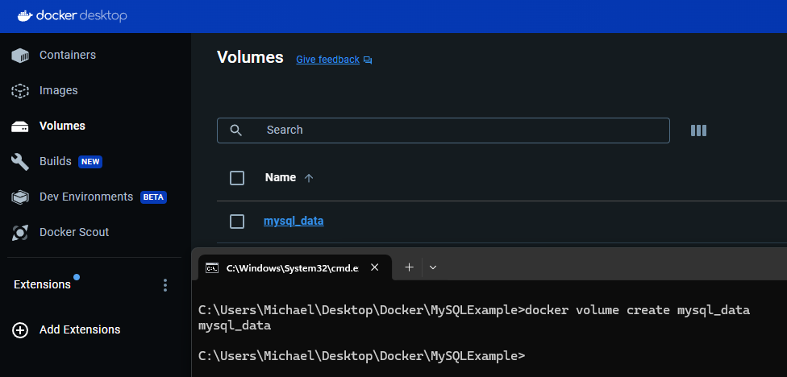
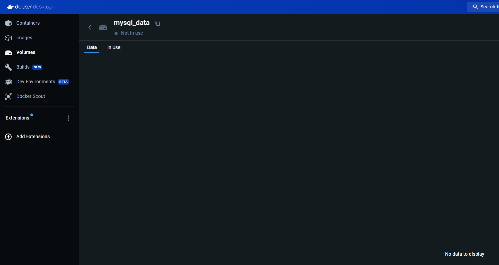
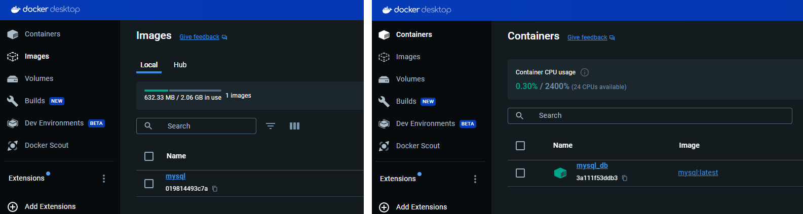
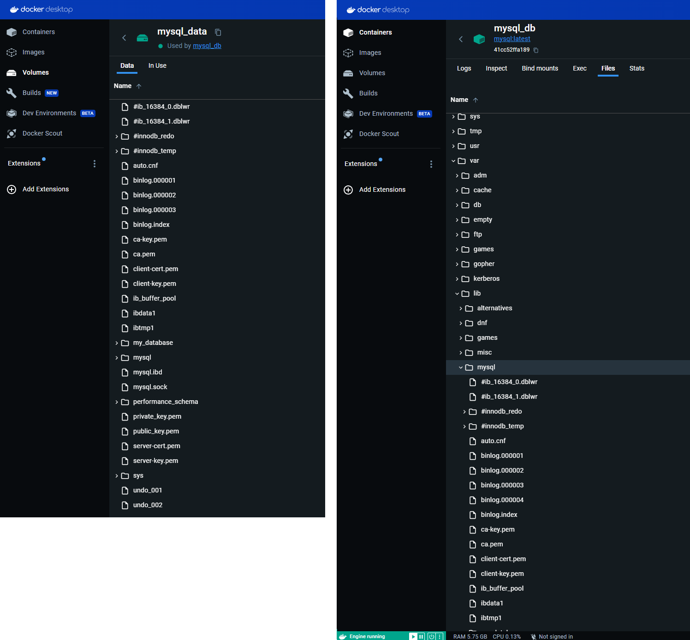
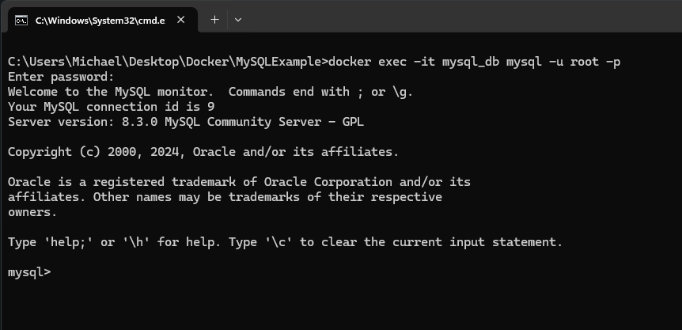
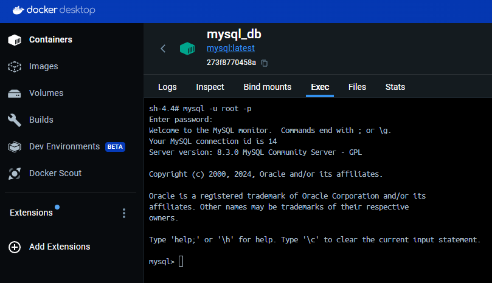

<div align="center">
  <h1> Volumes </h1>
</div>

On a host we have a physical file system. The way volumes work is that we plug the physical file system path into the containers file system path. Meaning, a folder in the physical host file system is mounted into the virtual file system of Docker. What happens is that when a container writes to its file system it gets automatically repliced/written on the host file system directory (and vice versa). This is why, if a container restarts from a fresh state in its own virtual file system it gets the data automatically from the host because the data is still there. This is how data is populated on startup of a container.

Volumes provide a way to persist data beyond the lifecycle of a container. They can be used to share files between the host machine and the container or between multiple containers. When you mount a volume to a container, the contents of the volume are accessible to the container at runtime, and any changes made to the volume from within the container are reflected on the host machine and vice versa.

**Volumes are mounted to containers during the runtime stage, when you create and start a container from a Docker image.  Because volumes are used at runtime, the `.dockerignore` file is used to ignore files during build time. Therefore, it doesn't works with volumes.**

Their are two ways to get app code into the container, which have different advantages/disadvantages, but you would typically only do one or the other, but not both:

1. **Copy the code into the immutable image as a layer during build time** when you want to ship your code to run in production. This is done in the Dockerfile with the `COPY` command.

2. **Mount a directory on the host containing your code** when you want to iterate quickly during development and test changes without rebuilding the image.

# Volume Types.

#### Host Volume

Their are three types of docker volumes and so, different ways of creating them. Usually the way to create a docker volume is by using the `docker run` command. Within here, their is a flag `-v`. This is where we define the connection of the reference between the host directory and container directory, specified in the format `-v <host directory>:<container directory>`. An example is as follows,

```sh
docker run -v /home/mount/data:/var/lib/mysql/data
```

This type of volume is called host volume. The main characteristic of this type is that we decide where on the host file system that reference is made. Meaning, which folder on the host file system we mount into the container. When the container is ran, the container folder `/var/lib/mysql/data` will now be mounted.

#### Anonymous Volume

The second type is where we create a volume, just by referencing the container directory. We do not specify which
directory on the host should be mounted, but that's taken care of by docker itself. An example is as follows,

```sh
docker run -v /var/lib/mysql/data
```

Docker will create an anonymous volume on the host machine, such as, `/var/lib/docker/volumes/<random hash>/_data`. For each container their will be a folder generated that gets mounted automatically to the container and this type of volume is called anonymous volume because you don't have a reference to the automatically generated folder. Therefore, we will have to know the path.

#### Named Volume

The third type of volume is an improvement on the anonymous volume by specifying the name of that volume. This volume will also be found on the host file system in the volumes location. The name is simply to reference the location of the volume. The syntax is changed to `<volume name>:<container folder>`, as example is as follows,

```sh
docker run -v name:/var/lib/mysql/data
```

This is the type of volume we should be using in production, as their is additional benefits to letting docker actually manage those volume directories on the host. It is possible to have multiple containers utilize the same named volume. This allows data sharing, illustrated below.


It's important to note that **data is never copied into a volume, it's always just mapped**. When you create a new file inside the container that is inside the volume location, we can observe that it's also inside the volume. This is because it's the same file mounted to appear in two places.

Picture the volume as a network share. If someone makes a change on the network share, everyone that's using it sees that change. So the first container starts, makes a change, and exits. The second container starts, and sees the change the first one made. If you ran two containers simultaneously they'd both be hitting the same files in the same volume, which would be messy with multiple databases trying to share a single location.

#### Volumes in Docker Compse

Volumes defined in the docker compose file is nearly identical to that defined in the CLI. Below is an example of using a named volume. Keep in mind, at the end, in the same level as the services, we need to list all of the volumes that we have defined.

```YAML
services:
    mongodb:
        image: mongo
        ports:
            - 27017:27017
        volumes:
            - db-data/var/lib/mysql/data
volumes:
    db-data
```

# Host Volume Example


Once an image is made, it becomes read only. Meaning, if we change our application in anyway whether it be changing the source code or adding new dependencies we then have to rebuild a new image based on those changes.

We can see that a container by default does not update by stopping and restarting a container by executing,

```bash
docker start my_container
```

Then observing the application and make changes,

```bash
docker stop my_container
docker start my_container
```

Keep in mind, `docker start` does not spawn a new container. However, `docker run` will create a new container instance. What we are observing is not a bug. This is expected behaviour as an image is a snapshot of the code taken at that point in time, it should not be expected to change or update. Once the image is created, it will become read only. To resolve this without volumes we would have to create a completely new image from the new code and make a new container from the new image.

To get around this behaviour, Docker offers volumes. Volumes are a feature that allow us to specify folders on our **host computer** that can be made available to running containers. We can map the folders on our host computer to specific folders inside the container. This means, if anything changed inside the specified folders on the host machine, that change will also be reflected into the mapped to folders inside the container.

One important thing to note about this is that the image itself **does not change**. Volumes just give us a way to map directories between containers and the host computer. The image that the container is running does not change. If we wanted to update the image to share or create new containers, then we will have to rebuild the image. Volumes are very useful for development purposes to see the changes without rebuilding the image.

Given a project structure as,

```
api/
├─ node_modules/
│  ├─ app.js
│  ├─ DockerFile
│  ├─ package.json
│  ├─ package-lock.json
```

and a Docker file which will be causing the container to work in `/app` which is caused by having `WORKDIR /app` inside the Docker file.

We need to map our `api` folder to `/app` in the container, using volumes. This can be done by the `-v` flag when creating our container, e.g.

```cmd
docker run --name my_container -v C:\...\api:/app my_image
```

Where the format is `<host folder>:<container folder>`. This means, any changes inside of `C:\...\api` will now be pushed to the container inside of `/app`.

In addition we can add a `-v /app/node_modules` to mount a volume (Docker internal volume) at the `/app/node_modules` directory inside the container. This can be added to avoid overwriting the `node_modules` directory with the local version. Mounting a volume here means that the `node_modules` directory will not be used and the image's built in `node_modules` will be preserved.

# Persistent Storage Using Named Volumes

In this example, I will create a volume to allow for persistent storage in a MySQL database.

1. The first thing to do is to create the volume.

```sh
docker volume create mysql_data
```



After execution of the command, the new volume will appear in the "Volumes" tab. When opening the Volume, we can observe that the Volume contains no data.



2. Once we have created the Volume, the next goal is to create both an image and a container. We must create a container from an image. The base image we are seeking is the `mysql` image. This is done using the following command,

```sh
docker run -d --name mysql_db -e MYSQL_ROOT_PASSWORD=password -e MYSQL_DATABASE=my_database -v mysql_data:/var/lib/mysql mysql:latest
```

We can break down the previous command as follows,

- `docker run` - This is the command used to create and start a new Docker container based on a Docker image.
- `-d` - This option stands for "detached" mode. It means that the container will run in the background and won't occupy the terminal session.
- `--name mysql_db` - This option assigns the name `mysql_db` to the container.
- `-e MYSQL_ROOT_PASSWORD=password` - This option sets an environment variable that is used by the MySQL Docker image to set the root password for the MySQL server running inside the container.
- `-e MYSQL_DATABASE=my_database` - This option sets an environment variable `MYSQL_DATABASE` to `my_database`. This environment variable tells MySQL Docker image to create a database named `my_database` when the container starts.
- `-v mysql_data:/var/lib/mysql` - This option uses the Docker volume named `mysql_data` mounts it to the directory `/var/lib/mysql` inside the container. This is where MySQL typically stores its data, including databases and tables. By using a volume, the data stored in this directory will persist even if the container is stopped or removed.
- `mysql:latest` - This is the name and tag of the Docker image used to create the container. In this case, it's the official MySQL Docker image tagged as `latest`, which means it will use the latest available version of the MySQL image.

In summary, when we run the command Docker will create a new container called `mysql_db` based on the `mysql:latest` image. The container will run in detached mode, setting the MySQL root password to `password` and create a database named `my_database`. Additionally, it will use a Docker volume named `mysql_data` to persist the MySQL data in the `/var/lib/mysql` directory.

After executing the command we can see creation of the image and container,



The volume has now been populated from the container initialization. Inside the `mysql_data` volume we can also see the `my_database` folder. Additionally, when we use the Volume from the flag `-v mysql_data:/var/lib/mysql` we can compare to volume to the container folder structure. When we use a volume, we are mounting the directory inside the container to the volume. This means that the container is no longer referencing a directory inside the container, but rather, it is now "mounted" and referring to the volume. This means any changes the container does inside of `/var/lib/mysql` will be making changes inside the volume, hence, when we initialized the MySQL server and the directory was populated with files, it is reflected inside the volume.



3. Once the Container is running, we then need to connect to the database and create a table. To connect to the container and gain the ability to execute commands we need to run,

```sh
docker exec -it mysql_db mysql -u root -p
```



Now, breaking down the command.

- `docker exec` - This is the command to execute commands in a running container.
- `-it` - These are options that stand for interactive mode with a pseudo-TTY. It allows you to interact with the command being executed inside the container. The combination of `i` (interactive) and `-t` (pseudo-TTY)  is often used together.
- `mysql_db` - This is the name of the Docker container where the command will be executed.
- `mysql -u root -p` - This is the actual command being executed inside the container. It starts the MySQL client and connects to the MySQL server with the following options,

- - `-u root` - Specifies the MySQL user as "root"
- - `-p` - Prompts for the MySQL password when connecting. After entering this command, you'll be prompted to enter the MySQL root password. In this case, it was previously set from the environment variable `MYSQL_ROOT_PASSWORD=password`.

Alternatively we can omit `docker exec -it my_sqldb` if we were to execute directly on the container using Docker Desktop.



4. Once inside the MySQL shell we can to create a sample table and populate it with a single row. This is done by using the following command,

```SQL
USE my_database;

CREATE TABLE example_table (
    id INT PRIMARY KEY,
    name VARCHAR(255)
);

INSERT INTO example_table (id, name) VALUES (1, 'John Doe');

-- Verify the data
SELECT * FROM example_table;
```

5. This exercise is to demonstrate persistent storage. Remember that a container is stateless, meaning once the container has stopped it will lose any data inside of it. Therefore we will run,

```sh
docker stop mysql_db
docker rm mysql_db
```

to delete the container. At this point, the MySQL container has been stopped and removed. If you were using a regular container without volumes, the data would be lost.

6. Now, we need to perform the previous commands to create the Docker container again and go inside the MySQL shell. However, to check for persistent data we need to verify that the row was still persistent.


```sh
docker run -d --name mysql_db -e MYSQL_ROOT_PASSWORD=password -e MYSQL_DATABASE=my_database -v mysql_data:/var/lib/mysql mysql:latest
```

Before the container starts, we have mounted `/var/lib/mysql` to our volume, they will contain the previously created files during the database initialization. Now, because these files exist, MySQL will run any initialization files again.

```sh
docker exec -it mysql_db mysql -u root -p
```

```SQL
USE my_database;

-- Verify the data is still present
SELECT * FROM example_table;
```

Executing the SQL command the output is,

```
mysql> SELECT * FROM example_table;
+----+----------+
| id | name     |
+----+----------+
|  1 | John Doe |
+----+----------+
1 row in set (0.01 sec)
```

We can see the inserted row, demonstrating that the data is persistent across container restarts and removals due to the Docker volume. This is the power of using volumes to separate data from the container's lifecycle. 

Alternatively, to do this with docker compose it would use the following `compose.yaml`.

```YAML
version: '3.8'

services:
  mysql_db:
    image: mysql:latest
    container_name: mysql_db
    environment:
      MYSQL_ROOT_PASSWORD: password
      MYSQL_DATABASE: my_database
    volumes:
      - mysql_data:/var/lib/mysql

volumes:
  mysql_data:
```

and then using,

```sh
docker compose -p projectname up -d
```

```sh
docker exec -it mysql_db mysql -u root -p
```

```SQL
USE my_database;

-- Verify the data is still present
SELECT * FROM example_table;
```

To validate the same thing.
