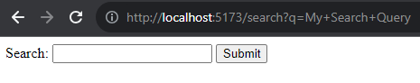

# `forms`

An HTML form is used to collect user input. The user input is most often sent to a server for processing.

```HTML
<form>
...
form elements
...
</form>
```

The `<form>` element is a container for different types of input elements, such as: text fields, checkboxes, radio buttons, submit buttons, etc. Input types are specified by the type option for any `<input>` e.g.,

```JavaScript
<input type="checkbox" ...> 
<input type="text" ...> 
<input type="submit" ...> 
...
```

# Submit Forms

Now, one of the "gotchas" that I have come across with when dealing with submit forms is the default behaviour, primarily due to historical reasons. When a form is submitted in a web page, the default behavior is for the **page to be refreshed**, and the URL may change depending on the form's `action` attribute. This default behavior is defined by the HTML specification.

When a form is submitted using the HTTP GET method, the form data is appended to the URL as query parameters. This is the default behavior for HTML forms when the `method` attribute is not specified or set to "get". The browser takes the form data and adds it to the URL, creating a new URL with the form parameters.

```HTML
<form action="/search" method="get">
    <label for="query">Search:</label>
    <input type="text" id="query" name="q">
    <button type="submit">Submit</button>
</form>
```


Consider the code above. When I enter "My Search Query", because this is a `<form ... method="get">`, the page will be refreshed
and the URL will change to the following.



This behaviour is primarily undesirable, to prevent it we need to call `preventDefault()` on the passed event object.


```JavaScript
<form action="/search" method="get" onsubmit="myFunction(event)">
    <label for="query">Search:</label>
    <input type="text" id="query" name="q">
    <button type="submit">Submit</button>
</form>

<script>
    function myFunction(event) {
        // Your custom logic goes here
        // If you want to prevent the default behavior, use event.preventDefault();
        event.preventDefault();
    }
</script>
```