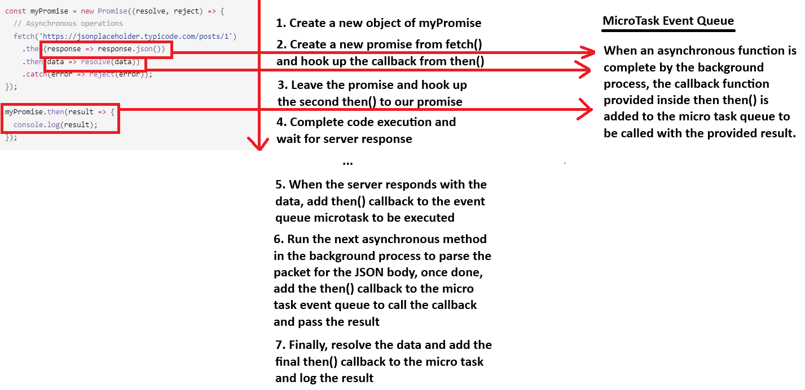

<div align="center">
  <h1> Promises </h1>
</div>

A 'Promise' is an object that represents the eventual completion or failure of an asynchronous operation and allow you to attach callbacks that will be executed when the operation is completed or when an error occurs. It has 3 states

1. **Pending** - The initial state; the promise is neither fulfilled nor rejected.
2. **Fulfilled** - The operation completed successfully, and the promise has a resulting value.
3. **Rejected** - The operation failed, and the promise has a reason for the failure.

## Creating a Promise and Execution Order

```JavaScript
const myPromise = new Promise((resolve, reject) => {
  // Perform asynchronous operation (await something else, etc...)
  const operation_successful = true;

  if (operation_successful) {
    resolve("Success Data");
  } else {
    reject("Error data");
  }
});
```

- **then()** - Used to handle the resolved state.
- **catch()** - Used to handle the rejected state.
- **finally()** - Executed regardless of the promise state.

```JavaScript
myPromise
    .then(data => {
        console.log(data);  // "Success Data", i.e. data passed to 'resolve'
    })
    .catch(error => {
        console.log(error); // "Error Data", i.e. data passed to 'reject'
    })
    .finally(() => {
        console.log("Finally Block");
    })
```

When you create a new Promise, the constructor receives an executor function, which itself receives two functions as arguments, `resolve` and `reject`. These are used to indicate whether the asynchronous operation succeed or failed.

- `resolve()` is used inside the Promise to send the result. It is how you complete or fulfill a promise from inside the executor.
- `.then()` is used outside the Promise to receive that result. It is how you register a callback to receive that result once its available. Even if `resolve()` is called immediately, `.then()` **does not execute immediately**. Instead, it is deferred using the microtask queue.

- The function you pass to `.then()` is **not the same** as `resolve` - it is simply a listener waiting for the Promise to be fulfilled.

```JavaScript
console.log("1. Start");

const myPromise = new Promise((resolve, reject) => {
  console.log("2. Inside executor");
  resolve("Success!");
});

myPromise.then(result => {
  console.log("4. Then:", result);
});

console.log("3. End");
```

| Step | Description                                     | Output               |
| ---- | ----------------------------------------------- | -------------------- |
| 1    | Synchronous code runs                           | `1. Start`           |
| 2    | Executor runs immediately                       | `2. Inside executor` |
| 3    | `resolve("Success!")` is called synchronously   | (No output yet)      |
| 4    | `.then(...)` callback is scheduled as microtask | (Still waiting)      |
| 5    | Remaining sync code finishes                    | `3. End`             |
| 6    | Microtasks run: `.then()` callback fires        | `4. Then: Success!`  |

## `await` and `then()`

Two common ways to handle a Promises result are,

1. Using the `await` keyword.
2. Using the `.then()` keyword.

Although they're interchangeable in many cases, their execution behaviour, readability impact and error handling approaches differ.

#### How an `async` Function Executes

An `async` function always return a Promise, regardless of whether it contains `await`. When called,

1. **The function begins executing synchronously until it reaches the first** `await`. It will complete if no `await` exists.
2. At that point, execution is paused and control returns to the caller.
3. When the awaited Promise resolves, execution resumes where it left off.

```TypeScript
async function test() {
  console.log('Start');
  await new Promise(r => setTimeout(r, 1000));
  console.log('End');
}

test();
console.log('After call');
```

```
Start
After call
End
```

This shows that **the async function begins execution immediately** and outputs `Start`. The runtime will then reach the `await`, to which it will give control back up and allow `After call` to be logged. Finally, the Promise will resolve, continue and output `End`.

1. `test()` is called. It starts executing synchronously and logs `Start`. This occurs because the asynchronous function is called and executes immediately until the first `await`.
2. It hits `await <promise>`. At this point the async function yields. It's suspended and **returns a pending Promise** to the caller. The JavaScript thread is not blocked. Control returns to the caller right away.
3. Because the caller didn't `await` the return Promise, the next line runs immediately, so we will see `After call`.
4. After ~1000ms `setTimeout` callback fires a macrotask, which resolves the awaited Promise. That queues a microtask to resume the suspended async function. The function continues and logs `End`.

The entire code doesn't halt, `await` only pauses that async function at that point. It doesn't block the thread or stop other code from running. It is basically syntax sugar for "split this function into two parts and continue the second part via a `.then()`".

You should use `await` when you are inside an `async` function and want sequential, readable and synchronous looking code.

#### `.then()` as an Alternative to `await`

Using `.then()` attaches a callback that runs when the Promise resolves.

```TypeScript
test().then(() => console.log('Done'));
```

In this style,

- The async function **still runs immediately** when called.
- `.then()` schedules the callback to execute after resolution.
- The rest of the surrounding code continues without waiting.

You should use `.then()` **when you are not inside an** `async` function or you want to chain multiple asynchronous transformations.

```TypeScript
fetchData()
  .then(process)
  .then(saveResult)
  .catch(handleError);
```

## Asynchronous Functions

When a function is declared with the `async` keyword, it behaves differently from a regular function in two fundamental ways.

1. **All return values are wrapped in a resolved Promise.**
2. **All errors (thrown or rejected) are wrapped in a rejected Promise.**

This means the return and error behaviour of an `async` function mirrors that of a manually constructed Promise chain using `.then()` and `.catch()`.

Consider the following API call,

```JavaScript
async function fetchUserData() {
  const response = await fetch("https://api.example.com/user");
  const data = await response.json();
  return data;
}
```

This functionally is functionally equivalent to,

```JavaScript
function fetchUserData() {
  return fetch("https://api.example.com/user")
    .then(response => response.json())
    .then(data => data);
}
```

Both versions,

1. Return a Promise.
2. **Automatically wrap the final return value** `data` inside a **resolved Promise.**.
3. If an error occurs (e.g. a network failure, invalid JSON or a bad request), it **gets caught and wrapped in a reject Promise**.

So we can call `.then()`, `.catch()` and `.finally()` on either one.

```JavaScript
fetchUserData()
  .then(data => {
    console.log("User data:", data);
  })
  .catch(error => {
    console.error("Failed to fetch:", error);
  });
```

Throwing errors in an `async` function returns a rejected Promise. Any `throw` in an `async` function or an error in an awaited Promise causes the entire function to return a rejected Promise. This rejected Promise is what `.catch()` handles externally.

```JavaScript
async function fetchUserData() {
  const response = await fetch("https://api.example.com/user");

  if (!response.ok) {
    throw new Error("Failed to fetch user");
  }

  const data = await response.json();
  return data;
}
```

The `async`/`await` syntax does not replace Promises, it simplifies them. Behind the scenes `async` functions wrap return values in resolved Promises and forward exceptions as rejected Promises. As a result, the familiar `.then()`, `.catch()` and `.finally()` methods work the same on the return value of an `async` function as they do on a regular Promise.

## Promises and Event Loop

When you create a Promise, its executor function is executed immediately. This function typically contains asynchronous operations. When you create a Promise and its executor function is immediately called, it might seem counterintuitive if you think of asynchrony purely in terms of I/O tasks. However, this immediate invocation is more related to the nature of the Promise mechanism and how it manages asynchronous control flow:

The immediate execution of the executor function allows for the decoupling of the asynchronous task from the Promise itself. The Promise is a placeholder for a value that may not be available yet. This design enables you to create a Promise and handle its resolution or rejection later, allowing for more flexible and expressive code.

Promises are designed to represent the eventual outcome of an asynchronous operation, whether it's I/O or some other form of delayed computation.

```JavaScript
const myPromise = new Promise((resolve, reject) => {
  // Asynchronous operations
  fetch('https://jsonplaceholder.typicode.com/posts/1')
    .then(response => response.json())
    .then(data => resolve(data))
    .catch(error => reject(error));
});

myPromise.then(result => {
  console.log(result);
});
```

In this example, the asynchronous operation is a network request using `fetch`. The `resolve` and `reject` functions are used to signal the completion or failure of the operation. When an asynchronous operation completes, its corresponding `resolve` or `reject` callback is scheduled as a microtask. Microtasks have higher priority than regular tasks in the event loop, ensuring they are executed before the next rendering or user input handling.

The event loop continuously checks the microtask queue for pending tasks. If the microtask queue is not empty, the event loop executes the microtasks in the order they were added. Promises use the microtask queue to ensure that their callbacks are executed in a predictable order.

In this example, it is crucial to remember the definition of asynchronous functions, **asynchronous behaviour is executed later**. Inside our promise we call an asynchronous function `fetch`, returning a `Promise` and then calling `then()` to listen to the callback. In this code snippet, the complete execution of the code is ran and the underlying mechanism of `fetch` is ran, which listens to `I/O` requests in a background process. When the request has been retrieved from the server, the event is queued to be executed which will then pass the data to our function callback.



Under the hood, the `fetch` API uses a `XMLHttpRequest` object to send HTTP requests and receive respones from the server. `XMLHttpRequest` is a low-level API. In a simplistic example, `fetch` could appear to work as the following.

```JavaScript
function fetch(url, options) {
  // create a new Promise object
  return new Promise((resolve, reject) => {
    // create a new XMLHttpRequest object
    const xhr = new XMLHttpRequest();

    // handle the response from the server
    xhr.onload = () => {
      const response = new Response(xhr.responseText, {
        status: xhr.status,
        statusText: xhr.statusText,
        headers: xhr.getAllResponseHeaders()
      });
      resolve(response);
    };

    // handle any errors that occur while fetching
    xhr.onerror = () => {
      reject(new TypeError('Network request failed'));
    };

    // open the connection to the server
    xhr.open(options.method || 'GET', url);

    // set any headers that were provided
    for (const header in options.headers) {
      xhr.setRequestHeader(header, options.headers[header]);
    }

    // send the request to the server
    xhr.send(options.body);
  });
}
```

## Promise Chaining

In the previous example,

```JavaScript
const myPromise = new Promise((resolve, reject) => {
  // Asynchronous operations
  fetch('https://jsonplaceholder.typicode.com/posts/1')
    .then(response => response.json())
    .then(data => resolve(data))
    .catch(error => reject(error));
});
```

we utilized `response.json()` and propagated it to another `then()`. The reason this occurred is because `response.json()` is asynchronous. Here, `.json()` returning another promise. When returning a promise inside of `then()`, the next `then()` does not receive an object, it waits until the promise is resolved and passes the result. This also means we could `await response.json()`.

Interestingly, after the initial `fetch()` call, only the headers have been read. So, to parse the body as JSON, first the body data has to be read from the incoming stream. Because reading from the TCP stream is asynchronous, the `.json()` operation ends up asynchronous. The actual parsing of the JSON itself is not asynchronous. It's just the retrieving of the data from the incoming stream that is asynchronous.

When you return something from a `then()` callback, it's a bit magic. **If you return a value**, the next `then()` is called with that value. However, **if you return something promise-like**, the next `then()` waits on it, and is only called when that promise settles (succeeds/fails).

```JavaScript
const five_promise = new Promise((resolve, reject) => {
  resolve(5); // Immediately resolve and pass 5 to the next `then()`
})

const ten_promise = new Promise((resolve, reject) => {
  resolve(10); // Immediately resolve and pass 10 to the next `then()`
})

const example = five_promise
  .then(d => {
      console.log(d); // 5
      return ten_promise; // Return a promise. This means it will wait until resolved and pass the resolved value.
  })
  .then(d => {
      console.log(d); // 10
      return 15 // Return a value. Passed to the next `then()`
  })
  .then(d => {
      console.log(d); // 15
  })
  .catch(error => {
      console.error(`Error occurred in one of the then() chains`);
  });
```

The `then()` method of a Promise returns a new Promise. This mechanism is what allows chaining in promise-based asynchronous code. Each call to `then()` returns a new Promise that represents the eventual completion or failure of the operation specified in that `then()` callback. The value that the new Promise is fulfilled with is the return value of the callback passed to that then call.

For arrow functions, if the function body consists of a single expression, the return statement is implicit. Hence, in our first example we could have instead have `.then(response => response.json())`.

In a promise chain, you generally only need one `catch()` at the end to handle errors that may have occurred at any point in the chain. This is because when an error occurs in any `then()` block in the chain, it will propagate down the chain until it encounters the next `catch()` block.
