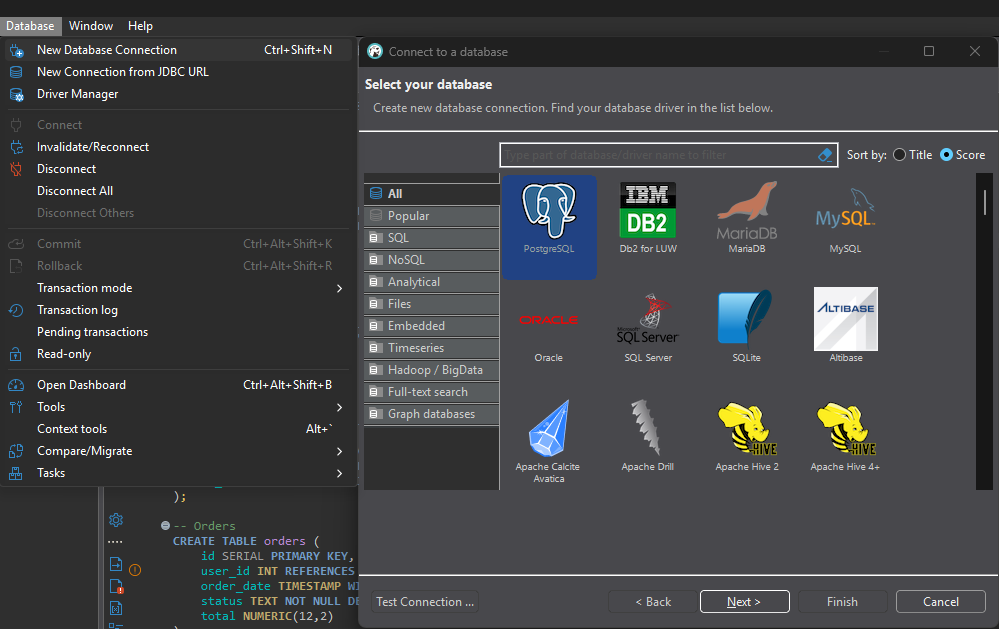
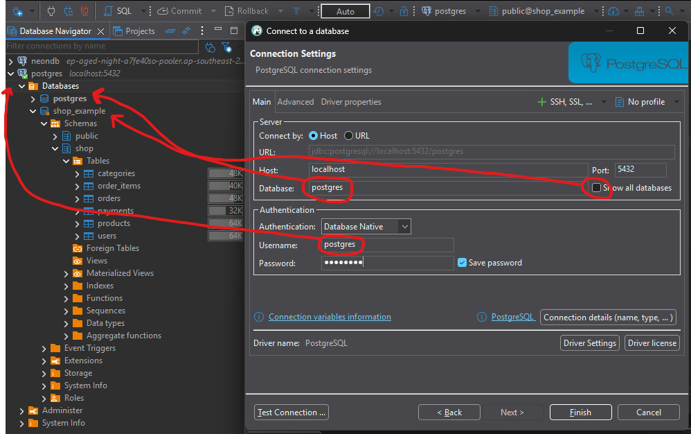
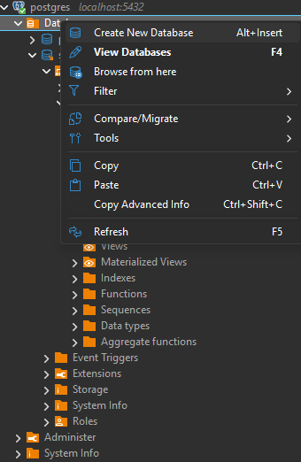
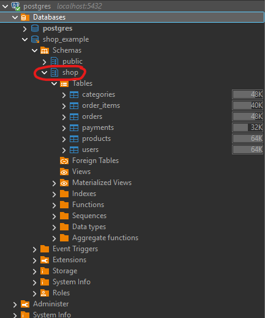
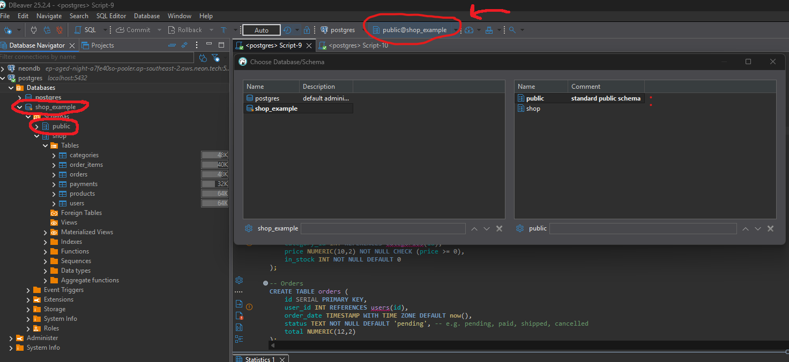
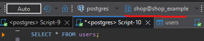
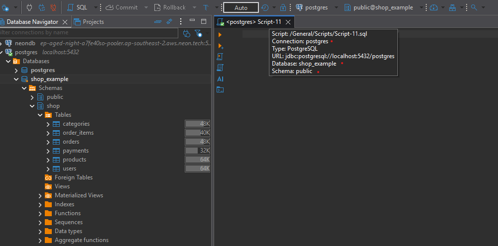
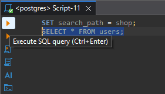
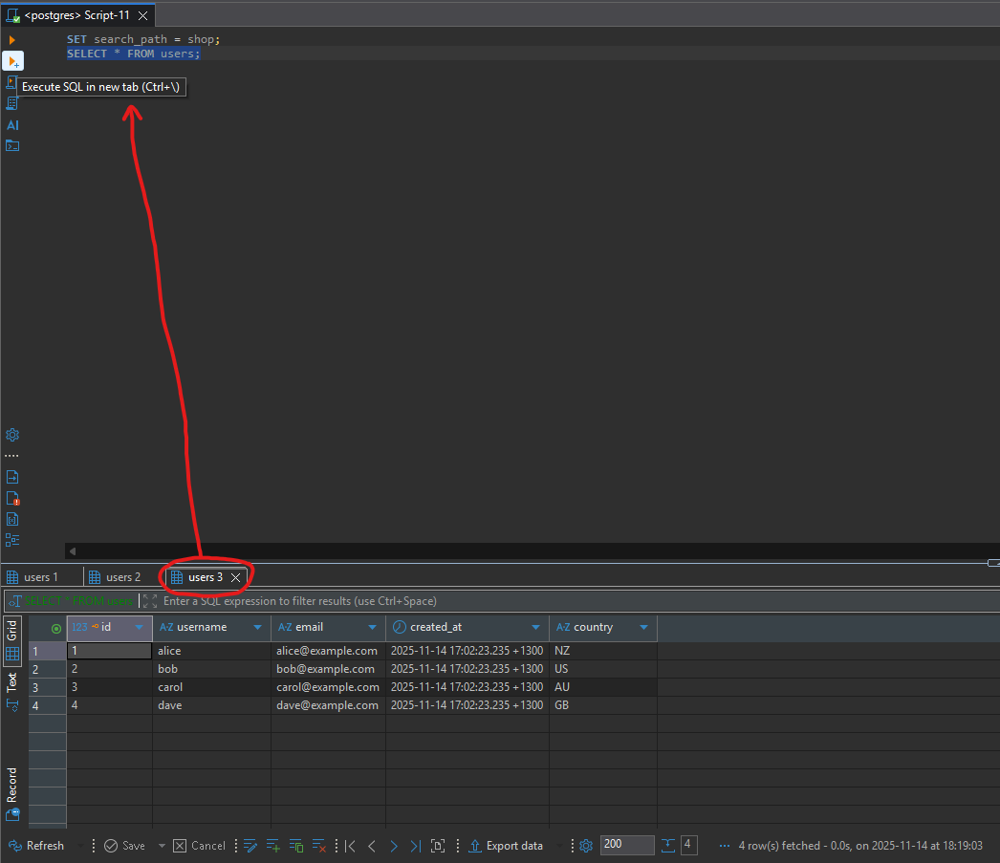
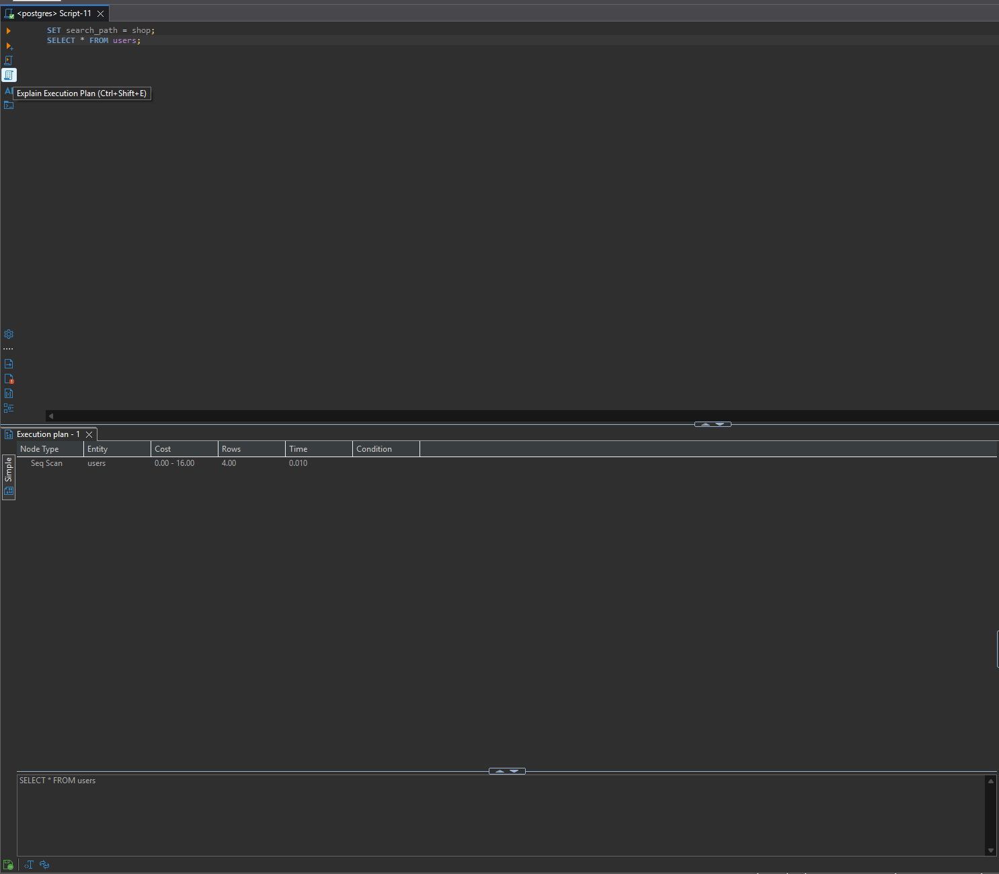

<div align='center'>
    <h1> DBeaver </h1>
</div>

#### Connections

A connection in DBeaver is a saved configuration that tells DBeaver how to connect a specific database server and which database to use. Think of it like a bookmark or shortcut that contains connection details,

1. Host/Server address - e.g. `localhost` or an IP address.
2. Port - e.g. 5432 for PostgreSQL.
3. Database name - Specifies which database to connect to.
4. Username and password.
5. Connection name.

One connection is connected to one database at a time. When you create a connection, you specify which database it connects to. If you want to work with multiple databases you either,

- Switch the database in your existing connection.
- Separate connections for each database.

<div align='center'>
    
</div>

By default DBeaver only shows the database you're connecting to when creating the connection. For example, below we connect to the `postgres` database. This means the `shop_example` database will not be shown in the tree below the `Databases` folder unless the `Show all databases` is ticked.

<div align='center'>
    
</div>

#### Creating a Database

<div align='center'>
    
</div>

#### PostgreSQL Schemas

After you create a database by either the following command,

```sql
CREATE DATABASE shop_example;
```

or via the UI shown above this creates a database under the `Databases` folder. PostgreSQL offers the ability for the `SCHEMA` keyword. Within the `shop_example` database we can begin our queries with the following at the top,

```sql
CREATE SCHEMA IF NOT EXISTS shop;
SET search_path = shop;

...
```

which dictates where the tables and queries are sent to.

PostgreSQL databases can maintain **multiple schemas**. By default, every database has a `public` schema. If you don't explicitly tell PostgreSQL which schema to use, it **creates tables in** `public`. `SET search_path = shop` only applies to the current session. When you run `SET search_path = shop;`, it only affects statements executed in that session. If DBeaver runs statements in different sessions or separate executions (like when you highlight part of the script), it may ignore `SET search_path`. That's why some tables ended up in `public` and instead of `shop`.

<div align='center'>
    
</div>

DBeaver offers the ability to have defaults. In the toolbar we can see `public@shop_example`, this means if we did not include `SET search_path = shop;`, it creates the tables inside of `public@shop_example`. This means it will be in `<schema@database>` as highlighted in the tree view. This can be configured by selecting the toolbar item and changing the default.

<div align='center'>
    
</div>

In the below example, I have changed the default to `shop@shop_example`. This means I can run `SELECT * FROM users;` as it pulls from the correct schema and the query succeeds. However, if I kept this as the default `public@shop_example` then query will fail because I do not have any `users` table within the `public` schema.

<div align='center'>
    
</div>

#### SQL Editor

An SQL Editor in DBeaver is a text editor window where you write and execute SQL queries against a database. This is a tab in DBeaver where each SQL Editors open as a separate tab.

<div align='center'>
    
</div>

In the following tab below we can observe,

- It is for the connection `postgres`.
- It is within the database `shop_example`.
- It is within the `public` schema for the database `shop_example`.

<div align='center'>
    
</div>

Now we can run queries in it. Because the default is `public` we need to include,

```sql
SET search_path = shop;
SELECT * FROM users;
```

Keep in mind, `SET search_path = shop;` only needs to be ran once per connection session.

##### Execute SQL query

When you have a script inside the SQL Editor, you can highlight a line and click `Execute SQL query`. This means it will only run the line highlighted. In the following example, it will **not run** `SET search_path = shop;`.

<div align='center'>
    
</div>

The button below it is the equivalent, however it runs the result and generates the output in another tab.

<div align='center'>
    
</div>

##### Execute SQL Script

The `Execute SQL Script` will run the script from top to bottom. The script will execute line by line, creating the schema, tables, and inserting data.

<div align='center'>
    
</div>

##### Explain Execution Plan

`Explain Execution Plan` shows you host PostgreSQL will **retrieve data** from your database. It's specifically a tool for understanding and optimizing queries that **read** data.

When you click `Explain Execution Plan` on a `SELECT` query (or `UPDATE`/`DELETE` that reads data), PostgreSQL shows you its step-by-step plan for finding and returning that data.

- How it will find the data - Will it scan every row in the table sequentially or use an index to jump directly to relevant rows?
- Join strategies.
- Filter operations.
- Cost estimates - PostgreSQL guess at how much work each step requires (CPU, disk reads, memory, ...).
- ...

**It only works on data retrieval queries**. This means `SELECT`, `UPDATE`, `DELETE`, ... (Anything that reads/finds data). It will not work on `CREATE`, `DROP`, `SET`, ... (Structural changes or data insertion). This is because `Explain Execution Plan` is about showing the strategy for **finding existing data**. Commands like `CREATE TABLE` don't search for data, they just create structures.

You want to use it when,

- A `SELECT` query is running slowly.
- You want to verify an index is being used.
- Comparing different ways to write the same query.
- Understanding complex JOIN performance.
- Debugging why a query returns results slowly.

<div align='center'>
    
</div>
