<div align='center'>
    <h1> SQL JOINs </h1>
</div>

If you need to merge two or more datasets in SQL, you can use joins. A `JOIN` is a SQL instruction that you put the `FROM` clause of your query. It is used to identify the tables you are querying and how they should be combined. There are multiple ways you can combine datasets so therefore there are multiple SQL `JOIN`s that you need to learn.

<div align='center'>
    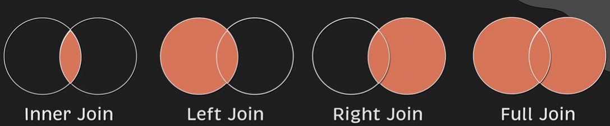
</div>

You need to be vary careful joining tables without foreign keys. It's possible to just two different colums using two different tables, but should be avoided.

<div align='center'>
    <h1> JOIN / INNER JOIN </h1>
</div>

<div align='center'>
    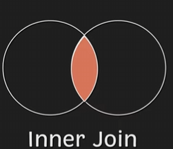
</div>

Each type of join is used to answer a specific business question. For example, what if we want to get only active users? In other words we want to get only users that have performed an action. You would use a `INNER JOIN` to join the tables together. An `INNER JOIN` combines the columns on a common dimension when possible and only includes data for the columns that share the same values in the common column.

`INNER JOIN` is the **default join** type, you do not need to type `INNER`, simply `JOIN` is sufficient and will implicitly use `INNER JOIN`.

SQL first creates a new table, with the columns from both tables you're trying to combine. **SQL will not add new rows that did not have a match**. We can illustrate this with the following example.

```sql
CREATE TABLE customer (
    customer_id INTEGER PRIMARY KEY,
    name TEXT NOT NULL,
    address TEXT NOT NULL
);

CREATE TABLE event (
    event_id INTEGER PRIMARY KEY,
    customer_id INTEGER NOT NULL,
    action TEXT NOT NULL,
    FOREIGN KEY (customer_id) REFERENCES customer(customer_id)
);

INSERT INTO customer (customer_id, name, address) VALUES
    (1, 'Casey', '2295 Spring Avenue'),
    (2, 'Peter', '924 Emma Street'),
    (3, 'Erika', '397 Terry Lane');

INSERT INTO event (event_id, customer_id, action) VALUES
    (101, 3, 'LOGIN'),
    (102, 3, 'VIEW PAGE'),
    (103, 1, 'LOGIN'),
    (104, 1, 'SEARCH');
```

<div align='center'>
    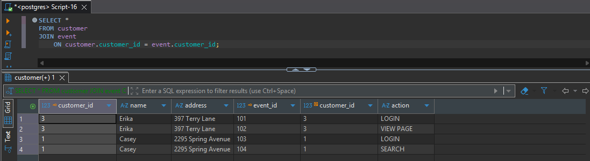
</div>

<div align='center'>
    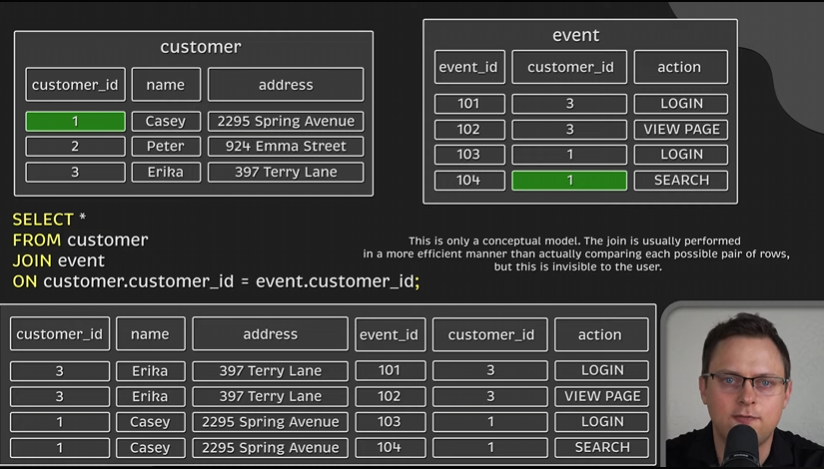
</div>

<div align='center'>
    <h1> LEFT JOIN </h1>
</div>

<div align='center'>
    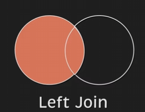
</div>

Now, what if we want to get all users from the customer table and only the actions that these users users have done? This is the second most common `JOIN` in SQL, **where left refers to the first table**. Initially, SQL will attempt to match all the users from the left table with actions in the right table. However, their is a significant difference in how SQL treats the left table. For any row that is in the first table that **does not have a match, SQL will add these rows in the first table to the new table, placing null as the values**.

<div align='center'>
    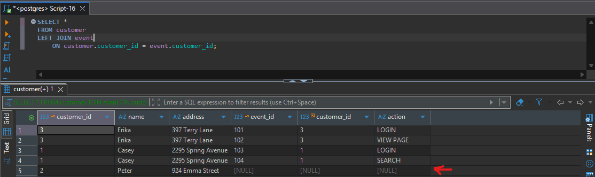
</div>

<div align='center'>
    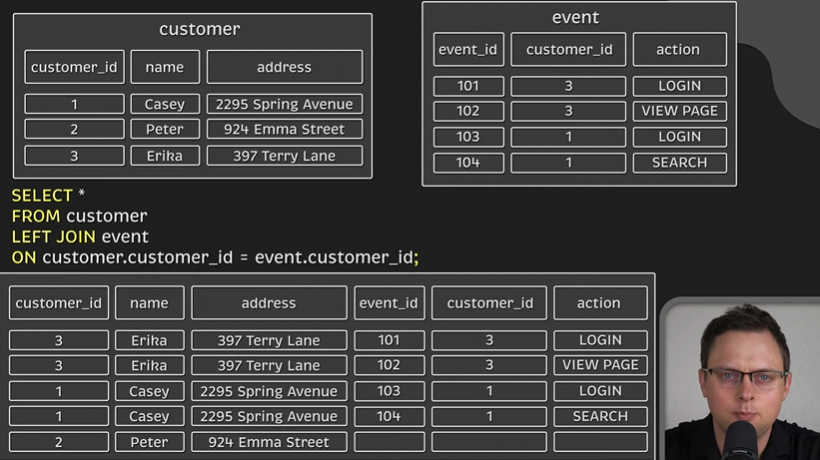
</div>

<div align='center'>
    <h1> RIGHT JOIN </h1>
</div>

<div align='center'>
    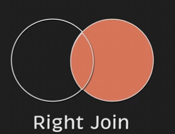
</div>

In this example, we will create two more tables.

```sql
CREATE TABLE action (
    action_id INTEGER PRIMARY KEY,
    name TEXT NOT NULL
);

INSERT INTO action (action_id, name) VALUES
    (201, 'LOGIN'),
    (202, 'VIEW PAGE'),
    (203, 'SEARCH'),
    (204, 'LOGOUT');

-- ============================================
-- Create event_v2 table
-- ============================================

CREATE TABLE event_v2 (
    event_id INTEGER PRIMARY KEY,
    customer_id INTEGER NOT NULL,
    action_id INTEGER NOT NULL,
    FOREIGN KEY (customer_id) REFERENCES customer(customer_id),
    FOREIGN KEY (action_id) REFERENCES action(action_id)
);

INSERT INTO event_v2 (event_id, customer_id, action_id) VALUES
    (101, 2, 201),
    (102, 2, 204);
```

<div align='center'>
    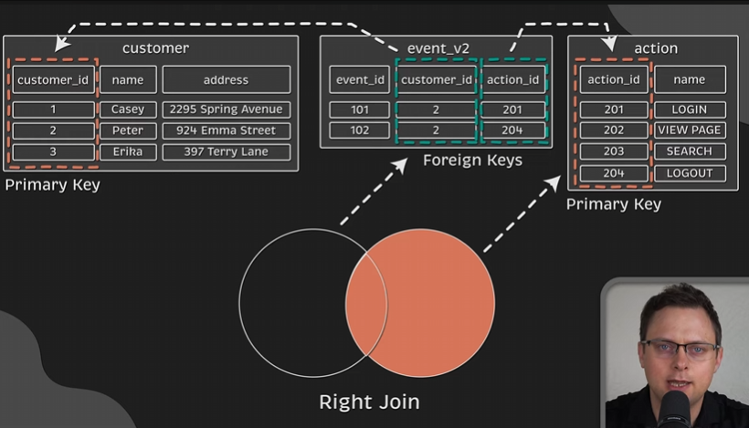
</div>

When performing a `RIGHT JOIN`, "right" in this context refers to the "right action" table. So, we aim to get all action types and only the associated events.

<div align='center'>
    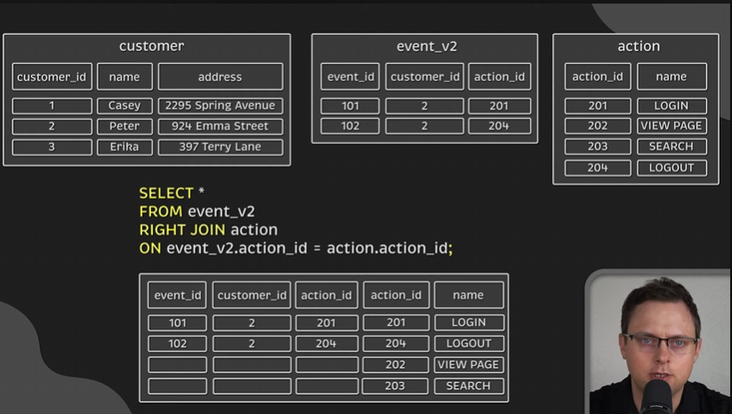
</div>

<div align='center'>
    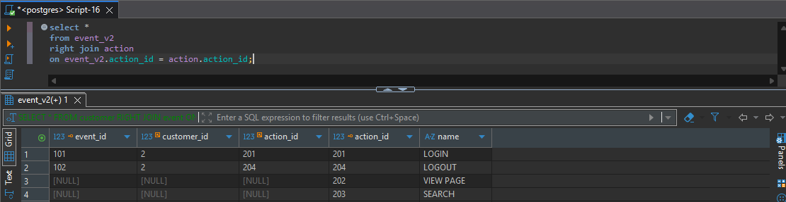
</div>

<div align='center'>
    <h1> FULL JOIN </h1>
</div>

<div align='center'>
    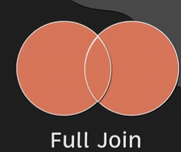
</div>

A `FULL JOIN` will contain all rows from both tables, but joined the rows where possible.

<div align='center'>
    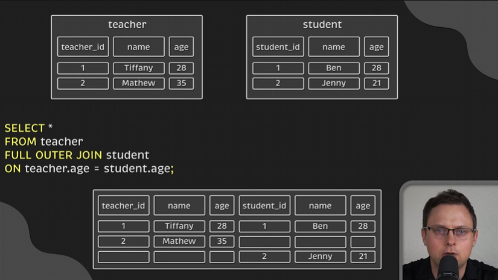
</div>

<div align='center'>
    <h1> Multiple JOINs </h1>
</div>

When you use multiple `JOIN`s in SQL, the database evaluates them **one at a time**, joining two tables, then taking that result and joining it again and so on.

If you were to write,

```sql
SELECT *
FROM A
JOIN B ON A.id = B.a_id
JOIN C ON B.id = C.b_id;
```

The logical order is,

1. Start with **A**
2. JOIN **B** → produces an intermediate table
3. JOIN **C** using the intermediate result

visually,

```
A  JOIN  B   →   AB   JOIN  C   →   ABC
```

```
Table A               Table B                    Table C
+----+--------+       +----+--------+            +----+-----------+
| id |  name  |       | id | a_id   |            | id | b_id      |
+----+--------+       +----+--------+            +----+-----------+
| 1  | Alice  |       | 10 |   1    |            | 100|   10      |
| 2  | Bob    |       | 20 |   2    |            | 101|   20      |
+----+--------+       +----+--------+            +----+-----------+
```

##### Step 1 - `JOIN` **A** and **B**

```
A.id = B.a_id

A row (id=1) joins B row (a_id=1)
A row (id=2) joins B row (a_id=2)
```

Will give **AB**,

```
+------+--------+------+--------+
| A.id | name   | B.id | a_id   |
+------+--------+------+--------+
| 1    | Alice  | 10   | 1      |
| 2    | Bob    | 20   | 2      |
+------+--------+------+--------+
```

##### Step 2 - `JOIN` the **AB** result with **C**

```
B.id = C.b_id

AB row (B.id=10) joins C row (b_id=10)
AB row (B.id=20) joins C row (b_id=20)
```

Will give **ABC**,

```
+------+--------+------+--------+------+--------+
| A.id | name   | B.id | a_id   | C.id | b_id   |
+------+--------+------+--------+------+--------+
| 1    | Alice  | 10   | 1      | 100  |  10    |
| 2    | Bob    | 20   | 2      | 101  |  20    |
+------+--------+------+--------+------+--------+
```
