<div align='center'>
    <h1> PostgreSQL Queries </h1>
</div>

#### Database Example Setup

```SQL
-- Create a dedicated database
CREATE DATABASE shop_example;

-- Create schema and tables, sample data
CREATE SCHEMA IF NOT EXISTS shop;
SET search_path = shop;

-- Users
CREATE TABLE users (
    id SERIAL PRIMARY KEY,
    username TEXT NOT NULL UNIQUE,
    email TEXT NOT NULL UNIQUE,
    created_at TIMESTAMP WITH TIME ZONE DEFAULT now(),
    country TEXT
);

-- Categories
CREATE TABLE categories (
    id SERIAL PRIMARY KEY,
    name TEXT NOT NULL UNIQUE
);

-- Products
CREATE TABLE products (
    id SERIAL PRIMARY KEY,
    sku TEXT NOT NULL UNIQUE,
    name TEXT NOT NULL,
    category_id INT REFERENCES categories(id),
    price NUMERIC(10,2) NOT NULL CHECK (price >= 0),
    in_stock INT NOT NULL DEFAULT 0
);

-- Orders
CREATE TABLE orders (
    id SERIAL PRIMARY KEY,
    user_id INT REFERENCES users(id),
    order_date TIMESTAMP WITH TIME ZONE DEFAULT now(),
    status TEXT NOT NULL DEFAULT 'pending', -- e.g. pending, paid, shipped, cancelled
    total NUMERIC(12,2)
);

-- Order items
CREATE TABLE order_items (
    id SERIAL PRIMARY KEY,
    order_id INT REFERENCES orders(id) ON DELETE CASCADE,
    product_id INT REFERENCES products(id),
    quantity INT NOT NULL CHECK (quantity > 0),
    unit_price NUMERIC(10,2) NOT NULL
);

-- Payments
CREATE TABLE payments (
    id SERIAL PRIMARY KEY,
    order_id INT REFERENCES orders(id) ON DELETE CASCADE,
    paid_at TIMESTAMP WITH TIME ZONE DEFAULT now(),
    amount NUMERIC(12,2) NOT NULL CHECK (amount >= 0),
    method TEXT NOT NULL
);

-- Seed data
INSERT INTO users (username, email, country) VALUES
('alice','alice@example.com','NZ'),
('bob','bob@example.com','US'),
('carol','carol@example.com','AU'),
('dave','dave@example.com','GB');

INSERT INTO categories (name) VALUES
('Electronics'), ('Books'), ('Clothing');

INSERT INTO products (sku, name, category_id, price, in_stock) VALUES
('SKU-101','USB-C Cable', 1, 9.99, 150),
('SKU-102','Wireless Mouse', 1, 24.50, 80),
('SKU-103','Mechanical Keyboard', 1, 89.99, 25),
('SKU-201','Modern SQL', 2, 39.90, 200),
('SKU-202','Algorithms Book', 2, 49.50, 45),
('SKU-301','T-Shirt Large', 3, 19.99, 120),
('SKU-302','Hoodie Medium', 3, 49.99, 60);

-- Orders
INSERT INTO orders (user_id, order_date, status, total) VALUES
(1, '2025-11-01 10:00:00+13', 'paid', 34.49),
(2, '2025-11-03 15:20:00+13', 'pending', 114.49),
(1, '2025-10-20 09:10:00+13', 'cancelled', 49.50),
(3, '2025-11-05 18:00:00+13', 'paid', 89.99);

-- Order items
INSERT INTO order_items (order_id, product_id, quantity, unit_price) VALUES
(1, 1, 2, 9.99),     -- Alice: 2 x USB-C Cable
(1, 2, 1, 14.51),    -- Alice: Wireless Mouse (custom price)
(2, 3, 1, 89.99),    -- Bob: Keyboard
(2, 4, 1, 24.50),    -- Bob: Modern SQL
(3, 5, 1, 49.50),    -- Alice cancelled
(4, 3, 1, 89.99);    -- Carol

-- Payments
INSERT INTO payments (order_id, paid_at, amount, method) VALUES
(1, '2025-11-01 10:05:00+13', 34.49, 'card'),
(4, '2025-11-05 18:10:00+13', 89.99, 'paypal');

-- Useful indexes
CREATE INDEX idx_products_category ON products(category_id);
CREATE INDEX idx_orders_user ON orders(user_id);
CREATE INDEX idx_order_items_order ON order_items(order_id);
```

##### 1. Create a Dedicated Database

```sql
CREATE DATABASE shop_example;
```

This command will,

1. Create a new database named `shop_example`
2. A database is a container for schemas, tables, indexes, functions, etc...
3. This isolates all your shop data from other databases.

<div align='center'>
    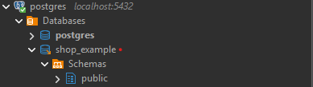
</div>

##### 2. Create a Schema and Set the Search Path

```sql
CREATE SCHEMA IF NOT EXISTS shop;
SET search_path = shop;
```

- `CREATE SCHEMA IF NOT EXISTS shop;` creates a schema called `shop`, this can be thought of as a namespace.
- `SET search_path = shop;` tells PostgreSQL to look ino the `shop` schema first for tables. This means all subsequent `CREATE TABLE` commands will automatically go into the `shop` schema.

<div align='center'>
    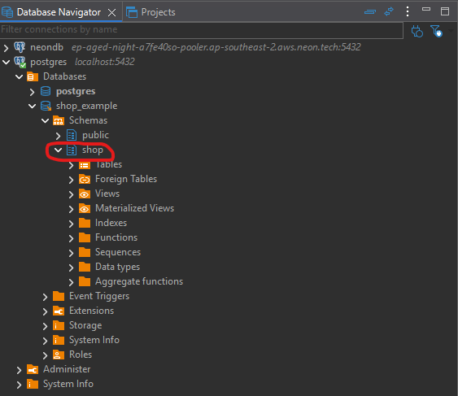
</div>

##### 3. Create the Tables

##### Users Table

```sql
CREATE TABLE users (
    id SERIAL PRIMARY KEY,
    username TEXT NOT NULL UNIQUE,
    email TEXT NOT NULL UNIQUE,
    created_at TIMESTAMP WITH TIME ZONE DEFAULT now(),
    country TEXT
);
```

- `id SERIAL PRIMARY KEY`
  - `SERIAL` keyword is a PostgreSQL keyword to create an integer column, create a sequence object, mark the column as `NOT NULL`.
  - `PRIMARY KEY` - This column uniquely identifies each row and cannot be `NULL`.
- `username TEXT NOT NULL UNIQUE`
  - `TEXT` - The column stores text strings.
  - `NOT NULL` - It must have a value, meaning it cannot be empty or `NULL`.
  - `UNIQUE` - No two rows can have the same username
- `created_at TIMESTAMP WITH TIME ZONE DEFAULT now()`
  - `TIMESTAMP WITH TIME ZONE` - Stores a date + time, adjusted for time zones.
  - `DEFAULT now()` - If no value is provided, PostgreSQL automatically sets it to the current timestamp at insertion time.
  - `country TEXT` - The column stores any text string. It's optional, can be `NULL` and allows duplicates.

<div align='center'>
    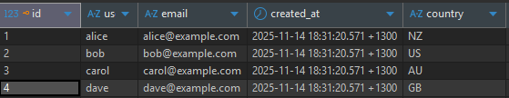
</div>

<div align='center'>
    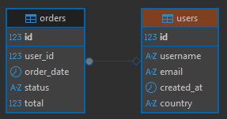
</div>

##### Categories Table

```sql
CREATE TABLE categories (
    id SERIAL PRIMARY KEY,
    name TEXT NOT NULL UNIQUE
);
```

- `id SERIAL PRIMARY KEY`
  - `SERIAL` keyword is a PostgreSQL keyword to create an integer column, create a sequence object, mark the column as `NOT NULL`.
  - `PRIMARY KEY` - This column uniquely identifies each row and cannot be `NULL`.
- `name TEXT NOT NULL UNIQUE`

  - `TEXT` - Stores text.
  - `NOT NULL` - Must have a value.
  - `UNIQUE` - No two rows can use the same name.

<div align='center'>
    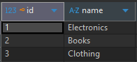
</div>

<div align='center'>
    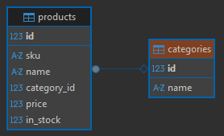
</div>

##### Products Table

```sql
CREATE TABLE products (
    id SERIAL PRIMARY KEY,
    sku TEXT NOT NULL UNIQUE,
    name TEXT NOT NULL,
    category_id INT REFERENCES categories(id),
    price NUMERIC(10,2) NOT NULL CHECK (price >= 0),
    in_stock INT NOT NULL DEFAULT 0
);
```

- `id SERIAL PRIMARY KEY`

  - `SERIAL` keyword is a PostgreSQL keyword to create an integer column, create a sequence object, mark the column as `NOT NULL`.
  - `PRIMARY KEY` - This column uniquely identifies each row and cannot be `NULL`.

- `sku TEXT NOT NULL UNIQUE`

  - `TEXT` - Stores text strings.
  - `NOT NULL` - Must have a value.
  - `UNIQUE` - No two products can have the same SKU.

- `name TEXT NOT NULL`

  - `TEXT` - Stores text strings.
  - `NOT NULL` - Must have a value.

- `category_id INT REFERENCES categories(id)`

  - `INT` - Stores an integer.
  - `REFERENCES categories(id)` - Foreign key linking to the `id` column in the `categories` table.

- `price NUMERIC(10,2) NOT NULL CHECK (price >= 0)`

  - `NUMERIC(10,2)` - Stores a number with up to 10 digits total, 2 of which are after the decimal point
  - `NOT NULL` - Must have a value.
  - `CHECK (price >= 0)` - Value cannot be negative.

- `in_stock INT NOT NULL DEFAULT 0`
  - `INT` - Stores an integer.
  - `NOT NULL` - Must have a value.
  - `DEFAULT 0` - If no value is provided, automatically starts at 0.

<div align='center'>
    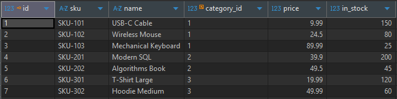
</div>

<div align='center'>
    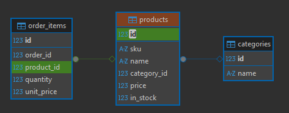
</div>

##### Orders Table

```sql
CREATE TABLE orders (
    id SERIAL PRIMARY KEY,
    user_id INT REFERENCES users(id),
    order_date TIMESTAMP WITH TIME ZONE DEFAULT now(),
    status TEXT NOT NULL DEFAULT 'pending',
    total NUMERIC(12,2)
);
```

- `id SERIAL PRIMARY KEY`

  - `SERIAL` keyword is a PostgreSQL keyword to create an integer column, create a sequence object, mark the column as `NOT NULL`.
  - `PRIMARY KEY` - This column uniquely identifies each row and cannot be `NULL`.

- `user_id INT REFERENCES users(id)`

  - `INT` - Stores an integer.
  - `REFERENCES users(id)` - Sets a foreign key constraint to the `id` column of the `users` table.
  - `TIMESTAMP WITH TIME ZONE` - Stores a date and time with timezone information.
  - `DEFAULT now()` - Automatically sets the current timestamp if no value is provided.

- `status TEXT NOT NULL DEFAULT 'pending'`

  - `TEXT` - Stores text strings.
  - `NOT NULL` - Must have a value.
  - `DEFAULT 'pending'` - Automatically set to `pending` if no value is provided.

- `total NUMERIC(12,2)`
  - `NUMERIC(12, 2)` - Stores a number with up to 12 digits, 2 of which are after the decimal point.
  - No `NOT NULL` - Can be `NULL`.
  - No default - Must be explicitly set if needed.

<div align='center'>
    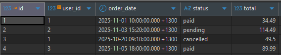
</div>

<div align='center'>
    
</div>

##### Order Items Table

```sql
CREATE TABLE order_items (
    id SERIAL PRIMARY KEY,
    order_id INT REFERENCES orders(id) ON DELETE CASCADE,
    product_id INT REFERENCES products(id),
    quantity INT NOT NULL CHECK (quantity > 0),
    unit_price NUMERIC(10,2) NOT NULL
);
```

The `order_items` table contains a `unit_price` column. This is linked to the price of the item by the `product_id` column. However the `products` table also has a `price` column. The `products.price` represents the **current price** of the product in the catalog. This means it costs $9.99 today. This can change over time due to sales, discounts, inflation, etc. The `order_items.unit_price` is the price of the product **at the time of the order**. So this means Alice bought 2 USB-C cables last week for $9.99, but now the price is $10.50.

- `id SERIAL PRIMARY KEY`

  - `SERIAL` keyword is a PostgreSQL keyword to create an integer column, create a sequence object, mark the column as `NOT NULL`.
  - `PRIMARY KEY` - This column uniquely identifies each row and cannot be `NULL`.

- `order_id INT REFERENCES orders(id) ON DELETE CASCADE`

  - `INT` - Stores an integer.
  - `REFERENCES orders(id)` - Foreign key linking to the `id` column in the `orders` table.
  - `ON DELETE CASCADE` - If the referenced order is deleted, all rows with this order_id are automatically deleted

- `product_id INT REFERENCES products(id)`

  - `INT` - Stores an integer.
  - `REFERENCES products(id)` - Foreign key linking to the `id` column in the `products` table.

- `quantity INT NOT NULL CHECK (quantity > 0)`

  - `INT` - Stores an integer.
  - `NOT NULL` - Must have a value.
  - `CHECK (quantity > 0)` - Value must be greater than 0.

- `unit_price NUMERIC(10,2) NOT NULL`
  - `NUMERIC(10,2)` - Stores a number with up to 10 digits, 2 after the decimal point.
  - `NOT NULL` - Must have a value.

<div align='center'>
    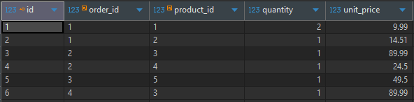
</div>

<div align='center'>
    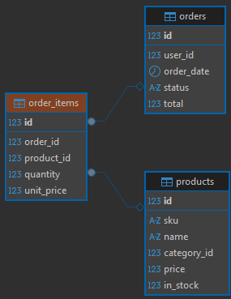
</div>

##### Payments Table

```sql
CREATE TABLE payments (
    id SERIAL PRIMARY KEY,
    order_id INT REFERENCES orders(id) ON DELETE CASCADE,
    paid_at TIMESTAMP WITH TIME ZONE DEFAULT now(),
    amount NUMERIC(12,2) NOT NULL CHECK (amount >= 0),
    method TEXT NOT NULL
);
```

- `id SERIAL PRIMARY KEY`

  - `SERIAL` keyword is a PostgreSQL keyword to create an integer column, create a sequence object, mark the column as `NOT NULL`.
  - `PRIMARY KEY` - This column uniquely identifies each row and cannot be `NULL`.

- `order_id INT REFERENCES orders(id) ON DELETE CASCADE`

  - `INT` - Stores an integer.
  - `REFERENCES orders(id)` - Foreign key linking to the `id` column in the `orders` column.
  - `ON DELETE CASCADE` - If the referenced order is deleted, all rows with this `order_id` are automatically deleted.

- `paid_at TIMESTAMP WITH TIME ZONE DEFAULT now()`

  - `TIMESTAMP WITH TIME ZONE` - Stores date and time with timezone information.
  - `DEFAULT now()` - Automatically sets the current timestamp if no value is provided

- `amount NUMERIC(12,2) NOT NULL CHECK (amount >= 0)`

  - `NUMERIC(12, 2)` - Stores a number with up to 12 digits, 2 after the decimal point.
  - `NOT NULL` - Must have a value.
  - `CHECK (amout >= 0)` - Value cannot be negative.

- `method TEXT NOT NULL`
  - `TEXT` - Stores text strings.
  - `NOT NULL` - Must have a value.

<div align='center'>
    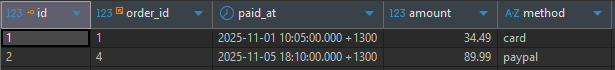
</div>

<div align='center'>
    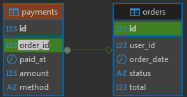
</div>

##### 4. Insert Seed Data

##### Users

Add four sample users.

The value of `created_at` is not given, set from `now()`.

```sql
INSERT INTO users (username, email, country) VALUES
('alice','alice@example.com','NZ'),
('bob','bob@example.com','US'),
('carol','carol@example.com','AU'),
('dave','dave@example.com','GB');
```

##### Categories

Add three categories.

```sql
INSERT INTO categories (name) VALUES
('Electronics'), ('Books'), ('Clothing');
```

##### Products

Adds products and assigns them to categories using `category_id`.

```sql
INSERT INTO products (sku, name, category_id, price, in_stock) VALUES
('SKU-101','USB-C Cable', 1, 9.99, 150),
...
```

##### Orders

Adds orders, linking them to users.

```sql
INSERT INTO orders (user_id, order_date, status, total) VALUES
(1, '2025-11-01 10:00:00+13', 'paid', 34.49),
...
```

##### Order Items

Each order can have multiple products.

Example - Alice bought 2 USB-C Cables + 1 Wireless Mouse.

```sql
INSERT INTO order_items (order_id, product_id, quantity, unit_price) VALUES
(1, 1, 2, 9.99),
(1, 2, 1, 14.51),
...
```

<div align='center'>
    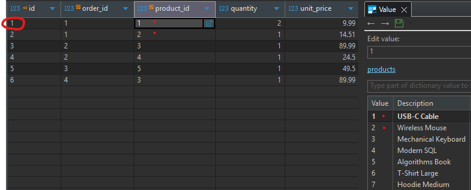
</div>

##### Payments

Only paid orders have corresponding payment records.

```sql
INSERT INTO payments (order_id, paid_at, amount, method) VALUES
(1, '2025-11-01 10:05:00+13', 34.49, 'card'),
...
```

##### Create Indexes

Speed up queries that filter by `category_id`, `user_id` or `order_id`.

```sql
CREATE INDEX idx_products_category ON products(category_id);
CREATE INDEX idx_orders_user ON orders(user_id);
CREATE INDEX idx_order_items_order ON order_items(order_id);
```

<div align='center'>
    <h1> Logical Evaluation Order For a SELECT Query
</div>

### `WITH` - Common Table Expression

Create a named temporary result set used by the main query. Can be recursive or non-recursive. Useful for readability and subquery reuse. In modern PostgreSQL, non-recursive CTEs may be inlined by the planner unless `MATERIALIZED` is specified.

`WITH` is written at the start of the query, before `SELECT`.

```SQL
WITH paid_orders AS (
  SELECT * FROM shop.orders WHERE status = 'paid'
)
SELECT paid_orders.id, shop.users.username, paid_orders.total
FROM paid_orders
JOIN shop.users ON shop.users.id = paid_orders.user_id;
```

1. Evaluate the CTE `paid_orders` (run its `SELECT` and produce a temporary result set).
2. Proceed to `FROM` using `paid_orders`.
3. Join with `users`, apply `ON` condition, then `WHERE` (none), then `SELECT` projection.
4. Return rows.

<div align='center'>
    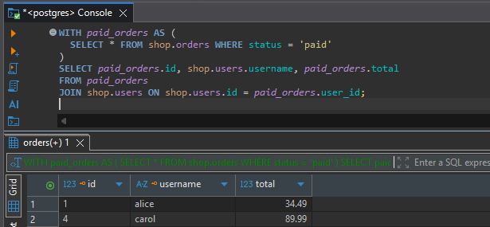
</div>

##### Step 1 - Evaluate the CTE `paid_orders`

```sql
SELECT * FROM shop.orders WHERE status = 'paid';
```

It scans `orders` and returns only rows where `status = 'paid'`. Resulting temporary set `paid_orders`.

| id  | user_id | status | total |
| --- | ------- | ------ | ----- |
| 1   | 1       | paid   | 34.49 |
| 4   | 3       | paid   | 89.99 |

##### Step 2 - Join `paid_orders` with `shop.users` using `ON shop.users.id = paid_orders.user_id;`

We now conceptually take each row from `paid_orders` and find matching matching rows in `users` where `shop.users.id = paid_orders.user_id`. This is an `INNER JOIN`, so only matching pairs are kept. As a result, SQL creates a new table with all columns from `paid_orders` and `shop.users`.

```sql
JOIN shop.users ON shop.users.id = paid_orders.user_id;
```

For every row in `paid_orders`, find rows in users where `shop.users.id = paid_orders.user_id` and combine them. This will _conceptually_ create a temporary table with all columns from both tables where each row successfully meets the criteria above.

```
+--------------------- paid_orders --------------------+-------------------- users ---------------------+
| id | user_id |  total  | ...                         | id | username | email | ...                    |
+----+---------+---------+-----------------------------+----+----------+-------+------------------------+
|  1 |    1    |  34.49  | ...                         |  1 | alice    | ...   | ...                    |
|  4 |    3    |  89.99  | ...                         |  3 | carol    | ...   | ...                    |
+----+---------+---------+-----------------------------+----+----------+-------+------------------------+
```

##### Step 3 - `SELECT` picks columns

After the join pairs are formed, the engine projects/returns only the requested columns from,

```sql
SELECT paid_orders.id, shop.users.username, paid_orders.total
```

Because the resulting table contains the columns from all tables, we can `SELECT` from multiple tables.

This results in,

| order_id | username | total |
| -------- | -------- | ----- |
| 1        | alice    | 34.49 |
| 4        | carol    | 89.99 |
